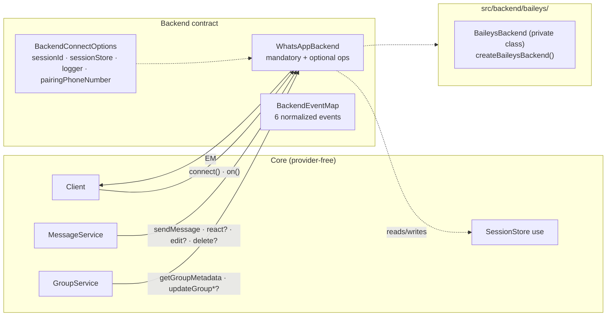
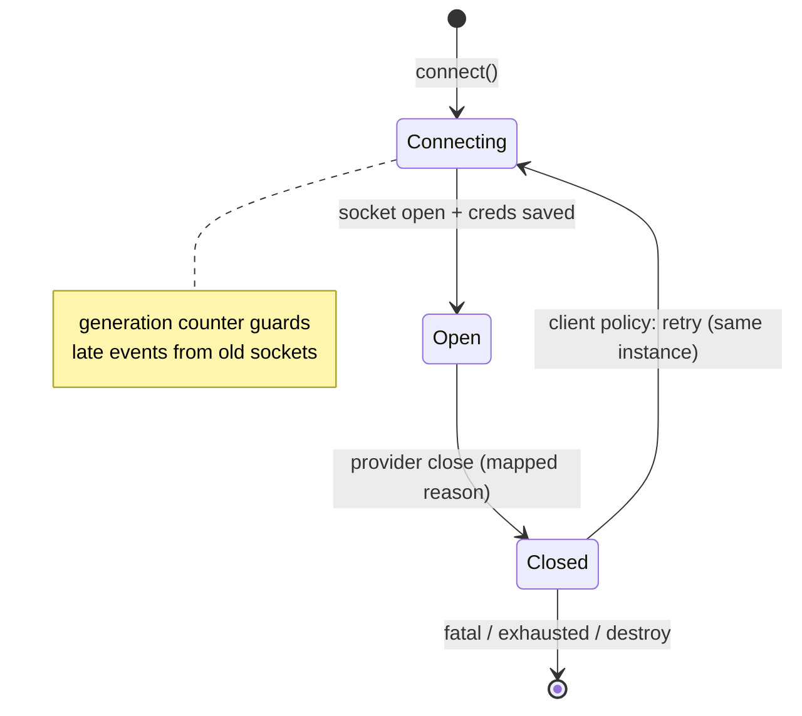

# Backend contract

The seam. `WhatsAppBackend` + `BackendEventMap` define everything the core needs from a provider — no more, no less. Baileys is an implementation detail behind `src/backend/baileys/`.



## The interface

Full annotated reference: [Backend API page](/reference/backend#whatsappbackend). Split:

| Tier | Members | Rule |
| --- | --- | --- |
| identity | `id` | stable string (e.g. `"baileys"`), used in sessions and logs |
| lifecycle | `connect` `disconnect` `isConnected` | `connect()` is **re-entrant** — the same instance must survive reconnects |
| I/O | `sendMessage` `downloadMedia` `getGroupMetadata` | always present; provider failures must not leak provider error classes |
| events | `on(event, listener) → Unsubscribe` | six normalized events, domain types only |
| capabilities | `react?` `editMessage?` `deleteMessage?` `updateGroupParticipants?` `updateGroupName?` `updateGroupDescription?` `requestPairingCode?` `logout?` `getPhoneNumberForLid?` `getLidForPhoneNumber?` `fetchUser?` `getProfilePictureUrl?` `getAbout?` `getBusinessProfile?` | checked before every call |

## Mandatory vs optional — why

Providers differ (reactions yes/no, pairing codes, edits). Making everything mandatory would lie; making everything optional would cripple DX. The compromise:

- core checks `if (backend.react)` and raises `UnsupportedOperationError` (`` `Backend "baileys" does not support reactions.` ``) when absent;
- capability discovery in user code is honest: `if (client.backend.react) …`;
- the contract is small enough to reimplement in ~200 lines (the repo's `MockBackend` test double does exactly that).

Missing `requestPairingCode` raises `UnsupportedOperationError` `ERR_UNSUPPORTED` from `Client.requestPairingCode` — the same capability rule as `fetchUser` and the profile lookups: a capability the backend does not have is reported, never guessed. The identity capabilities (`getPhoneNumberForLid`/`getLidForPhoneNumber`) are lookups, not operations — `client.users.resolvePhone`/`resolveLid` resolve `undefined` when they are absent instead of throwing. `fetchUser` is the deliberate third case: `client.users.fetch` raises `UnsupportedOperationError` when it is absent, because reporting existence is a capability the backend must confirm — never a guess. Profile enrichment (`getProfilePictureUrl`/`getAbout`/`getBusinessProfile`) follows the same rule: `client.users.pictureUrl`/`about`/`accountType` raise `UnsupportedOperationError` when the capability is missing, and resolve `undefined` only for genuinely missing or privacy-hidden data once the capability answers.

## `BackendConnectOptions` — the lifeline

The only way infrastructure reaches a backend:

| Field | Purpose |
| --- | --- |
| `sessionId` | which slot to hydrate |
| `sessionStore` | load/save opaque session bytes — backends persist **only** through this |
| `logger` | your injected `Logger` instance (provider diagnostics included) |
| `pairingPhoneNumber` | auto-request a pairing code on connect, when set |

No globals, no env reads — a backend is a pure function of its options.

## Event normalization rules

`BackendEventMap` payloads may contain **only library domain types** (`ChatId`, `UserId`, `MessageContent`, `DisconnectReason`, `GroupParticipantAction`, `GroupUpdateChanges`, `Date`). Specifically forbidden: provider JID helpers beyond raw id strings, `Long`/protobuf types, provider enums, provider error classes.

This is what makes "swap the provider, keep the bot" true at the type level.

## Baileys adapter

Five modules plus an `index.ts` barrel, one public factory (`createBaileysBackend` — the class is module-private):

| File | Role |
| --- | --- |
| `BaileysBackend.ts` | socket lifecycle, event wiring, send/react/edit/delete/group ops, pairing, raw-message LRU (500) for `download()`, group-metadata LRU (`GROUP_META_CACHE_LIMIT = 512`) feeding Baileys' `cachedGroupMetadata` hook, provider-content conversion, generation guards |
| `BaileysMapper.ts` | pure mapping functions (see [event pipeline](/architecture/event-pipeline#stages)) |
| `BaileysAuth.ts` | `AuthenticationState` backed by a `SessionStore`; coalesced write chain; `BufferJSON` serialization; app-state key revival |
| `BaileysDisconnect.ts` | Boom/status-code → [`DisconnectReason`](/reference/disconnect-reason) (incl. network errnos) |
| `BaileysLogger.ts` | library `Logger` → provider logging shape |

Adapter defaults:

```ts
const DEFAULT_BROWSER = ["libwa.js", "1.0.0", "1"];
const RAW_CACHE_LIMIT = 500;
const GROUP_META_CACHE_LIMIT = 512;
// syncFullHistory: false → shouldSyncHistoryMessage: () => false, emitOwnEvents: false
```

History sync is **off by default**: only `messages.upsert` entries with `type === "notify"` dispatch — bots respond to live traffic, no first-login deluge.



## Enforced boundaries

| Mechanism | What it guarantees |
| --- | --- |
| import discipline | only `src/backend/baileys/` may `import … from "@whiskeysockets/baileys"` (convention + review — biome has no import-restriction rule; `check:exports` guards the emitted types) |
| package `exports` | only `.` and `./package.json` — exports-aware resolvers (bundler/node16) reject deep `dist/` paths; legacy `moduleResolution: "node"` can still reach `dist/` on disk, so deep imports are unsupported, not impossible |
| `npm run check:exports` | walks the reachable graph of `dist/index.d.ts`; any provider token (`@whiskeysockets/baileys`, `WAMessage`, `WASocket`, `proto.`, …) fails the build |
| tests | import `src/…` paths; provider-free tests use `MockBackend`; Baileys behavior tested at mapper/auth/disconnect level with realistic fixtures |

Details: [Public API guard](/development/public-api-guard).

## See also

- [Backend reference](/reference/backend) — full type documentation
- [Backends guide](/guide/backends) — using/configuring backends
- [Sessions architecture](/architecture/sessions) — what backends persist
