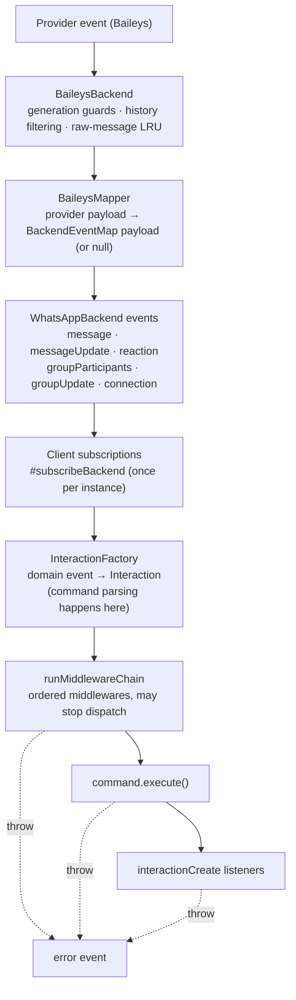
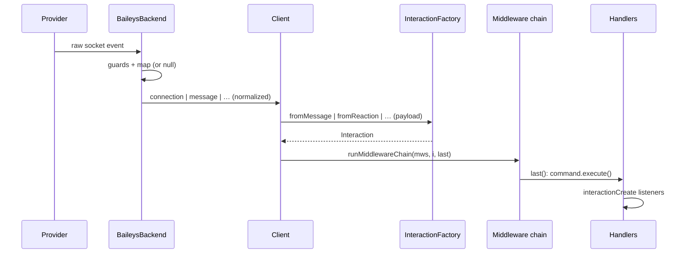
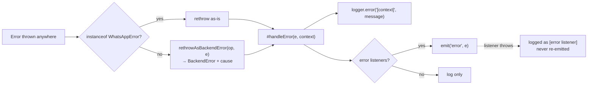

# Event pipeline

One inbound event's journey from a provider socket to your handler — and the properties that make it safe.

## Stages

### 1. Provider → backend (adapter)

`src/backend/baileys/BaileysBackend.ts` subscribes to provider sockets and applies guards **before** anything becomes a domain event:

| Guard | Effect |
| --- | --- |
| generation counter | events from a dead socket (pre-reconnect) are dropped |
| history filtering | only `messages.upsert` with `type === "notify"` dispatches; `syncFullHistory` off, `emitOwnEvents: false` |
| raw-message LRU (500) | keeps raw payloads for lazy `download()` |

### 2. Mapper (provider payload → domain payload)

`BaileysMapper.ts` is pure functions: `mapIncomingMessage`, `mapMessageUpdates`, `mapMessagesDelete`, `mapReaction`, `mapGroupParticipants`, `mapGroupUpdates`, `mapGroupMetadata`.

- normalizes wrappers (ephemeral/view-once/device-sent/edit), timestamps (seconds/Long → `Date`), JIDs (device-suffix stripping);
- every content type becomes a [`MessageContent`](/reference/content) union member;
- **`null` means "no event"** — protocol messages, reaction stubs, poll updates, history upserts never surface.

### 3. Backend event bus

Six [`BackendEventMap`](/reference/backend#backendeventmap) events, domain types only:

### 4. Client subscription

`Client.#subscribeBackend()` attaches the six listeners **once per instance** (guarded). Each payload:

1. for message/reaction/update/group payloads, the matching `InteractionFactory.from*()` method → a concrete `Interaction` (never `null`; `ignoreSelf` only suppresses *command* promotion — the message still dispatches as a `MessageInteraction`). `connection` payloads go to the lifecycle logic instead;
2. `void this.#dispatch(interaction)` — fire-and-forget with errors captured internally (message-shaped events only).

### 5. Middleware → command → listeners

`#dispatch` runs three guarded stages in order:

| Stage | Behavior on throw |
| --- | --- |
| `runMiddlewareChain(middlewares, i, last)` | context `middleware` → `error` event |
| gate `groupOnly`/`dmOnly` → `command.execute(i)` | context `` `command "${name}"` `` → `error` event |
| `interactionCreate` listeners (sequential, awaited) | context `interactionCreate listener` → `error` event |

Every stage is individually try/caught — one failure never skips the rest of that stage's siblings, and **the process never crashes**.

## Dispatch-order rationale

| Order | Why |
| --- | --- |
| middleware **first** | rate limits/filters cover commands *and* plain messages; skip `next()` = total silence |
| command **before** listeners | `execute()` is the primary reaction; listeners observe (UI, logging, side effects) |
| gated commands still notify | a `groupOnly` command in a DM skips `execute()` but listeners still see the attempt |

See [Design decisions #12](/architecture/design-decisions#_12-dispatch-order-middleware-command-listeners).

## Failure isolation summary

## Key properties

- **Nothing provider-shaped crosses the boundary** — public types contain zero Baileys concepts (enforced by `npm run check:exports`).
- **Null = no event** — unmappable payloads vanish instead of reaching handlers half-formed.
- **Media stays lazy** — mappers attach `download()` closures over the raw-message LRU; apps see `Uint8Array` only when asked.
- **Ordered and snapshot-isolated** — listeners run in registration order over a snapshot; unsubscribing mid-emit is safe.
- **Errors are data** — dispatch failures surface on `error` with a context string, never as unhandled rejections.

## See also

- [Events guide](/guide/events) — handler-side view
- [Middleware](/reference/middleware) — chain semantics
- [Interactions](/reference/interactions) — what the factory builds
