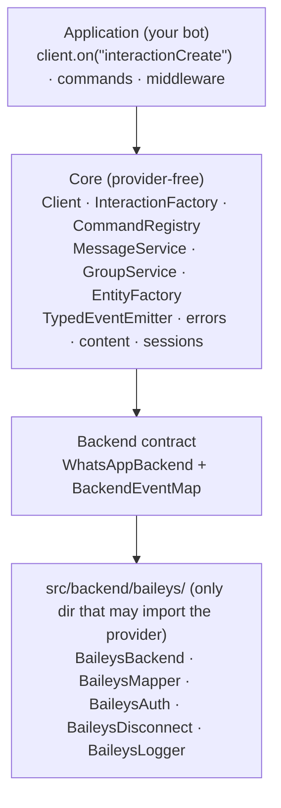
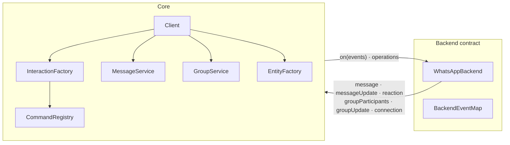

# Architecture overview

libwa is a small core with a **hard boundary around provider code**. Everything above the seam is provider-free; the only code allowed to import `@whiskeysockets/baileys` lives in `src/backend/baileys/`.

## Layers

### Application

Your code: listeners, commands, middleware. Talks only to `Client`, services, entities, and interactions — the package surface (`src/index.ts`, enforced by [`check:exports`](/development/public-api-guard)).

### Client <ApiBadge kind="class" />

[`src/Client.ts`](/reference/client) is the **composition root** and the only owner of connection lifecycle:

- resolves `ClientOptions` (defaults, validation) and constructs services;
- subscribes to the six normalized backend events exactly once per instance;
- converts backend events → interactions (`InteractionFactory`), runs the middleware chain, dispatches to commands and `interactionCreate` listeners;
- owns **reconnection policy** (backoff, attempt counting, fatal-reason classification) — backends only report *why* a close happened;
- owns **login bookkeeping**: `login()` is a deferred promise resolved on first `ready`, rejected on fatal/auth failure or exhausted retries.

### Services

| Service | Field | Responsibility |
| --- | --- | --- |
| `MessageService` | `client.messages` | Validate/normalize `ReplyContent`, resolve targets, delegate to backend, convert confirmations back into domain `Message`s; react/edit/delete with capability checks |
| `GroupService` | `client.groups` | Metadata resolve — `ensure` (60s cache, fetch on miss) or `fetch` (always round-trips) — plus member/setting operations, keeping cached metadata in sync |
| `CommandRegistry` | `client.commands` | Registration, aliases, uniqueness, prefix parsing (data only — execution happens in the pipeline) |

### Entities

Value objects built by `EntityFactory`:

- `Chat` / `Group` (one file; `Group extends Chat`, `isGroup()` narrows), `User`, `Message`;
- chats and group metadata are **cached by id** — `interaction.chat === interaction.message.chat` — while `User` is recreated per event; membership/update events patch the cached group between fetches;
- entities expose intent-level actions (`chat.send`, `message.react`, `group.addMembers`) that delegate back to **services**, never to a provider.

### Interactions

The abstract [`Interaction`](/reference/interactions) carries `id`, `timestamp`, `chat`, `author`, `isFromMe`, `reply()` and the guard family. Subclasses add event-specific data (`CommandInteraction.args`, `ReactionInteraction.emoji`, …). The `InteractionType` discriminator and class hierarchy stay in sync: `CommandInteraction extends MessageInteraction`, so `isMessage()` is true for commands.

## Module map

| Directory | Contents | Provider imports? |
| --- | --- | --- |
| `src/Client.ts`, `src/ClientOptions.ts` | composition root, option resolution | ❌ |
| `src/events/` | `ClientEvents`, `TypedEventEmitter` | ❌ |
| `src/interactions/` | interaction classes + factory | ❌ |
| `src/entities/` | `Chat`, `Group`, `Message`, `User`, `EntityFactory` | ❌ |
| `src/commands/` | registry, definitions | ❌ |
| `src/messaging/`, `src/groups/` | outbound services + payload normalization | ❌ |
| `src/middleware/` | `compose.ts` chain runner | ❌ |
| `src/errors/`, `src/logging/`, `src/core/`, `src/auth/` | errors, logger, ids/content/reasons, stores | ❌ |
| `src/backend/` | contract (`Backend.ts`, `events.ts`), `createDefaultBackend` | ❌ |
| **`src/backend/baileys/`** | the adapter (5 modules + `index.ts` barrel — 4 of them import the provider) | ✅ **only here** |

## Data flow in one line each

| Direction | Flow |
| --- | --- |
| Inbound | provider event → mapper → `BackendEventMap` → `InteractionFactory` → middleware → command/listeners |
| Outbound | `reply()/send()` → `normalizeReplyContent` → backend request → `Message` confirmation |
| Session | backend ⇄ `SessionStore` (opaque `Uint8Array`, only through the given store) |
| Close | backend maps reason → `connection: close` → client policy → retry or `disconnect` event |

## Where to go next

- [Event pipeline](/architecture/event-pipeline) — inbound dispatch in detail
- [Backend contract](/architecture/backend-contract) — the seam and the Baileys adapter
- [Sessions](/architecture/sessions) — auth persistence design
- [Reconnection](/architecture/reconnection) — retry policy internals
- [Design decisions](/architecture/design-decisions) — ADR-style rationale
