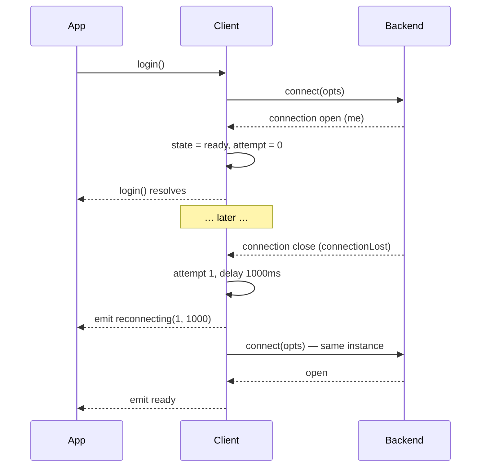

# Reconnection

Reconnection is **client-owned**. Backends map provider close codes into [`DisconnectReason`](/reference/disconnect-reason) and report; the client decides whether, when, and how to retry.

```mermaid
flowchart TD
    A["connection close<br/>(reason + detail from backend)"] --> B{"state === destroyed?"}
    B -->|yes| Z["ignored (terminal)"]
    B -->|no| C["isReady = false"]
    C --> D{"FATAL_DISCONNECT_REASONS.has(reason)?"}
    D -->|yes| F["state = idle<br/>login pending → emit 'error' (login) + reject AuthenticationError<br/>emit 'disconnect'(reason)"]
    D -->|no| E{"reconnect === false?"}
    E -->|yes| F
    E -->|no| G{"attempts used >= attempts?"}
    G -->|yes| H["state = idle<br/>login pending → emit 'error' (login) + reject ConnectionError<br/>emit 'disconnect'(reason)<br/>emit 'error' (reconnect exhausted)"]
    G -->|no| I["state = connecting<br/>attempt++<br/>delay = min(max, initial * factor^&#123;n-1&#125;)<br/>emit 'reconnecting'(attempt, delay)<br/>schedule timer (unref)"]
    I --> J["connect() again<br/>(same backend instance)"]
    J -->|open| K["attempt = 0<br/>emit 'ready' (again)"]
    J -->|throws| L["error event (context: reconnection)<br/>rerun close logic with same reason"]
```



## Policy inputs

From [`ReconnectOptions`](/reference/client-options#reconnectoptions):

| Field | Default | Role |
| --- | --- | --- |
| `attempts` | `5` | max retries **per connection epoch** (reset on every successful open) |
| `initialDelayMs` | `1000` | delay before attempt 1 |
| `maxDelayMs` | `30000` | ceiling |
| `factor` | `2` | exponential base |
| `reconnect: false` | — | never retry; first close → immediate `disconnect` |

Backoff formula: `delay(n) = min(maxDelayMs, initialDelayMs * factor ** (n - 1))` → 1s, 2s, 4s, 8s, 16s, 30s, 30s, …

## Decision table

| Situation | Outcome |
| --- | --- |
| fatal reason (loggedOut, badSession, connectionReplaced, forbidden) | no retry → login pending: `error` (context `login`) + reject `AuthenticationError`, then `disconnect` |
| `reconnect: false` | no retry → `disconnect` |
| attempts exhausted | login pending: `error` (login) + reject `ConnectionError`, then `disconnect`, then `error` (gave up message) |
| transient reason, attempts left | `reconnecting(attempt, delayMs)` + timer → `connect()` |
| scheduled `connect()` throws | `error` (context `reconnection`) → close logic reruns with same reason |
| `destroy()` mid-timer | timer cancelled, listeners detached, pending `login()` rejected (no `error` event for that) |
| reopen after retry | attempt counter reset, `me` refreshed, **`ready` emitted again** |

## Login as a deferred

```ts
login(): Promise<void>
```

- resolves on the **first** `ready` (deferred settled inside the connection-open handler, before emission);
- shared across concurrent `login()` calls (same promise);
- rejections:
  - **fail-fast paths**: `ValidationError` (bad options) or `AuthenticationError` from `connect()` itself — no retries for auth/session problems;
  - **fatal close while pending** → `AuthenticationError`;
  - **retries exhausted while pending** → `ConnectionError`;
  - **`destroy()` while pending** → `ConnectionError("Client was destroyed.")` (reported = false — no `error` event);
- a rejection with no `await` is pre-caught internally so fire-and-forget `login()` never crashes the process.



## Same backend instance

Retries call `connect()` **on the existing backend** — no re-instantiation mid-reconnect. The Baileys adapter tears down its previous socket on re-entry and uses a generation counter so late events from a dead socket are dropped ([Design decisions #8](/architecture/design-decisions#_8-reconnect-the-same-backend-instance)).

## Terminal operations

| Operation | Reconnect effect | Session effect | Listeners |
| --- | --- | --- | --- |
| `destroy()` | cancels timer, state `destroyed` | preserved | backend listeners detached (application listeners kept) |
| `logout()` | cancels timer, state `idle` | **cleared** (after remote revoke) | kept — `login()` re-pairs fresh |

## Observability

```ts
client.on("reconnecting", (attempt, delayMs) =>
  metrics.increment("wa.reconnect").tag("attempt", attempt),
);
client.on("disconnect", (reason) => {
  metrics.increment("wa.disconnect").tag("reason", reason);
  if (FATAL_DISCONNECT_REASONS.has(reason)) alert("re-pair required");
});
```

Timers are `unref`'d — pending backoff never keeps a Node process alive.

## Testing policy

The repo tests this with fake timers: exhaust path, fatal path, disabled path, reset-on-open, timer cancel on destroy ([Development → testing](/development/testing#what-we-test-guarantees)).

## See also

- [DisconnectReason reference](/reference/disconnect-reason) — reason catalog
- [Error handling guide](/guide/error-handling#disconnects) — application patterns
- [Client reference](/reference/client#login) — login semantics
