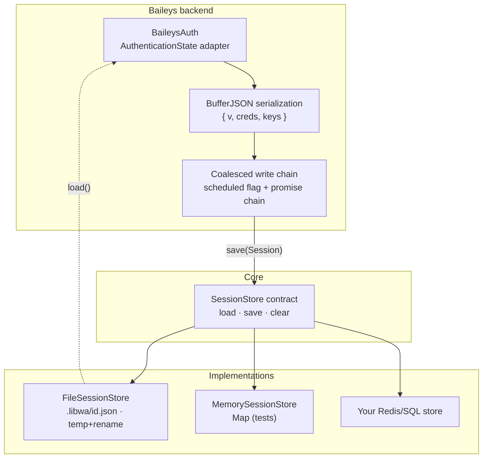
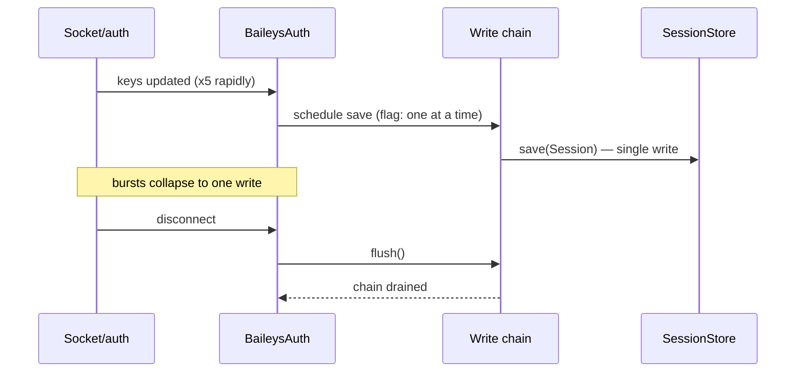

# Sessions architecture

Authentication state is **provider-owned bytes** moving through a **core-owned contract**. The core never interprets it; stores never interpret it; only the backend that wrote it reads it back.



## The contract

```ts
interface Session {
  readonly id: string;         // slot id
  readonly provider: string;   // backend id, e.g. "baileys"
  readonly data: Uint8Array;   // opaque
  readonly updatedAt: Date;
}

interface SessionStore {
  load(id): Promise<Session | null>;
  save(session): Promise<void>;
  clear(id): Promise<void>;
}
```

Design rules:

1. **Opaque `data`** — the core treats it as a blob; cross-module type safety comes from `provider` (mismatch detection), not from parsing.
2. **Slot = `sessionId`** — multiple accounts share one store (`sessionId: "alice"` / `"bob"`).
3. **Missing ≠ error** — `load()` returns `null`; `clear()` of a missing slot is a no-op.
4. **Only through the given store** — a backend never opens files or reads env; `BackendConnectOptions.sessionStore` is the single channel.

## Baileys persistence

The Baileys adapter serializes `{ v, creds, keys }` with `BufferJSON` into `Session.data`, and revives app-state keys back into protobuf objects on read.

| Concern | Mechanism |
| --- | --- |
| bursty key updates | **coalesced writes**: a `scheduled` flag + promise chain collapses N updates into 1 store write |
| drain on disconnect | `flush()` awaits the write chain before the socket dies |
| corrupt/unsupported blob | `ValidationError` — fail fast; clear the slot to recover |
| provider mismatch (`session.provider !== "baileys"`) | warn + start from fresh creds (never crash on someone else's bytes) |



## Stores

### FileSessionStore (default)

- path `<directory>/<id>.json` (`directory` default `.libwa`);
- payload `{ provider, data: base64, updatedAt }`;
- **atomic**: write `<file>.<writerId>.tmp` → `rename()` (`writerId` = a `randomUUID()` per store instance, so concurrent stores never share one temp file);
- **serialized per slot**: internal promise queue per id;
- **safe ids**: `assertSafeSessionId` (`[A-Za-z0-9_-]{1,64}`) on every op → `ERR_SESSION_ID`;
- corrupt JSON → `ValidationError` `ERR_SESSION_CORRUPT` (cause preserved);
- file exists but cannot be read (`EACCES`, `EIO`, … — anything but `ENOENT`) → `ValidationError` `ERR_SESSION_UNREADABLE` (cause preserved): a stored session is never mistaken for "no session".

### MemorySessionStore

`Map<string, Session>` — tests and throwaway processes; no id validation (no filesystem), no persistence.

### Custom stores

Any three-method implementation works (see the [Redis sketch](/reference/sessions#choosing-a-store)). Requirements: per-id write safety and honest `null` for missing slots.

## Lifecycle touchpoints

| Event | Session effect |
| --- | --- |
| first `login()` | `load()` → backend hydrates creds (or starts pairing) |
| during connection | coalesced `save()` on key/cred changes |
| recoverable close | backend instance kept; session untouched; retry `connect()` |
| fatal close (`loggedOut` etc.) | session bytes may remain — `client.logout()` clears them |
| `logout()` | `backend.logout()` (remote revoke, optional) → `store.clear(sessionId)` → disconnect |
| `destroy()` | disconnect only — **session preserved** for next process run |
| `provider` mismatch on load | warn + fresh creds (old bytes effectively abandoned) |

Multi-account: one `FileSessionStore`, distinct `sessionId`s — each gets an independent file and connection.

```ts
const store = new FileSessionStore({ directory: "/var/lib/bots" });
const alice = new Client({ sessionStore: store, sessionId: "alice" });
const bob = new Client({ sessionStore: store, sessionId: "bob" });
// .libwa/alice.json · .libwa/bob.json
```

## Why not parse sessions in the core?

- **Swap-ability**: a future Signal/Telegram-style backend brings its own auth model; the core must not encode Baileys' `{ v, creds, keys }`.
- **Store simplicity**: Redis/SQL stores store bytes — they never need schema knowledge of auth.
- **Security surface**: core code paths never deserialize credentials (only the owning backend does).

See [Design decisions #6](/architecture/design-decisions#_6-opaque-session-blobs-coalesced-persistence).

## See also

- [Sessions guide](/guide/sessions) — recipes
- [Sessions reference](/reference/sessions) — API details
- [Reconnection](/architecture/reconnection) — how retries interact with sessions
