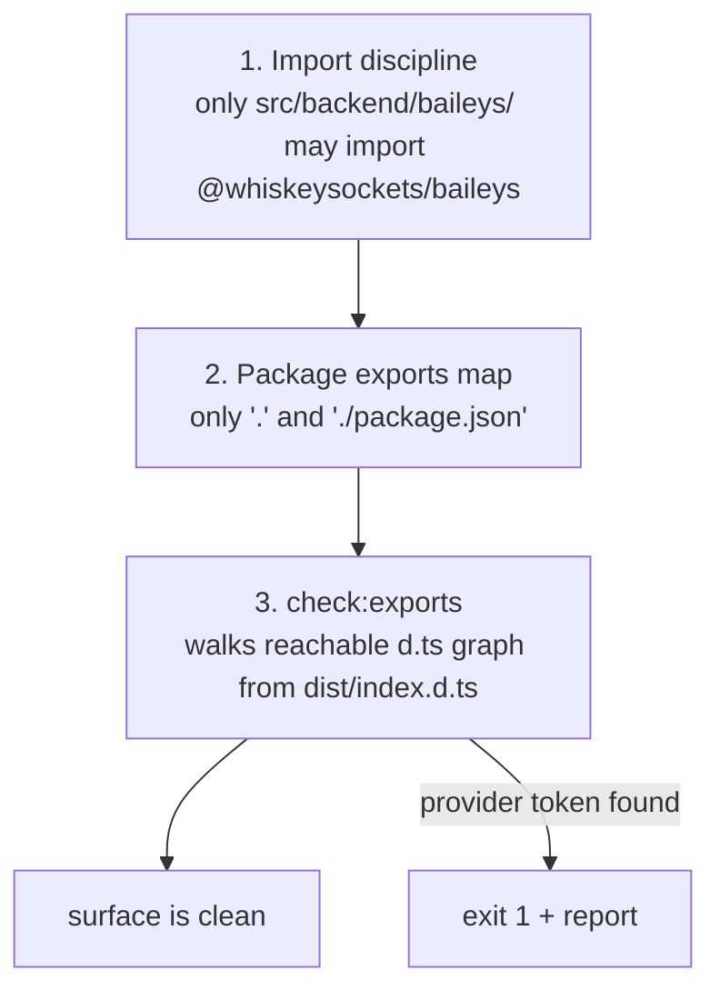

# Public API guard

"No provider types in the public API" is **mechanically enforced**, not a review rule. `npm run check:exports` fails the build the moment Baileys becomes reachable from `dist/index.d.ts`.

```bash
npm run build && npm run check:exports
# check:exports: ok — 40 declaration file(s) reachable from dist/index.d.ts,
# no provider tokens in the public type surface.
```

## The three layers of defense



### 1. Source discipline

By convention (and review), provider imports live exclusively in `src/backend/baileys/`. `createDefaultBackend.ts` is the only core file naming the provider factory, and it does so lazily through the adapter's own entry.

### 2. Exports map

```json
"exports": {
  ".": { "types": "./dist/index.d.ts", "import": "./dist/index.js" },
  "./package.json": "./package.json"
}
```

No `./dist/…` subpaths → consumers physically cannot deep-import internal declarations (which *may* reference provider types — that is fine, they are unreachable).

### 3. The script (`scripts/check-exports.mjs`, 192 lines)

Runs **after build**; exits non-zero with a violation report.

**Forbidden tokens:**

```
@whiskeysockets/baileys · WAMessage · WASocket · IWebMessageInfo · makeWASocket · proto.
```

**Checks, in order:**

| # | Check | Fails when |
| --- | --- | --- |
| 1 | `dist/index.d.ts` exists | build not run |
| 2 | exports map keys | any key besides `.` / `./package.json`; wrong `types` pointer |
| 3 | reachability walk | relative import in a reachable `.d.ts` cannot be resolved (missing declaration) |
| 4 | `index.d.ts` scan | **any** forbidden token anywhere in the root declaration |
| 5 | reachable files: provider import | file text contains `@whiskeysockets/baileys` (forces consumers to resolve provider declarations) |
| 6 | reachable files: export lines | an `export …` line/block mentions a forbidden type name |

How the walk works:

1. parse relative specifiers (`from "./x.js"` / `import("./x.js")`);
2. map emitted `.js` specifiers back to `.d.ts` candidates;
3. BFS from `dist/index.d.ts`, visiting each file once;
4. apply checks 4–6 per visited file.

**Allowed by design:** *unreachable* internal `.d.ts` files may reference Baileys — the exports map keeps consumers away from them. (The reachable graph is ~40 files; `src/backend/baileys/*.d.ts` is not among them because no public type mentions the adapter's internals.)

## Demonstration: a leak fails the build

Inject a provider type into the surface (e.g. `export type { WASocket } from "./backend/baileys/index.js";` in `src/index.ts`), rebuild, and:

```bash
npm run build && npm run check:exports
# check:exports: 2 violation(s):
#   - dist/index.d.ts mentions "WASocket" — provider details leaked into the public API.
#   - dist/backend/baileys/index.d.ts imports the provider module — …
```

Exit code 1 → `npm run verify` fails. Remove the export and the guard goes green again. (This was tested against the real repo — leak in, red; leak out, green.)

## What it does NOT check

| Out of scope | Why |
| --- | --- |
| runtime behavior | types-only concern; `dist/index.js` may import the adapter (it must, to create the default backend) |
| non-exported runtime values | `.d.ts` reachability is the contract consumers see |
| text of JSDoc examples | tokens in comments are tolerated (they don't force type resolution) |

## See also

- [Design decisions #15](/architecture/design-decisions#_15-leaks-are-a-build-failure) — why
- [Workflow](/development/workflow) — `verify` ordering
- [Backend contract](/architecture/backend-contract#enforced-boundaries) — boundary summary
