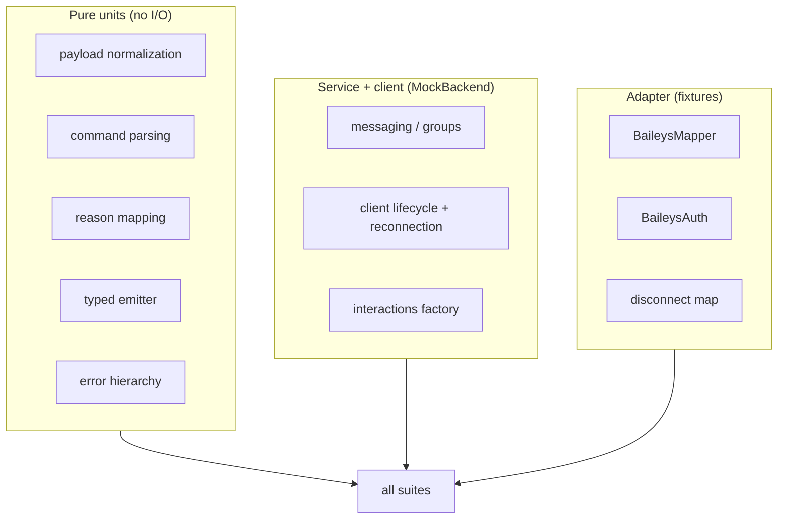

# Testing

How `libwa` is tested: strategy, helpers, suite map, and what each layer guarantees.

## Setup

| Item | Value |
| --- | --- |
| runner | vitest 3 (`npm test` = `vitest run`) |
| location | `tests/**/*.test.ts`, node environment |
| config | `vitest.config.ts` — coverage excludes `src/backend/baileys/**` and `src/index.ts` |
| totals | **14 files, 252 tests**, ~2s wall time |

## Strategy: contract tests, not provider integration



1. **Provider-free core** runs against `MockBackend` — no sockets, no network, deterministic.
2. **Baileys-specific code** is unit-tested at the mapper/auth/disconnect level with **realistic provider fixtures** — no live WhatsApp in CI.
3. **Reconnection** uses fake timers (backoff, exhaustion, cancellation) — no real waiting.

## Helpers

### `tests/helpers/MockBackend.ts` (299 lines)

```ts
class MockBackend implements WhatsAppBackend { /* … */ }
class CapableMockBackend extends MockBackend { /* adds every optional capability */ }
```

- implements the full mandatory contract (~200 lines — living proof of the [small contract](/architecture/design-decisions#_3-provider-behind-an-interface-with-optional-capabilities) decision);
- records calls (`sentMessages`, `reacted`, …) for assertions;
- programmable failures (throw on `sendMessage`, …);
- `CapableMockBackend` enables the optional methods so capability-gated paths are testable;
- helper `groupMetadataFixture(id)` builds `GroupMetadata`.

### `tests/helpers/fixtures.ts` (95 lines)

Builders for every backend event: `messageEvent`, `reactionEvent`, `messageUpdateEvent`, `groupParticipantsEvent`, `groupUpdateEvent`, `referenceFixture` — each with `Partial<…>` overrides so tests only spell the fields they care about.

## Suite map

| Suite | Tests | Covers |
| --- | --- | --- |
| `client.test.ts` | 33 | state machine, dispatch order, group metadata ensure (≤60s TTL, in-flight dedupe, failure backoff, event patching without refetch), middleware integration, error routing, login deferred, destroy/logout, reconnect (fake timers), pairing-code flow |
| `baileys-mapper.test.ts` | 52 | every content kind, wrappers (ephemeral/view-once/edit/device-sent), timestamps, JID normalization, references, mentions, stub filtering, LID ↔ phone id-pair capture, participant usernames, content riding along with sender-key distribution |
| `messaging.test.ts` | 18 | send target resolution, quotes, mentions, react/edit/delete, capability errors, entity reconstruction from `BackendSentMessage` |
| `interactions.test.ts` | 22 | guards/narrowing, factory classification, subclass fields, `interaction.member` (roles, cross-scheme, metadata-missing), `reply()` |
| `commands.test.ts` | 13 | name/alias validation, duplicates, parse algorithm, case folding |
| `baileys-auth.test.ts` | 11 | `AuthenticationState` ⇄ store round-trips, coalescing, buffer JSON, app-state key revival |
| `payload.test.ts` | 10 | `normalizeReplyContent`: empty/ambiguous/caption/media, mention merging |
| `session.test.ts` | 10 | file store atomicity, id validation, corrupt JSON, memory store |
| `users.test.ts` | 30 | `client.users`: id-pair recording (messages/metadata/membership), capability and capability-less resolution, scheme guards, error propagation, `fetch` (formats/capabilities/lookups), push-name memory across id-only payloads, profile enrichment (`pictureUrl`/`about`/`accountType`) |
| `groups.test.ts` | 21 | fetch/apply metadata, `ensure` cache (fetch-once, TTL window, in-flight dedupe, failure backoff), membership-change application (add/remove/promote/demote, cross-scheme, idempotent), participants ops, rename/description, unsupported paths, bare group ids, `Group.member` lookups (ids, users, cross-scheme) |
| `errors.test.ts` | 8 | codes, `cause`, `toError`, `rethrowAsBackendError` passthrough/wrap |
| `baileys-disconnect.test.ts` | 8 | Boom codes, HTTP statuses, network errnos → `DisconnectReason` |
| `typed-event-emitter.test.ts` | 11 | on/once/off, ordering, snapshots, error hook, recursion safety |
| `middleware.test.ts` | 5 | ordering, skip semantics, double-`next()` guard, throw propagation |

## What we test (guarantees)

- **Dispatch order**: middleware → command → listeners, including gate-skips still notifying listeners.
- **Failure isolation**: a throwing listener/command/middleware produces an `error` event (with right context) and nothing else — plus the `error`-listener recursion guard.
- **Reconnection policy**: fatal set honored, attempts exhausted, `reconnect: false`, backoff formula, counter reset on open, timer cancellation on `destroy()`.
- **Validation paths**: each validation rule is exercised for the right input — assertions use the error class, `error.code`, or a regex on the constructor message.
- **Identity lookups**: `client.users.fetch` accepted formats, capability-missing errors, lid resolution chains (pair → capability → undefined), push-name memory flowing to id-only payloads, and profile enrichment (defaults/types, normalization, unsupported/propagation paths).
- **Group context**: metadata resolves through `client.groups.ensure` — a ≤60s cache with one in-flight fetch per group; failures back off for the window and dispatch over cached state + a warning; membership/update events patch the cache before the interaction builds; `interaction.member` / `Group.member` answer roles across both id schemes.
- **Mapping fidelity**: provider fixtures → exact `MessageContent` shapes (the biggest suite — the mapper is the highest-risk surface).
- **Store semantics**: atomic writes, per-slot serialization, `null` for missing, `ERR_SESSION_ID` / `ERR_SESSION_CORRUPT`.
- **No leaks**: `check:exports` (separate stage) proves the surface stays provider-free.

## Conventions inside tests

- import internals via `src/…` paths (only the root is public — see [Public API guard](/development/public-api-guard));
- use `Partial<…>` overrides in fixtures instead of hand-building full payloads;
- fake timers for anything involving backoff;
- no network, no filesystem beyond temp dirs (session tests use `node:os` temp or in-memory paths);
- assert the error class and `error.code` where stable; regex on message text for exact constructor messages.

## Running subsets

```bash
npx vitest run tests/client.test.ts
npx vitest run -t "reconnect"          # by test name
npm run test:watch                      # watch mode
```

## Coverage config

```ts
coverage: {
  reportsDirectory: "coverage",
  include: ["src/**/*.ts"],
  exclude: ["src/backend/baileys/**", "src/index.ts"],
}
```

The Baileys directory is excluded from coverage pressure (it is exercised by fixture-driven suites and would otherwise demand untestable socket-level code); `index.ts` is pure re-exports.

## See also

- [Workflow](/development/workflow) — where tests sit in `verify`
- [Repository](/development/repository) — file map
