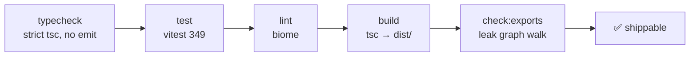

# Workflow

Daily commands for developing `libwa.js` — from quick loops to the full gate.

## Scripts

| Command | What it runs | When |
| --- | --- | --- |
| `npm run typecheck` | `tsc -p tsconfig.json --noEmit` (src + tests + examples + vitest config) | any time; catches `exactOptionalPropertyTypes` issues early |
| `npm test` | `vitest run` — single run | before commits |
| `npm run test:watch` | `vitest` watch mode | during development |
| `npm run test:coverage` | `vitest run --coverage` (v8) | when auditing coverage |
| `npm run lint` | `biome check .` (format + lint + import order) | before commits |
| `npm run lint:fix` | `biome check --write .` | autofix |
| `npm run format` | `biome format --write .` | formatting-only pass |
| `npm run build` | `node scripts/clean-dist.mjs && tsc -p tsconfig.build.json` → clean `dist/` (js, d.ts, maps) | before `check:exports` / publishing |
| `npm run check:exports` | `node scripts/check-exports.mjs` (leak guard) | after build |
| **`npm run verify`** | typecheck → test → lint → build → check:exports | **the gate** — run before every commit |
| `npm run prepare` | `npm run build` | automatically on `npm install` from a git checkout |
| `npm run prepublishOnly` | `npm run verify` | automatically before `npm publish` |

```bash
npm run verify
# typecheck ✓  tests 349 ✓  lint ✓  build ✓  check:exports ✓
```

## Suggested loops

**Implementing a feature**

```bash
npm run test:watch          # red → green
npm run typecheck           # strictness while you go
npm run lint:fix            # before committing
```

**Touching the public surface**

```bash
npm run verify              # never skip check:exports after index.ts edits
```

**Provider/adapter work** (`src/backend/baileys/`)

```bash
npx vitest run tests/baileys-mapper.test.ts tests/baileys-auth.test.ts tests/baileys-disconnect.test.ts tests/baileys-backend.test.ts
npm run verify              # adapter is still the only provider importer
```

**Docs work** (this site)

```bash
cd ../libwa.js-docs
npm run dev                 # http://localhost:5173
npm run build               # production bundle
```

## Verification stages explained



| Stage | Catches |
| --- | --- |
| typecheck | type errors incl. `exactOptionalPropertyTypes`, `noUncheckedIndexedAccess` misuse, bad `imports` in examples |
| test | behavior regressions (reconnection, dispatch, mapping, stores) |
| lint | format drift, `any`, non-null assertions, import order |
| build | emit-only issues (declarations, `rootDir` violations) |
| check:exports | provider types reachable from `dist/index.d.ts` |

None of the stages is optional in `verify`; the repo treats a failing stage as "not done".

## Continuous integration

`.github/workflows/ci.yml` (in the libwa.js repo) runs the same gate outside a laptop: on **pushes to `main`** and on **pull requests** it checks out the repo, sets up **Node 20** (with npm cache), runs `npm ci`, then `npm run verify` — typecheck, tests, lint, build, `check:exports`. There is no CI-only logic: if `npm run verify` is green locally, CI is green.

## Git hygiene (repo practice)

- stage only intended files; never commit `dist/` or `.libwa.js/` (both ignored);
- message style: short imperative line, scope when useful (`fix: guard login rejection without listeners`);
- no commits during `verify` failures — fix forward, don't amend broken commits.

## Publishing checklist

1. `npm run verify` green;
2. version bump in `package.json` (`files` already ships `dist` + docs);
3. `npm publish` (registry config assumed local);
4. examples + README still match the surface (they compile as part of typecheck).

## See also

- [Repository](/development/repository) — file map
- [Testing](/development/testing) — what the suites cover
- [Public API guard](/development/public-api-guard) — last stage in depth
