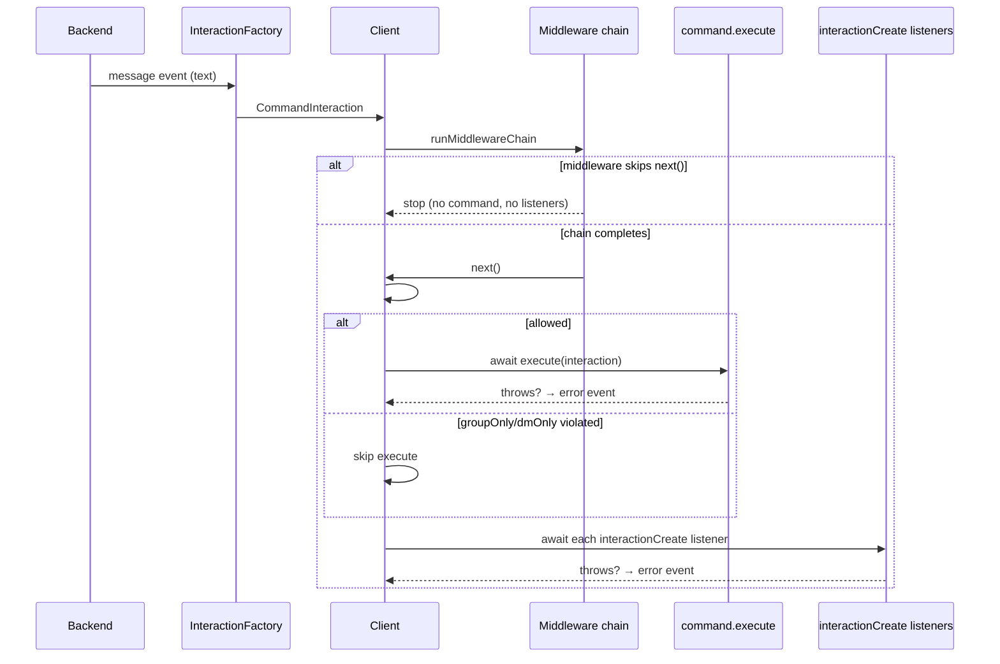

# Commands

libwa ships a complete command system: prefixes, aliases, typed arguments, scope guards, and a registry you can query to build help commands.

## Registering commands

Commands live on [`client.commands`](/reference/commands) — a [`CommandRegistry`](/reference/commands#commandregistry) instance:

```ts
import { Client } from "libwa";

const client = new Client({ commands: { prefix: ["!", "/"] } });

client.commands.register({
  name: "echo",
  description: "Repeats your text",
  aliases: ["say"],
  category: "fun",
  execute: (interaction) => {
    const text = interaction.rawArgs.length > 0 ? interaction.rawArgs : "…nothing to echo.";
    void interaction.reply(text);
  },
});

client.commands.registerAll([
  { name: "ping", description: "Health check", execute: (i) => void i.reply("pong") },
  {
    name: "members",
    description: "Group member count",
    groupOnly: true,           // enforced during dispatch
    async execute(i) {
      if (!i.isFromGroup()) return;
      const group = await i.chat.client.groups.fetch(i.chat.id);
      await i.reply(`Members: ${group.memberCount ?? "?"}`);
    },
  },
]);
```

### `CommandDefinition`

<ApiTable
  :rows="[
    { name: 'name', type: 'string', description: 'Command name without prefix. Matched case-insensitively: the registry key and parsed names are lowercased, while definition.name keeps its original casing. Pattern (applied to the lowercased value): /^[a-z0-9][a-z0-9_-]{0,31}$/ (1-32 chars, starts with a letter or digit).' },
    { name: 'description', type: 'string', def: 'undefined', description: 'Short help text. Free-form — the library never renders help for you.' },
    { name: 'aliases', type: 'readonly string[]', def: 'undefined', description: 'Alternative names. Each must pass the same name pattern and must not collide with any existing command or alias.' },
    { name: 'category', type: 'string', def: 'undefined', description: 'Grouping label for your own help listings. libwa stores it but does not use it.' },
    { name: 'groupOnly', type: 'boolean', def: 'false', description: 'When true, execute() runs only for interactions in group chats.' },
    { name: 'dmOnly', type: 'boolean', def: 'false', description: 'When true, execute() runs only in direct chats.' },
    { name: 'execute', type: '(interaction: CommandInteraction) => void | Promise<void>', description: 'Runs when the command matches. Rejections are caught and reported through the client error event — dispatch continues with interactionCreate listeners.' }
  ]"
/>

::: tip Commands are messages
Inside `execute`, the interaction is a `CommandInteraction`, which **is** a `MessageInteraction`: `interaction.text`, `interaction.message`, `interaction.reply()`, media guards — all available. `interaction.content` is guaranteed `TextContent`.
:::

## Registration rules

`register()` validates eagerly and throws [`ValidationError`](/reference/errors#validationerror) with specific codes:

| Situation | Code | Example message |
| --- | --- | --- |
| Name/alias fails `^[a-z0-9][a-z0-9_-]{0,31}$` | `ERR_INVALID_COMMAND_NAME` | `Invalid command name "Ping!": use 1-32 chars from [a-z0-9_-]...` |
| Name already registered | `ERR_DUPLICATE_COMMAND` | `Command "ping" is already registered.` |
| Alias collides with a command or another alias | `ERR_DUPLICATE_COMMAND` | `Alias "p" conflicts with an existing command.` |

Names are stored lowercase as registry keys; `register({ name: "Ping" })` keys the command as `"ping"` while `definition.name` stays `"Ping"` (the pattern test runs on the lowercased value, and `parse()` always yields lowercase names).

```ts
try {
  client.commands.register({ name: "Ping!", execute: () => {} }); // "ping!" → invalid
} catch (error) {
  console.error((error as Error).message);
}
```

## Parsing rules

Parsing happens per incoming message inside the [`InteractionFactory`](/reference/interactions#interactionfactory), *before* dispatch:

1. Command parsing must be enabled (`commands` option is not `false`).
2. The message content must be `kind: "text"` — media never parses as a command.
3. If `ignoreSelf` is on and the message is from the bot itself, skip parsing.
4. The text must start with one of the configured prefixes (checked in order).
5. Everything after the prefix is trimmed; an empty body is not a command.
6. The first whitespace-delimited token is the command name; it must match `COMMAND_NAME_PATTERN` or the message stays a plain `MessageInteraction`.
7. The name is lowercased; `args` = remaining tokens split on whitespace; `rawArgs` = the untouched remainder (or `""`).
8. The registry resolves name-or-alias → definition (possibly `undefined`).

```ts
client.commands.parse("!Ping   a   b c", ["!"]);
// {
//   prefix: "!",
//   name: "ping",
//   args: ["a", "b", "c"],
//   rawArgs: "a   b c",        // original spacing preserved
//   command: <definition>       // or undefined when unregistered
// }

client.commands.parse("hello", ["!"]);            // null — no prefix
client.commands.parse("!  ", ["!"]);              // null — empty body
client.commands.parse("!not a command!!", ["!"]); // name "not" + args — but
// "!42 bad" style names must match the pattern: "42" is valid ([a-z0-9] start).
```

Raw text that never parses as a command is dispatched as a normal `MessageInteraction` — a message like `!` alone, or `! bad-name`, is *not* silently swallowed (unless the leading token fails the pattern, in which case it arrives as a message).

### Multi-prefix

```ts
new Client({ commands: { prefix: ["!", "/", "?"] } });
// "!ping", "/ping", "?ping" all match — first matching prefix in array order wins.
```

### Disabling parsing

```ts
new Client({ commands: false });
```

`client.commands` still exists for registration, but the factory never promotes messages to `CommandInteraction`.

## Dispatch: how a command runs



Key behaviors:

- **Middleware runs first.** A rate limiter that skips `next()` also skips commands.
- **`groupOnly` / `dmOnly` are enforced by the client**, not by the factory: a command invoked in the wrong chat is simply not executed, but `interactionCreate` listeners still observe the interaction (so logging/help still work).
- **Errors are isolated.** A throwing command reports `error` with context `command "<name>"`; listeners still run.

```ts
client.on("error", (error) => {
  console.error(error.message); // e.g. [command "members"]: ...
});
```

## Scope guards

```ts
client.commands.register({
  name: "unmute",
  groupOnly: true,
  execute: (i) => void i.reply("works only in groups"),
});

client.commands.register({
  name: "register",
  dmOnly: true,
  execute: (i) => void i.reply("works only in direct chats"),
});
```

Enforcement logic (`Client.#commandAllowed`):

```ts
if (command.groupOnly === true && !interaction.isFromGroup()) return false;
if (command.dmOnly === true && !interaction.isFromDirectChat()) return false;
return true;
```

Both set? The command can never run (nothing stops you from declaring it — it is just dead). Prefer one.

## Building a help command

The registry exposes enough to generate help yourself:

```ts
client.commands.register({
  name: "help",
  description: "Lists available commands",
  execute: (i) => {
    const lines = client.commands
      .list()
      .map((cmd) => {
        const alias = cmd.aliases?.length ? ` (${cmd.aliases.join(", ")})` : "";
        const scope = cmd.groupOnly ? " [groups]" : cmd.dmOnly ? " [DMs]" : "";
        return `!${cmd.name}${alias} — ${cmd.description ?? "no description"}${scope}`;
      });
    void i.reply(lines.join("\n") || "No commands registered.");
  },
});
```

::: info Line breaks
`reply` with a string sends a text message; long strings are sent as-is (WhatsApp wraps them). libwa does not split messages.
:::

## Registry API summary

| Method | Purpose |
| --- | --- |
| `register(def)` | Validate + add; returns `this` (chainable). |
| `registerAll(iterable)` | Register many; stops at the first invalid one (partial registration possible). |
| `unregister(name)` | Remove by name or alias (also removes its aliases); returns whether the canonical command existed. |
| `get(name)` | Canonical name lookup only (aliases do **not** match). |
| `resolve(name)` | Name **or** alias → definition. |
| `has(name)` | `resolve(name) !== undefined`. |
| `list()` | Snapshot array in registration order. |
| `size` | Number of registered commands (aliases excluded). |
| `clear()` | Remove everything. |
| `parse(text, prefixes)` | Standalone parser (see above). |

Full signatures: [CommandRegistry reference](/reference/commands#commandregistry).

## Edge cases & pitfalls

- **Case insensitivity:** commands are always lowercased — `!PING` invokes `ping`.
- **Prefix inside text:** only a *leading* prefix counts (`hello !ping` is a message).
- **`rawArgs` spacing:** preserved verbatim after trimming ends — use `args` for token logic.
- **Aliases are global:** `alias: "ping"` collides with a command named `ping`. The reverse is *not* checked — a new command name only collides with existing commands, so it can shadow an existing alias (`resolve()` prefers the alias). Keep names unique.
- **Unknown prefixed commands:** still `CommandInteraction`s with `command === undefined` — handle in listeners or via a fallback command check:

  ```ts
  client.on("interactionCreate", (i) => {
    if (i.isCommand() && i.command === undefined) {
      void i.reply(`Unknown command: ${i.name}`);
    }
  });
  ```

- **Self messages:** without `ignoreSelf: true`, your own prefixed replies re-enter the parser (useful for prefix-triggered flows; footgun for echo-y bots).

## Related

- [Commands reference](/reference/commands) — full registry/definition API
- [CommandInteraction](/reference/interactions#commandinteraction) — the interaction type
- [Middleware](/guide/middleware) — gating commands before execution
- [Reference example](/guide/examples#middleware-filters-ts-—-middleware-filters-reactions)
