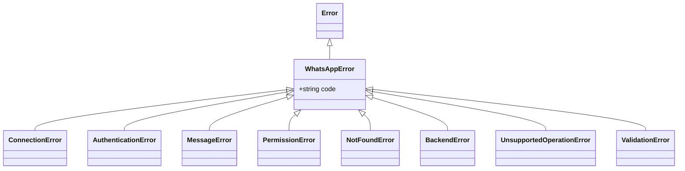
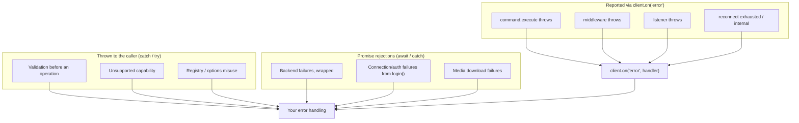

# Error handling

libwa guarantees that **every error it raises extends `WhatsAppError`** with a stable machine-readable `code`. Provider-specific error classes never reach application code.

## The hierarchy



| Class | Default `code` | Meaning |
| --- | --- | --- |
| [`WhatsAppError`](/reference/errors#whatsapperror) | `ERR_WHATSAPP` | Root class; base of everything the library throws. |
| [`ConnectionError`](/reference/errors#connectionerror) | `ERR_CONNECTION` | Connection could not be established/lost, or lifecycle misuse (login after destroy, backend not connected). |
| [`AuthenticationError`](/reference/errors#authenticationerror) | `ERR_AUTHENTICATION` | Login failed; stored session unusable; fatal disconnect during `login()`. |
| [`MessageError`](/reference/errors#messageerror) | `ERR_MESSAGE` | Send/edit/delete/download failed at the provider. |
| [`PermissionError`](/reference/errors#permissionerror) | `ERR_PERMISSION` | Not allowed (401/403-style provider responses, admin-only operations). |
| [`NotFoundError`](/reference/errors#notfounderror) | `ERR_NOT_FOUND` | Chat/group/message could not be found (404, expired media cache). |
| [`BackendError`](/reference/errors#backenderror) | `ERR_BACKEND` | Any unknown provider failure wrapped by `rethrowAsBackendError`. |
| [`UnsupportedOperationError`](/reference/errors#unsupportedoperationerror) | `ERR_UNSUPPORTED` | The active backend does not implement the capability. |
| [`ValidationError`](/reference/errors#validationerror) | `ERR_VALIDATION` | The library was used incorrectly (bad argument, bad state). |

All of them are exported from the package root:

```ts
import {
  WhatsAppError,
  ConnectionError,
  AuthenticationError,
  MessageError,
  PermissionError,
  NotFoundError,
  BackendError,
  UnsupportedOperationError,
  ValidationError,
} from "libwa";
```

## Anatomy

```ts
class WhatsAppError extends Error {
  readonly code: string;
  constructor(message: string, options?: { code?: string; cause?: unknown });
}
```

- `message` — human-readable, includes operation context (`"Failed to send message: …"`).
- `code` — stable identifier; **branch on this or on the class**, never on message text.
- `cause` — the underlying provider error when there is one (`error.cause`, standard `Error` cause).
- `error.name` — the class name (`"ValidationError"`, `"BackendError"`, …) via `new.target.name`.

```ts
try {
  await client.messages.send(chat, "");
} catch (error) {
  if (error instanceof ValidationError) {
    console.log(error.code); // "ERR_EMPTY_MESSAGE"
    return;
  }
  throw error;
}
```

## Where errors come from



### 1. Thrown synchronously / rejected promises (you can catch)

| Call | Notable errors |
| --- | --- |
| `new Client(options)` | `ValidationError` `ERR_INVALID_PREFIX` |
| `client.login()` | rejects with `AuthenticationError` (fatal/session) or `ConnectionError` (connect failed, retries off/exhausted before ready); resolves after first `ready` |
| `client.requestPairingCode(phone)` | `ValidationError` `ERR_INVALID_PHONE` / `ERR_UNSUPPORTED` |
| `client.destroy()` | never rejects — internal failures are reported through `error` (context `disconnect during destroy`) |
| `client.logout()` | backend logout/disconnect failures → `error`; a rejecting `sessionStore.clear()` rejects the call |
| `client.messages.send(...)` | `ValidationError` (payload rules) / `MessageError` (bundled adapter) / `BackendError` |
| `client.messages.react/edit/delete` | `ValidationError` / `UnsupportedOperationError` / `MessageError` |
| `client.users.fetch(...)` | `ValidationError` `ERR_INVALID_USER_ID` / `UnsupportedOperationError` (backend can't check) / `BackendError` |
| `client.users.pictureUrl/about/accountType(...)` | `ValidationError` `ERR_INVALID_USER_ID` / `UnsupportedOperationError` (backend can't answer) / `BackendError` — absent/private data resolves `undefined` instead of throwing |
| `client.groups.*` | `ValidationError` / `UnsupportedOperationError` / `NotFoundError` / `PermissionError` / `BackendError` |
| `attachment.download()` | `NotFoundError` (evicted from cache) / `MessageError` (download failure) |
| `client.commands.register(...)` | `ValidationError` `ERR_INVALID_COMMAND_NAME` / `ERR_DUPLICATE_COMMAND` |
| session stores | `ValidationError` `ERR_SESSION_ID` / `ERR_SESSION_CORRUPT` |
| Baileys auth load | `ValidationError` (corrupt/unsupported/missing-creds session) — surfaces from `login()` |

### 2. Reported through `error` (no rejection reaches you)

- `command.execute` rejections → context `command "<name>"`
- middleware throws → context `middleware`
- listener rejections → context `listener for "<event>"` (except `interactionCreate` handlers → `interactionCreate listener`)
- reconnect exhausted → `ConnectionError("Gave up reconnecting after N attempt(s) (reason).")`
- backend logout failures during `client.logout()` → context `backend logout`

```ts
client.on("error", (error) => {
  if (error instanceof PermissionError) return warnUser();
  if (error instanceof MessageError) return retryLater();
  logger.error({ err: error }, "unhandled libwa error");
});
```

::: warning Error-listener contract
If your `error` listener throws, that failure is only logged (`[error listener] …`) — the event does not re-fire. Keep the listener total.
:::

## The wrapping rule

Services never leak provider errors. `rethrowAsBackendError(operation, error)`:

```ts
if (error instanceof WhatsAppError) throw error;      // pass library errors through
throw new BackendError(`${operation}: ${msg}`, { cause: error }); // wrap the rest
```

Library-raised failures are `WhatsAppError` subclasses, so `catch (e) { if (e instanceof WhatsAppError) ... }` covers them. A raw `Error` can still escape unwrapped from `connect()` (provider or custom-backend throws pass through `toError` unchanged) — branch on `instanceof Error` for the rest. `BackendError.cause` holds the original for debugging (log it, don't branch on it).

## Capability errors

Optional backend features fail with `UnsupportedOperationError` **before** any network I/O:

```ts
try {
  await message.react("👍");
} catch (error) {
  if (error instanceof UnsupportedOperationError) {
    // Backend "xxx" does not support reactions.
  }
}
```

Feature-detect up front if you prefer:

```ts
if (client.backend.react) {
  await message.react("👍");
}
```

## Validation codes

Master list of `ValidationError` codes:

| Code | Raised by | Condition |
| --- | --- | --- |
| `ERR_INVALID_PREFIX` | `resolveClientOptions` | empty prefix list / empty-string prefix |
| `ERR_INVALID_COMMAND_NAME` | `CommandRegistry.register` | name/alias fails `^[a-z0-9][a-z0-9_-]{0,31}$` |
| `ERR_DUPLICATE_COMMAND` | `CommandRegistry.register` | duplicate command or alias collision |
| `ERR_EMPTY_MESSAGE` | `normalizeReplyContent`, `MessageService.edit` | empty string/text/edited text |
| `ERR_AMBIGUOUS_MESSAGE` | `normalizeReplyContent` | more than one body in payload |
| `ERR_INVALID_CAPTION` | `normalizeReplyContent` | caption without image/video/document |
| `ERR_EMPTY_MEDIA` | `normalizeReplyContent` | zero-byte attachment |
| `ERR_EMPTY_REACTION` | `MessageService.reactTo` | empty emoji string |
| `ERR_EMPTY_GROUP_NAME` | `GroupService.rename` | empty name |
| `ERR_EMPTY_USER_LIST` | `GroupService.#participants` | no users |
| `ERR_INVALID_USER_ID` | `UserService.fetch` | id is not a phone JID (…@s.whatsapp.net / …@c.us, device suffix ok), bare digits (optional `+`), or `…@lid` |
| `ERR_INVALID_PHONE` | `Client.requestPairingCode` | not `^\d{7,15}$` |
| `ERR_UNSUPPORTED` | `Client.requestPairingCode` | backend lacks pairing codes |
| `ERR_SESSION_ID` | `FileSessionStore` | slot id fails `^[A-Za-z0-9_-]{1,64}$` |
| `ERR_SESSION_CORRUPT` | `FileSessionStore.load` | session file is not valid JSON |
| `ERR_ENTITY_CONSTRUCTION` | `new Chat(...)` | constructing a plain `Chat` with `kind: "group"` |

## Disconnects

Connection loss is **not** an `error` event — it arrives on `disconnect` with a [`DisconnectReason`](/reference/disconnect-reason):

```ts
import { DisconnectReason, FATAL_DISCONNECT_REASONS } from "libwa";

client.on("disconnect", (reason) => {
  if (FATAL_DISCONNECT_REASONS.has(reason)) {
    // loggedOut / badSession / connectionReplaced / forbidden → re-pair
    await client.logout().catch(() => undefined);
    process.exit(1);
  }
  // transient reason, attempts exhausted (or reconnect: false) → decide yourself
});
```

| Reason class | Meaning | Your move |
| --- | --- | --- |
| fatal (4 reasons) | session dead — never auto-retried | re-pair (QR/pairing), notify |
| transient, attempts left | client already retrying | watch `reconnecting`, stay alive |
| transient, exhausted | gave up (`error` fired first) | alert + manual backoff, or raise `reconnect.attempts` |

While `login()` is pending, the same conditions reject it (`AuthenticationError` / `ConnectionError`) **and** still emit `disconnect` — handle both paths.

## Logging

The default logger is `nullLogger` — **the library prints nothing**. Two independent channels:

| Channel | Use for |
| --- | --- |
| `ClientOptions.logger` | internal diagnostics: reconnects, backend/provider detail, failure contexts |
| `error` event | programmatic reactions: alerts, metrics, user-facing messages |

```ts
import { Client, createConsoleLogger, WhatsAppError } from "libwa";

const client = new Client({
  logger: createConsoleLogger("bot"), // "bot error: …"
  commands: { prefix: "!" },
});
client.on("error", (e) =>
  metrics.increment("bot.error").tag("code", e instanceof WhatsAppError ? e.code : "UNKNOWN"),
);
```

Rules of thumb:

- dev: `createConsoleLogger(prefix)` or a pino-backed `Logger`;
- prod: always inject a real logger — otherwise failures exist only in the `error` event, and with no listeners, nowhere at all;
- logger calls are unguarded — a throwing logger propagates into the triggering operation, so keep your `Logger` total (never throw).

## Patterns

### Fail fast at startup

```ts
try {
  await client.login();
} catch (error) {
  if (error instanceof AuthenticationError) {
    console.error("session invalid — delete .libwa/ and re-pair");
    process.exit(1);
  }
  throw error;
}
```

### Never let handlers throw unlogged

```ts
client.on("interactionCreate", async (i) => {
  try {
    await respond(i);
  } catch (error) {
    // option A: swallow with context
    console.error("respond failed", i.id, error);
    // option B: rethrow → also reported by the dispatcher as listener context
  }
});
```

(Throwing is fine — the dispatcher catches it. Do both only if you want extra context.)

### Inspecting wrapped causes

```ts
} catch (error) {
  if (error instanceof BackendError) {
    console.error(error.message, "→", error.cause);
  }
}
```

## Related

- [Errors reference](/reference/errors) — every class, constructor and helper (`toError`, `rethrowAsBackendError`)
- [Configuration → validation](/guide/configuration#validation-performed-at-construction)
- [Troubleshooting](/troubleshooting) — symptom-driven diagnosis
