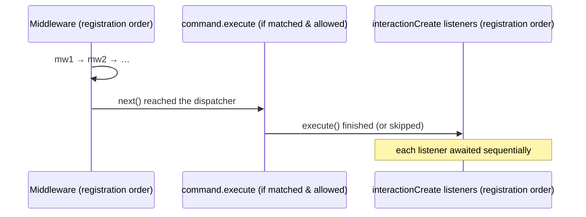

# Events

The client exposes a small, closed, fully-typed event surface via `client.on(...)`. There are exactly seven events — raw provider events are never surfaced.

## The event map

```ts
import type { ClientEvents } from "libwa";

type ClientEvents = {
  ready: [client: Client];
  interactionCreate: [interaction: Interaction];
  error: [error: Error];
  disconnect: [reason: DisconnectReason];
  reconnecting: [attempt: number, delayMs: number];
  qr: [qr: string];
  pairingCode: [code: string];
};
```

| Event | Arguments | Fired when |
| --- | --- | --- |
| `ready` | `(client)` | The connection opens — first time **and** after every successful reconnect. `client.me` is already populated. |
| `interactionCreate` | `(interaction)` | A backend event became an interaction **and** passed the middleware pipeline. All listeners run after any matched command has executed. |
| `error` | `(error)` | Something failed inside the library, middleware, a command, or a listener. Never fired for unhandled rejections of your own code. |
| `disconnect` | `(reason)` | The connection closed and will **not** be retried (fatal reason, `reconnect: false`, or attempts exhausted). |
| `reconnecting` | `(attempt, delayMs)` | A retry was scheduled. `attempt` starts at 1; `delayMs` is the backoff wait. |
| `qr` | `(qr)` | A QR payload is available (QR login flow; `pairingCode` covers the other path). |
| `pairingCode` | `(code)` | A pairing code is available (auto-requested when `auth.pairingPhoneNumber` is set, or via `client.requestPairingCode()`). |

## Registering listeners

```ts
const stop = client.on("interactionCreate", (i) => {
  console.log(i.type);
}); // → Unsubscribe function

client.once("ready", (c) => {
  console.log(`hello ${c.me?.displayName}`);
});

stop();                 // remove just this listener
client.off("interactionCreate", fn); // remove a specific listener
client.off("interactionCreate");     // remove ALL listeners for the event
```

All three methods return `void` (except `on`/`once`, which return `Unsubscribe = () => void`).

### Async listeners

Listeners may be async. Each is awaited in registration order (the dispatcher awaits it), but **failures never crash the process**:

```ts
client.on("interactionCreate", async (i) => {
  await handle(i); // throws
});
```

The rejection is caught and routed to `#handleError`, which:

1. logs `[<context>] <message>` through the injected `logger`, then
2. emits `error` **if at least one `error` listener exists**.

::: warning No error listener → log-only
If you never subscribe to `error`, failures are only visible through your `logger` (silent by default). Production bots should always register `client.on("error", ...)`.
:::

### The `error` event never re-enters itself

If an `error` **listener itself throws**, the failure is logged as `[error listener] <message>` and *not* re-emitted — no infinite recursion:

```ts
client.on("error", (error) => {
  throw new Error("boom"); // logged, not re-emitted
});
```

### Error contexts

The `error` event receives a plain `Error` (usually a `WhatsAppError` subclass). The originating context is stringified into the log line, not the event payload. The full set of contexts: `connect`, `disconnect during destroy`, `backend logout`, `disconnect after logout`, `command "<name>"`, `middleware`, `interaction build`, `reconnection`, `reconnect exhausted`, `login`, `listener for "<event>"`.

## Ordering guarantees

For a single interaction:



Across events: backend events dispatch asynchronously (`void this.#dispatch(...)`), so **two events can interleave** if an earlier dispatch awaits long-running middleware. If strict serialization matters, guard shared state yourself.

## Common patterns

### Ignore your own messages

```ts
client.on("interactionCreate", (i) => {
  if (i.isFromMe) return;
  // ...
});
```

### One handler per interaction kind

```ts
const handlers: Array<(i: Interaction) => void | Promise<void>> = [];

client.on("interactionCreate", async (i) => {
  for (const handler of handlers) await handler(i);
});
```

### Teardown

```ts
const stopReady = client.on("ready", onReady);
// later:
stopReady();
// or everything:
client.destroy(); // also detaches backend listeners
```

### Startup/QR flow

```ts
client.on("qr", (qr) => writeQrToTerminal(qr));
client.on("pairingCode", (code) => console.log(code));
client.on("ready", () => console.log("online"));
client.on("reconnecting", (attempt, delay) =>
  console.warn(`retry ${attempt} in ${delay}ms`));
client.on("disconnect", (reason) => console.error("gone:", reason));

await client.login();
```

## Built-in listener errors

The client installs its own `onListenerError` hook on the internal [`TypedEventEmitter`](/reference/typed-event-emitter). You never configure it directly; the mapping is:

| Throwing listener | Result |
| --- | --- |
| any event except `error` | log + emit `error` |
| `error` event | log only |

For the raw emitter (used by backends and available for your own code), see the [TypedEventEmitter reference](/reference/typed-event-emitter).

## Related

- [Client events reference](/reference/client-events) — exact type signatures
- [Client reference](/reference/client#on-once-off) — `on` / `once` / `off` methods
- [Middleware guide](/guide/middleware) — gate `interactionCreate` before listeners
- [Reconnection architecture](/architecture/reconnection) — when `reconnecting`/`disconnect` fire
