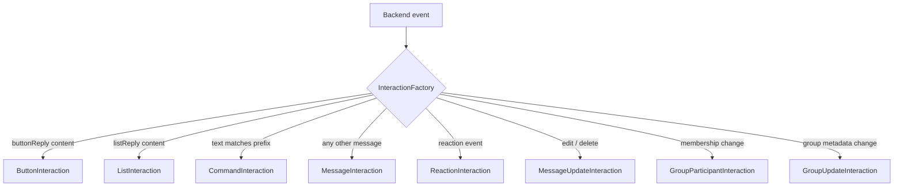

# Interactions

Every meaningful event in WhatsApp reaches your bot as an **`Interaction`**. This page explains the model, the guards, and each concrete subclass.

## The base class

All interactions extend the abstract [`Interaction`](/reference/interactions#interaction):

```ts
abstract class Interaction {
  abstract readonly type: InteractionType;   // discriminator
  readonly id: string;
  readonly timestamp: Date;
  readonly client: Client;
  readonly chat: Chat;
  readonly group: Group | undefined;         // defined when isFromGroup()
  readonly author: User | undefined;
  readonly member: GroupMember | undefined;  // author’s role/tag in group (group chats)
  readonly isFromMe: boolean;

  reply(content: ReplyContent): Promise<Message>;

  isMessage(): this is MessageInteraction;
  isCommand(): this is CommandInteraction;
  isReaction(): this is ReactionInteraction;
  isMessageUpdate(): this is MessageUpdateInteraction;
  isGroupParticipantUpdate(): this is GroupParticipantInteraction;
  isGroupUpdate(): this is GroupUpdateInteraction;
  isButton(): this is ButtonInteraction;
  isList(): this is ListInteraction;
  isFromGroup(): this is Interaction & { group: Group };
  isFromDirectChat(): boolean;
}
```

### Identity fields

| Field | Type | Meaning |
| --- | --- | --- |
| `type` | [`InteractionType`](/reference/interactions#interactiontype) | Discriminator (`"message"`, `"command"`, `"reaction"`, …). |
| `id` | `string` | Unique id — the message id for message-ish interactions; a synthetic `` `${chat}:${message}:${action}:${time}` `` for updates; `reaction:<chat>:<msg>:<user>` for reactions; a composed id for group participant events. |
| `timestamp` | `Date` | When the underlying event happened (provider timestamps are converted from seconds; some updates fall back to `new Date()`). |
| `client` | `Client` | The client that produced it — handy for `interaction.client.messages...`. |
| `chat` | `Chat` | Where it happened. Identity is stable: the same chat id always yields the same cached `Chat` instance. |
| `group` | `Group \| undefined` | The group when `isFromGroup()` is true — the same instance as `chat` for group interactions. `undefined` for direct chats. |
| `author` | `User \| undefined` | Who caused it: message author, reactor, group actor. `undefined` when unknown (e.g. group metadata updates have no actor). |
| `member` | `GroupMember \| undefined` | The author's membership in `group` — `{ user, role, tag }`, group-scoped. `undefined` outside group chats, for author-less events, or while group metadata is unknown. See [Group membership](/guide/groups#membership-roles-and-tags). |
| `isFromMe` | `boolean` | True when the logged-in account caused it. |

### `reply()`

```ts
interaction.reply("hello");                        // plain text
interaction.reply({ image: bytes, caption: "hi" }); // structured payload
```

Replies go through [`MessageService.send`](/reference/messaging#send) targeting `interaction.chat`, with a quote attached when the interaction carries a reply target:

- **Message/command interactions** quote the incoming message itself.
- **Reactions** quote the reacted message.
- **Button/list interactions** quote the original prompt when the provider supplied one, otherwise the response message.
- **Group/update interactions** have no reply target — `reply()` sends an unquoted message in the chat.

### Chat-context guards

`isFromGroup()` is a type predicate: inside the guard, `interaction.group` is typed `Group`, so member lists and metadata are directly reachable. `isFromDirectChat()` returns a plain boolean, and `chat.isGroup()` still narrows the chat itself:

```ts
if (interaction.isFromGroup()) {
  const group: Group = interaction.group;          // narrowed
  console.log(group.memberCount, group.members);
}

if (interaction.chat.isGroup()) {
  const group: Group = interaction.chat;           // narrowed
}
```

## Choosing the right interaction



::: info Commands are messages
`CommandInteraction extends MessageInteraction<TextContent>` and `isMessage()` returns `true` for commands as well. Order your guards accordingly — check `isCommand()` **first** if you need to distinguish them.
:::

## MessageInteraction

> Class · [full API](/reference/interactions#messageinteraction)

Produced for every incoming message that is not a button/list reply. Generic over the content type so content guards narrow both `this` and `this.content`.

```ts
client.on("interactionCreate", async (i) => {
  if (!i.isMessage()) return;

  if (i.isImage()) {
    const [attachment] = i.attachments;
    if (attachment) {
      const bytes = await attachment.download();
      console.log(`image, ${bytes.byteLength} bytes`);
    }
    await i.react("📷");
    return;
  }

  if (i.isText()) {
    await i.reply(`You said: ${i.text}`);
  }
});
```

### Accessors

| Member | Type | Notes |
| --- | --- | --- |
| `message` | [`Message`](/reference/entities#message) | The underlying domain message. |
| `author` | `User` | Overridden as always-known. |
| `content` | `C extends MessageContent` | Normalized body; narrowed by content guards. |
| `text` | `string` | `text`, caption, list title, display text, or `""` — never throws. |
| `attachments` | `readonly Attachment[]` | 0 or 1 items. |
| `reference` | `MessageReference \| undefined` | Quoted message, when inline content was delivered. |
| `isReply` | `boolean` | `reference !== undefined`. |
| `isForwarded` | `boolean` | Provider marked it forwarded (score > 0, newsletter/AI forward info). |
| `mentions` | `readonly User[]` | @-mentioned users. |

### Actions

| Method | Behavior |
| --- | --- |
| `reply(content)` | Sends in the same chat, quoting this message. |
| `react(emoji \| null)` | Adds/removes the bot's reaction ([capability-gated](/reference/messaging#react-reactto)). |
| `delete()` | Deletes the message — own messages, or any message if the bot is group admin. |
| `edit(text)` | Edits it (must be the bot's own message); returns an updated `Message`. |

### Content guards

Each guard narrows `content` at compile time:

| Guard | Narrows to |
| --- | --- |
| `isText()` | `TextContent` |
| `isImage()` / `isVideo()` / `isAudio()` / `isDocument()` / `isSticker()` | respective media content |
| `isLocation()` | `LocationContent` |
| `isContact()` | `ContactContent` |
| `isPoll()` | `PollContent` |
| `isMedia()` | `MediaMessageContent` (any content with an `attachment`) |

```ts
if (i.isPoll()) {
  console.log(i.content.name, i.content.options, i.content.selectableCount);
}
if (i.isMedia()) {
  i.content.attachment.mimeType; // narrowed: attachment always exists
}
```

## CommandInteraction

> Class · [full API](/reference/interactions#commandinteraction)

Created when a **text** message starts with a configured prefix and passes command-name validation — whether or not the name is registered.

```ts
client.on("interactionCreate", (i) => {
  if (!i.isCommand()) return;
  console.log(i.name);    // normalized lowercase name, prefix removed
  console.log(i.args);    // ["a", "b"]
  console.log(i.rawArgs); // "a b"
  console.log(i.command); // CommandDefinition | undefined (undefined = unknown command)
});
```

- Parsing rules, name validation, and registry behavior → [Commands](/guide/commands).
- An unknown prefixed command still becomes a `CommandInteraction` (`command === undefined`) so you can answer `Unknown command` yourself.
- Everything on `MessageInteraction` remains available.

## ReactionInteraction

> Class · [full API](/reference/interactions#reactioninteraction)

Someone added or removed a reaction.

```ts
client.on("interactionCreate", async (i) => {
  if (!i.isReaction()) return;

  if (i.isRemoved) {
    console.log(`${i.author?.displayName} removed their reaction`);
    return;
  }

  if (i.emoji === "🔥" && i.author && !i.isFromMe) {
    await i.react("🔥"); // reciprocate (capability-gated)
  }
});
```

<ApiNote kind="info" title="Reaction payloads carry no push name">
Provider reaction events ship only the target key and the emoji — no sender name. `i.author?.name` still answers from the library's **name memory** (the push name seen on that user's earlier messages, under either id scheme); with nothing remembered yet, `displayName` falls back to phone → id.
</ApiNote>

| Member | Notes |
| --- | --- |
| `messageId` | The reacted message. |
| `emoji` | Emoji string, or `null` when the reaction was **removed**. |
| `isRemoved` | Shorthand for `emoji === null`. |
| `author` | The reactor (always known). |
| `react(emoji)` | Reacts to the **same message** (replies would quote it). |

## MessageUpdateInteraction

> Class · [full API](/reference/interactions#messageupdateinteraction)

A message was edited or deleted — surfaced from provider revocation stubs, `message: null` updates, and `messages.delete` events.

```ts
client.on("interactionCreate", (i) => {
  if (!i.isMessageUpdate()) return;

  if (i.isEdit) {
    console.log(`edited ${i.messageId}:`, i.content && "text" in i.content ? i.content.text : "");
  } else if (i.isDelete) {
    console.log(`deleted ${i.messageId}`);
  }
});
```

| Member | Notes |
| --- | --- |
| `messageId` | The affected message. |
| `action` | `"edit"` or `"delete"`. |
| `content` | New content for edits; `undefined` for deletions. |
| `isEdit` / `isDelete` | Convenience booleans. |
| `author` | When known (`undefined` for many bulk deletes). |

## GroupParticipantInteraction

> Class · [full API](/reference/interactions#groupparticipantinteraction)

Membership changes: add, remove, promote, demote — plus `"other"` for unmapped provider actions.

```ts
client.on("interactionCreate", async (i) => {
  if (!i.isGroupParticipantUpdate()) return;

  if (i.isAdd) {
    const names = i.users.map((u) => u.displayName).join(", ");
    await i.reply(`Welcome ${names}!`);
  } else if (i.isRemove && i.isFromMe) {
    console.log("bot removed someone");
  }
});
```

`group` is the [`Group`](/reference/entities#group) entity with **freshly fetched metadata** (the client refreshes it before participant/update events and fetches it once per group for messages, so `group.members` is current); `user` is the affected participant (`users[0]` — exactly who was added/removed/promoted/demoted for single-participant changes), `users` covers batches; `author` is who performed it (may be `undefined`); convenience getters: `isAdd`, `isRemove`, `isPromote`, `isDemote`.

## GroupUpdateInteraction

> Class · [full API](/reference/interactions#groupupdateinteraction)

Group metadata changed. Changes are **partial**: only fields the provider reported are present.

```ts
client.on("interactionCreate", (i) => {
  if (!i.isGroupUpdate()) return;

  if (i.hasNameChange) {
    console.log(`group renamed to ${i.changes.name}`);
  }
  if (i.hasDescriptionChange) {
    console.log(`new description: ${i.changes.description}`);
  }
  if (i.changes.announceOnly !== undefined) {
    console.log("announce-only:", i.changes.announceOnly);
  }
});
```

::: tip Cached state updates itself
Before the interaction is created, the factory applies the changes to the cached group ([`EntityFactory.applyGroupChanges`](/reference/entities#entityfactory)) — `i.group.name` already reflects the update.
:::

## ButtonInteraction & ListInteraction

> Classes · [full API](/reference/interactions#buttoninteraction)

Legacy interactive replies (buttons, lists, and modern *native flow* responses) map to dedicated interactions rather than plain messages:

```ts
client.on("interactionCreate", async (i) => {
  if (i.isButton()) {
    // i.buttonId  — provider id (native flow: `id` from paramsJson, else flow name)
    // i.title     — prompt title recovered from the quoted prompt, or ""
    // i.displayText— text on the tapped button
    // i.variant   — "template" | "plain"
    await handleChoice(i.buttonId, i);
    return;
  }

  if (i.isList()) {
    // i.rowId, i.title, i.description
    await handleRow(i.rowId, i);
  }
});
```

Both carry `messageId`, `reference` (the prompt, when quoted), and reply with a quote to the prompt when available. Mapping details (which provider payload produces which field) are in [Design decisions §14](/architecture/design-decisions#_14-legacy-buttons-lists-map-to-dedicated-interactions).

## Full worked example

```ts
import { type Interaction, Client } from "libwa";

const client = new Client({ commands: { prefix: "!" } });

client.on("interactionCreate", async (i: Interaction) => {
  try {
    if (i.isCommand()) return; // handled by command definitions

    if (i.isMessage()) {
      if (i.isFromMe) return;
      if (i.isMedia()) await i.react("👀");
      return;
    }

    if (i.isReaction()) {
      console.log("reaction:", i.emoji, "by", i.author?.displayName);
      return;
    }

    if (i.isMessageUpdate()) {
      console.log(`message ${i.messageId} ${i.action}`);
      return;
    }

    if (i.isGroupParticipantUpdate() && i.isAdd) {
      await i.reply(`Welcome! You are member #? of ${i.group.displayName}`);
    }
  } catch (error) {
    console.error("handler failed:", error);
  }
});

await client.login();
```

Listener exceptions never crash the process: they are routed to the client's `error` event (see [Error handling](/guide/error-handling)).

## Related

- [Events guide](/guide/events) — the `interactionCreate` lifecycle, ordering, unsubscribe patterns
- [Message content reference](/reference/content) — every content shape in detail
- [Interactions reference](/reference/interactions) — signatures, constructors, init interfaces
- [InteractionFactory (internal)](/reference/interactions#interactionfactory) — how backend events become interactions
