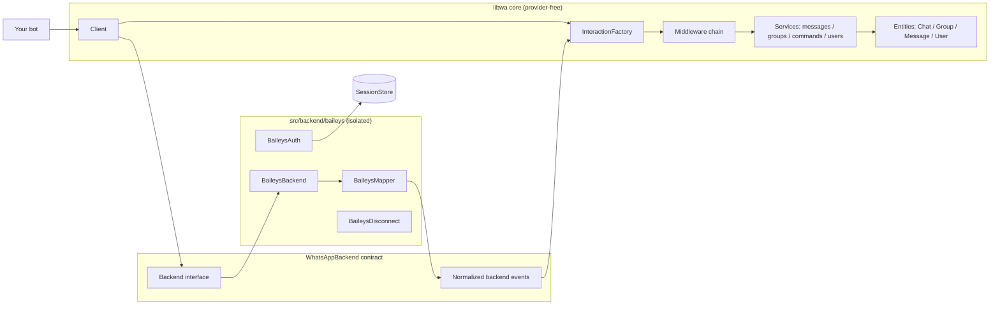
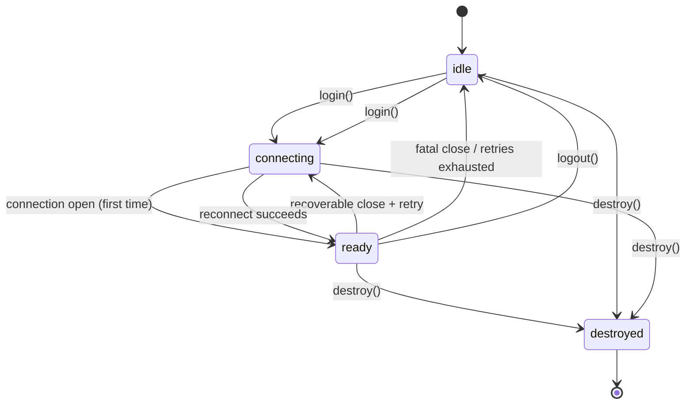

# Introduction

**libwa** is a TypeScript library for building WhatsApp bots. It hides the messiness of the WhatsApp wire protocol behind a single, opinionated abstraction: the **interaction**. Instead of handling raw provider payloads, your bot receives typed objects and answers them with a small, consistent API.

```ts
import { Client } from "libwa";

const client = new Client();

client.on("interactionCreate", async (interaction) => {
  if (interaction.isMessage() && interaction.isText()) {
    await interaction.reply(`You said: ${interaction.text}`);
  }
});

await client.login();
```

That snippet is a complete bot: it connects to WhatsApp (showing a QR code to scan), receives messages, and echoes them back.

## What makes libwa different

| Concern | Raw provider libraries | libwa |
| --- | --- | --- |
| Incoming messages | Nested, provider-specific payload trees | One `Interaction` class family with narrowing guards |
| Message content | Dozens of half-present optional fields | A discriminated `MessageContent` union, normalized every time |
| Commands | Roll your own parser | `CommandRegistry` with prefixes, aliases, args, guards |
| Errors | Whatever the provider throws | Stable `WhatsAppError` hierarchy with `.code` |
| Sessions | Ad-hoc file handling inside the provider | `SessionStore` abstraction (file/SQLite/memory/bring-your-own) |
| Reconnection | Often provider-owned or manual | Client-owned policy with exponential backoff |
| Multi-account | Unclear | `sessionId` slots over one store |

## Core concepts

Everything in libwa flows through a handful of ideas. You will use all of them:

**[Client](/reference/client)** — the entry point. Owns the connection lifecycle, composes the services (`client.messages`, `client.groups`, `client.commands`, `client.users`), converts backend events into interactions, runs middleware, and dispatches to your listeners.

**[Interaction](/reference/interactions)** — something meaningful that happened: a message arrived, a command matched, someone reacted, group membership changed. Produced by the library from backend events; you narrow them with guards:

```ts
client.on("interactionCreate", (i) => {
  if (i.isCommand()) {
    /* CommandInteraction */
  } else if (i.isReaction()) {
    /* ReactionInteraction */
  } else if (i.isMessage()) {
    /* MessageInteraction */
  }
});
```

**[MessageContent](/reference/content)** — the normalized body of a message: `text`, `image`, `video`, `audio`, `document`, `sticker`, `location`, `contact`, `poll`, `buttonReply`, `listReply`, or `unknown`. You `switch` on `content.kind` — never on provider structures.

**[Backend](/reference/backend)** (`WhatsAppBackend`) — the provider adapter interface. The bundled default is [Baileys](https://github.com/WhiskeySockets/Baileys), but the core only ever talks to this contract. Optional capabilities (`react`, `editMessage`, …) surface as `UnsupportedOperationError` when a backend lacks them.

**[SessionStore](/reference/sessions)** — persistence for login credentials: [`FileSessionStore`](/reference/sessions#filesessionstore) (default), [`SqliteSessionStore`](/reference/sessions#sqlitesessionstore) (production — one WAL-mode database for every slot), `MemorySessionStore` (tests) or your own. The core treats session data as an opaque `Uint8Array`; only the owning backend interprets it.

**[Middleware](/reference/middleware)** — ordered functions that gate dispatch: `client.use((interaction, next) => …)`. Skipping `next()` stops the interaction from reaching commands and listeners.

**[Events](/reference/client-events)** — a closed, typed set (`ready`, `interactionCreate`, `error`, `disconnect`, `reconnecting`, `qr`, `pairingCode`). Listener arguments are fully inferred.

**[Errors](/reference/errors)** — everything the library throws extends `WhatsAppError` with a stable `code`, in eight specializations (`ConnectionError`, `ValidationError`, …).

## Architecture at a glance



Key rule: **provider types never cross the boundary.** Baileys is imported only inside `src/backend/baileys/`, and a build-time guard (`npm run check:exports`) fails the build if any provider token becomes reachable from the public type surface. See [Public API guard](/development/public-api-guard).

## Lifecycle in one picture



`login()` returns a promise that resolves on the first `ready` and rejects on authentication failure or exhausted retries. Read more in [Sessions & login](/guide/sessions) and [Reconnection](/architecture/reconnection).

## Terminology

| Term | Meaning |
| --- | --- |
| **Chat** | A WhatsApp conversation — direct, group, broadcast list, or newsletter. Identified by a `ChatId` string (e.g. `123@g.us`, `5511…@s.whatsapp.net`). |
| **Group** | A chat with `kind: "group"`; the entity class `Group extends Chat`. |
| **Interaction** | A normalized event object delivered to commands and listeners. |
| **Command** | A registered `CommandDefinition` matched by prefix + name. |
| **Backend / provider** | The adapter implementing `WhatsAppBackend` (backend); the underlying protocol library (provider — Baileys). |
| **Session** | Persisted login state: `{ id, provider, data, updatedAt }`. |
| **Slot** | One session id inside a shared store (`ClientOptions.sessionId`, default `"default"`). |
| **`isFromMe`** | True when the logged-in account caused the interaction. |
| **JID** | Provider-format id (`user@s.whatsapp.net`). libwa passes ids as plain strings and normalizes device suffixes in the backend. |

## What libwa does *not* do

- It is not a framework: no file-based command loader, no plugins, no dashboard. Bring your own structure on top of the primitives.
- It does not expose provider extras (anti-spam, story uploads, …) — anything the `WhatsAppBackend` contract does not model would require your own backend code.
- It does not sync full chat history by default ([why?](/architecture/design-decisions#_7-history-sync-off-by-default)).
- There is no CLI: you run your bot with your own runtime (`node`, `tsx`, `vitest`, …).

## Where to go next

- New here? → [Getting started](/guide/getting-started)
- Looking up a specific symbol? → [API overview](/reference/)
- Wondering why something works this way? → [Design decisions](/architecture/design-decisions)
- Something broke? → [Troubleshooting](/troubleshooting)
