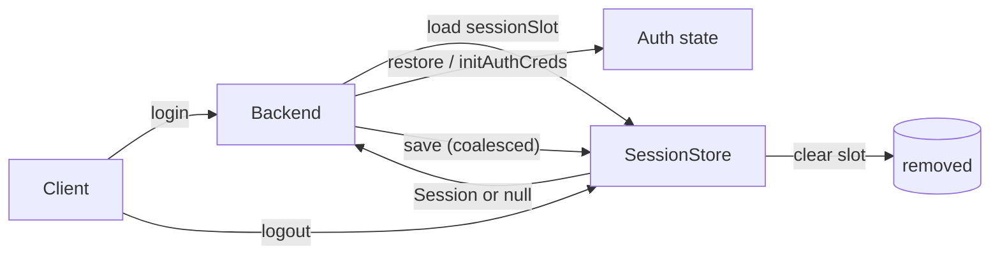
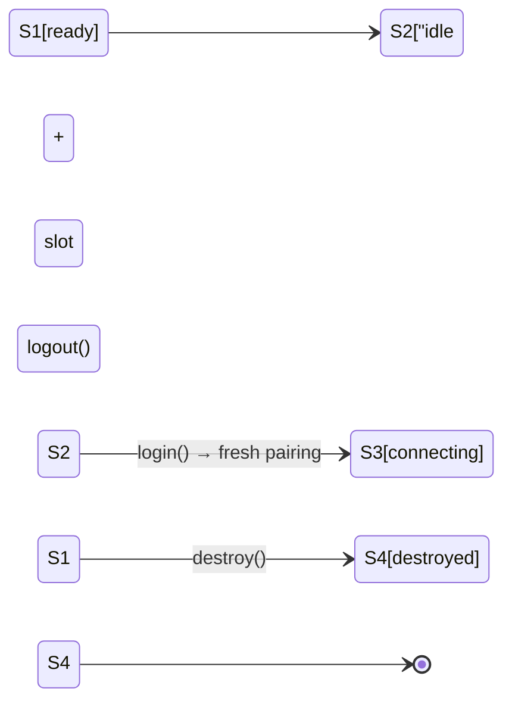

# Sessions & login

A **session** is the persisted login state that lets your bot come back online without scanning a QR again. libwa.js keeps sessions provider-independent: the core stores an opaque blob; only the owning backend interprets it.

## The session model

```ts
interface Session {
  readonly id: string;          // slot id — ClientOptions.sessionId
  readonly provider: string;    // backend id that wrote it, e.g. "baileys"
  readonly data: Uint8Array;    // opaque serialized state
  readonly updatedAt: Date;
}
```



Rules:

- The core **never** reads `data` — it only passes `Session` objects between store and backend.
- `provider` guards against cross-backend restore: a blob written by another backend id is ignored with a warning and re-initialized fresh.
- Slot ids must satisfy `/^[A-Za-z0-9_-]{1,64}$/` (enforced by the file and SQLite stores; the id comes from `ClientOptions.sessionId`, default `"default"`).

## Stores

### FileSessionStore (default)

```ts
import { Client, FileSessionStore } from "libwa.js";

new Client(); // → new FileSessionStore() → directory ".libwa.js"
new Client({ sessionStore: new FileSessionStore({ directory: ".sessions/work" }) });
```

- One JSON file per slot: `<directory>/<id>.json`, payload base64-encoded:

  ```json
  { "provider": "baileys", "data": "eyJ2IjoxL…", "updatedAt": "2026-09-25T12:00:00.000Z" }
  ```

- **Atomic writes**: temp file (`<target>.<writerId>.tmp`, `writerId` being a `randomUUID()` unique to the store instance) + `rename`.
- **Per-slot write queue**: concurrent `save`s for the same id serialize; different slots write in parallel.
- `load()` of a missing slot → `null` (only `ENOENT` counts as missing — any other read failure, e.g. `EACCES`/`EISDIR`, throws `ValidationError` `ERR_SESSION_UNREADABLE`); corrupt JSON → `ValidationError` `ERR_SESSION_CORRUPT`.
- `clear()` tolerates missing slots (deletes with `force: true`).
- `directory` getter exposes the resolved directory.
- No teardown needed — nothing is held open between calls.

### SqliteSessionStore (production)

```ts
import { Client, SqliteSessionStore } from "libwa.js";

const store = new SqliteSessionStore({ filename: "var/bot.db" });
const sales = new Client({ sessionStore: store, sessionId: "sales" });
const support = new Client({ sessionStore: store, sessionId: "support" });

await Promise.all([sales.login(), support.login()]);
// on shutdown:
await sales.destroy();
await support.destroy();
store.close(); // you own the handle — libwa.js never closes it
```

One database file holds every slot. Prefer it over the file store once sessions matter: WAL mode plus `synchronous = FULL` means the last credential write survives a power loss, a `busy_timeout` lets a second process (a migration tool, a second instance) block instead of erroring, and each save is a single transactional upsert.

- Options: `filename` (default `libwa.js-sessions.db`; missing parent directories are created) and `busyTimeoutMs` (default `5000`).
- Ids are validated exactly like `FileSessionStore`; a row with the wrong column types → `ERR_SESSION_CORRUPT`.
- Used after `close()` → `ERR_SESSION_STORE`, so shutdown bugs fail loudly.
- The schema version lives in `PRAGMA user_version`: a database written by a newer libwa.js is refused instead of being opened with a schema this build does not understand.
- Backed by `better-sqlite3`, loaded lazily — `import "libwa.js"` never touches the native binding. An install done with `--ignore-scripts` fails with `ERR_SESSION_STORE` and instructions, not a load crash.

### MemorySessionStore (tests / ephemeral)

```ts
import { MemorySessionStore } from "libwa.js";

const store = new MemorySessionStore(); // sessions vanish on process exit
```

`load`/`save`/`clear` over a `Map` — no id validation, no durability.

### Bring your own

```ts
import type { Session, SessionStore } from "libwa.js";

const redisStore: SessionStore = {
  async load(id) {
    const raw = await redis.get(`wa:session:${id}`);
    return raw ? JSON.parse(raw, revive) : null;
  },
  async save(session) {
    await redis.set(`wa:session:${session.id}`, serialize(session), "EX", 60 * 60 * 24 * 30);
  },
  async clear(id) {
    await redis.del(`wa:session:${id}`);
  },
};
```

Expectations: `save` must persist `data` losslessly (bytes!); `load` returns `null` for missing; `clear` is idempotent. Everything else (queues, validation) is your store's business. If your store holds a socket or connection, add the optional `close(): Promise<void> | void` — libwa.js never calls it, so call it yourself on shutdown.

## What's inside the blob (Baileys)

For the bundled backend, `data` is UTF-8 JSON serialized with Baileys' `BufferJSON`:

```ts
{ v: 1, creds: { /* AuthenticationCreds incl. noiseKey, signedIdentityKey, me, … */ },
  keys: { "pre-key": { … }, "sender-key": { … }, "app-state-sync-key": { … }, … } }
```

- `v` is `SESSION_FORMAT_VERSION = 1`. Unknown versions → `ValidationError` "unsupported format".
- `creds` missing → `ValidationError` "missing credentials".
- Unparseable JSON → `ValidationError` "corrupt".
- Buffer-typed fields round-trip through `BufferJSON.replacer/reviver` (restored as `Buffer`s).
- `app-state-sync-key` entries are revived as protobuf objects (`proto.Message.AppStateSyncKeyData.fromObject`) at read time — mirroring the provider's reference auth state.

All four failures happen **during `login()`** (backend `connect`), fast-fail without retries (see [Error handling](/guide/error-handling#_1-thrown-synchronously-rejected-promises-you-can-catch)).

### Write coalescing

Baileys updates credentials and signal keys in bursts. `createBaileysAuth` schedules writes on a promise chain:

```ts
persist()  // if a write is already scheduled → return the pending chain
         // else mark scheduled → append one store.save() to the chain
flush()    // while (scheduled) await chain   — used on disconnect
```

So N key updates in one tick → **one** `store.save`. Save failures are logged (`failed to persist session`) but never crash the connection loop. Key-store `set()` also honors `null` entries as **deletes**.

## Login flows

### QR (default)

```ts
client.on("qr", (qr) => console.log(qr)); // render/scan promptly — first QR ~60s, later ones ~20s
await client.login();
```

The backend emits QR payloads while unauthenticated; scanning pairs the device; `ready` fires; creds persist automatically (`creds.update` → `persistCreds`).

### Pairing code

```ts
const client = new Client({ auth: { pairingPhoneNumber: "5511999999999" } });
client.on("pairingCode", (code) => console.log(code));
await client.login();
```

- With `pairingPhoneNumber`, the backend requests a code automatically while `!creds.registered && (creds.me === undefined || creds.me.name === "~")` (at connect, and again on a later QR/`connecting` update — a failed request re-arms, so the next update retries).
- On demand: `await client.requestPairingCode("5511999999999")` (validates format; `pairingCode` event also fires with the code).
- Codes are single-use per attempt; re-run pairing by clearing the session.

### `login()` semantics

```ts
const p1 = client.login();
const p2 = client.login();   // same promise while pending
await p1;                     // resolves on FIRST ready
```

| Situation | Result |
| --- | --- |
| Already ready | resolves immediately |
| Pending | returns the shared deferred |
| `ValidationError` / `AuthenticationError` from connect | rejects fast (no retries) |
| Other connect failure | logged + synthesized close → normal retry policy |
| Fatal disconnect before ready | rejects with `AuthenticationError` |
| Non-fatal close with retries off/exhausted | rejects with `ConnectionError` |
| `destroy()` was called | rejects with `ConnectionError` (state `destroyed`) |
| `logout()` called while pending | rejects with `ConnectionError("Client logged out before login completed.")` |
| rejection with no `await` | swallowed internally (attach `error` to observe) |

## Multi-account bots

```ts
const store = new FileSessionStore({ directory: ".sessions" });
const a = new Client({ sessionStore: store, sessionId: "sales" });
const b = new Client({ sessionStore: store, sessionId: "support" });

await Promise.all([a.login(), b.login()]);
```

Each slot is an independent session file / store key. Never run two live clients on the **same** slot: writes would interleave and both sockets would fight for one device session. With `SqliteSessionStore` the slots are rows in one table, so the same rule applies — one live client per slot, one store per deployment.

## Logout vs destroy



| | `logout()` | `destroy()` |
| --- | --- | --- |
| Provider session invalidated | yes, when backend has `logout()` | no |
| Session slot cleared | yes (`sessionStore.clear`) | no |
| Connection closed | yes | yes |
| Reconnect timer cancelled | yes | yes |
| State after | `idle` (unless destroyed) | `destroyed` (terminal) |
| `login()` afterwards | fresh pairing flow | rejects with `ConnectionError` |
| Pending `login()` | rejected with `ConnectionError("Client logged out before login completed.")` | rejected with `ConnectionError("Client was destroyed.")` |
| Entity & group caches | reset (`#entities.reset()` + `groups.reset()`) | reset (`#entities.reset()` + `groups.reset()`) — cached identity/group state never leaks into the next account |
| Backend errors | reported via `error`, swallowed | reported via `error`, swallowed |

```ts
// switch accounts
await client.logout();          // phone logs the old session out
await client.requestPairingCode("5511999999999"); // need connecting state

// shutdown
await client.destroy();
```

## Session hygiene

- **`.libwa.js/` (and `*.db`) is sensitive** — it authenticates your account. Add to `.gitignore`, never commit, never share. SQLite may also leave `-wal` / `-shm` files next to the database; they belong to the same secret.
- **Rotating devices**: WhatsApp may revoke sessions remotely → next connect yields `DisconnectReason.LoggedOut` → `disconnect` event, no retry. Delete the slot and re-pair.
- **Deleting the slot** (`rm .libwa.js/default.json` or `sessionStore.clear(id)`) forces a fresh login.
- **Corrupt slot**: the library fails with `ValidationError` telling you to clear it — fix by deleting the file/row, not by hand-editing JSON.
- **Shutdown**: `await client.destroy()` first (it stops writing), then `store.close()` if you are using `SqliteSessionStore`.

## Related

- [Sessions & stores reference](/reference/sessions) — full API of stores + `Session`
- [Architecture: sessions](/architecture/sessions) — auth state, coalescing, format internals
- [Baileys auth tests](/development/testing) — behavior pinned by `tests/baileys-auth.test.ts`
- [Troubleshooting](/troubleshooting) — session-related symptoms
