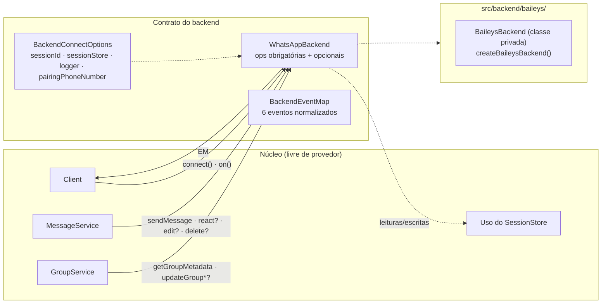
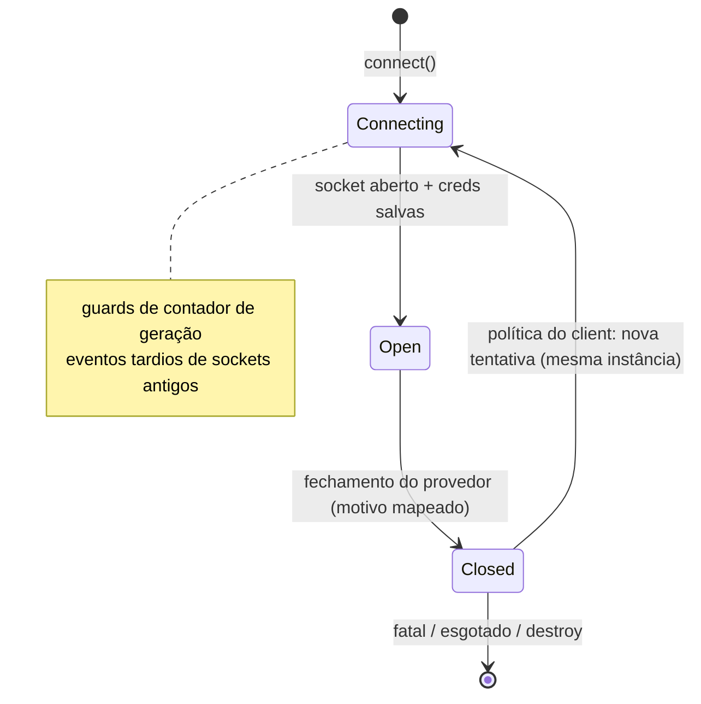

# Contrato do backend {#backend-contract}

A costura. `WhatsAppBackend` + `BackendEventMap` definem tudo o que o núcleo precisa de um provedor — nem mais, nem menos. O Baileys é um detalhe de implementação atrás de `src/backend/baileys/`.



## A interface {#the-interface}

Referência completa anotada: [página da API do Backend](/pt-BR/reference/backend#whatsappbackend). Divisão:

| Nível | Membros | Regra |
| --- | --- | --- |
| identidade | `id` | string estável (ex. `"baileys"`), usada em sessões e logs |
| ciclo de vida | `connect` `disconnect` `isConnected` | `connect()` é **reentrante** — a mesma instância deve sobreviver às reconexões |
| E/S | `sendMessage` `downloadMedia` `getGroupMetadata` | sempre presente; falhas do provedor não podem vazar classes de erro do provedor |
| eventos | `on(event, listener) → Unsubscribe` | seis eventos normalizados, apenas tipos de domínio |
| capacidades | `react?` `editMessage?` `deleteMessage?` `updateGroupParticipants?` `updateGroupName?` `updateGroupDescription?` `requestPairingCode?` `logout?` `getPhoneNumberForLid?` `getLidForPhoneNumber?` `fetchUser?` `getProfilePictureUrl?` `getAbout?` `getBusinessProfile?` | verificadas antes de cada chamada |

## Obrigatório vs opcional — por quê {#mandatory-vs-optional-—-why}

Provedores diferem (reações sim/não, códigos de pareamento, edições). Tornar tudo obrigatório seria mentir; tornar tudo opcional prejudicaria a DX. O compromisso:

- o núcleo verifica `if (backend.react)` e lança `UnsupportedOperationError` (`` `Backend "baileys" does not support reactions.` ``) quando ele está ausente;
- a descoberta de capacidades no código do usuário é honesta: `if (client.backend.react) …`;
- o contrato é pequeno o suficiente para ser reimplementado em ~200 linhas (o test double `MockBackend` do repositório faz exatamente isso).

A ausência de `requestPairingCode` lança `UnsupportedOperationError` `ERR_UNSUPPORTED` a partir de `Client.requestPairingCode` — a mesma regra de capacidade de `fetchUser` e das buscas de perfil: uma capacidade que o backend não tem é relatada, nunca adivinhada. As capacidades de identidade (`getPhoneNumberForLid`/`getLidForPhoneNumber`) são buscas, não operações — `client.users.resolvePhone`/`resolveLid` resolvem `undefined` quando estão ausentes, em vez de lançar erro. `fetchUser` é deliberadamente o terceiro caso: `client.users.fetch` lança `UnsupportedOperationError` quando está ausente, porque relatar existência é uma capacidade que o backend deve confirmar — nunca um palpite. O enriquecimento de perfil (`getProfilePictureUrl`/`getAbout`/`getBusinessProfile`) segue a mesma regra: `client.users.pictureUrl`/`about`/`accountType` lançam `UnsupportedOperationError` quando a capacidade falta, e resolvem `undefined` somente para dados realmente ausentes ou ocultos por privacidade, uma vez que a capacidade responde.

## `BackendConnectOptions` — a linha de vida {#backendconnectoptions-—-the-lifeline}

O único caminho pelo qual a infraestrutura alcança um backend:

| Campo | Propósito |
| --- | --- |
| `sessionId` | qual slot hidratar |
| `sessionStore` | carregar/salvar bytes de sessão opacos — os backends persistem **somente** por meio disso |
| `logger` | sua instância de `Logger` injetada (diagnósticos do provedor incluídos) |
| `pairingPhoneNumber` | solicitar automaticamente um código de pareamento ao conectar, quando definido |

Sem globals, sem leitura de env — um backend é uma função pura das suas opções.

## Regras de normalização de eventos {#event-normalization-rules}

Os payloads de `BackendEventMap` podem conter **apenas tipos de domínio da biblioteca** (`ChatId`, `UserId`, `MessageContent`, `DisconnectReason`, `GroupParticipantAction`, `GroupUpdateChanges`, `Date`). Especificamente proibido: helpers de JID do provedor além de strings de id brutas, tipos `Long`/protobuf, enums do provedor, classes de erro do provedor.

É isso que torna "trocar o provedor, manter o bot" verdadeiro no nível dos tipos.

## Adaptador Baileys {#baileys-adapter}

Cinco módulos mais um barrel `index.ts`, uma única factory pública (`createBaileysBackend` — a classe é privada ao módulo):

| Arquivo | Papel |
| --- | --- |
| `BaileysBackend.ts` | ciclo de vida do socket, wiring de eventos, ops de send/react/edit/delete/grupo, pareamento, LRU de mensagem bruta (500) para o `download()`, LRU de metadados de grupo (`GROUP_META_CACHE_LIMIT = 512`) alimentando o hook `cachedGroupMetadata` do Baileys, conversão de conteúdo do provedor, guards de geração |
| `BaileysMapper.ts` | funções puras de mapeamento (veja [pipeline de eventos](/pt-BR/architecture/event-pipeline#stages)) |
| `BaileysAuth.ts` | `AuthenticationState` respaldado por um `SessionStore`; cadeia de escrita coalescida; serialização `BufferJSON`; revives de chaves de app-state |
| `BaileysDisconnect.ts` | Boom/código de status → [`DisconnectReason`](/pt-BR/reference/disconnect-reason) (incl. errnos de rede) |
| `BaileysLogger.ts` | `Logger` da biblioteca → formato de logging do provedor |

Padrões do adaptador:

```ts
const DEFAULT_BROWSER = ["libwa", "1.0.0", "1"];
const RAW_CACHE_LIMIT = 500;
const GROUP_META_CACHE_LIMIT = 512;
// syncFullHistory: false → shouldSyncHistoryMessage: () => false, emitOwnEvents: false
```

A sincronização de histórico está **desligada por padrão**: somente entradas de `messages.upsert` com `type === "notify"` fazem dispatch — bots respondem a tráfego ao vivo, sem dilúvio no primeiro login.



## Fronteiras impostas {#enforced-boundaries}

| Mecanismo | O que garante |
| --- | --- |
| disciplina de import | somente `src/backend/baileys/` pode `import … from "@whiskeysockets/baileys"` (convenção + revisão — o biome não tem regra de restrição de import; `check:exports` protege os tipos emitidos) |
| `exports` do pacote | somente `.` e `./package.json` — resolvers cientes de exports (bundler/node16) rejeitam caminhos profundos em `dist/`; o legado `moduleResolution: "node"` ainda pode alcançar `dist/` em disco, então imports profundos são não suportados, não impossíveis |
| `npm run check:exports` | percorre o grafo alcançável de `dist/index.d.ts`; qualquer token de provedor (`@whiskeysockets/baileys`, `WAMessage`, `WASocket`, `proto.`, …) derruba o build |
| testes | importam caminhos `src/…`; testes livres de provedor usam `MockBackend`; o comportamento do Baileys é testado no nível do mapper/auth/disconnect com fixtures realistas |

Detalhes: [Guard da API pública](/pt-BR/development/public-api-guard).

## Veja também {#see-also}

- [Referência do backend](/pt-BR/reference/backend) — documentação completa dos tipos
- [Guia de backends](/pt-BR/guide/backends) — usando/configurando backends
- [Arquitetura de sessões](/pt-BR/architecture/sessions) — o que os backends persistem
