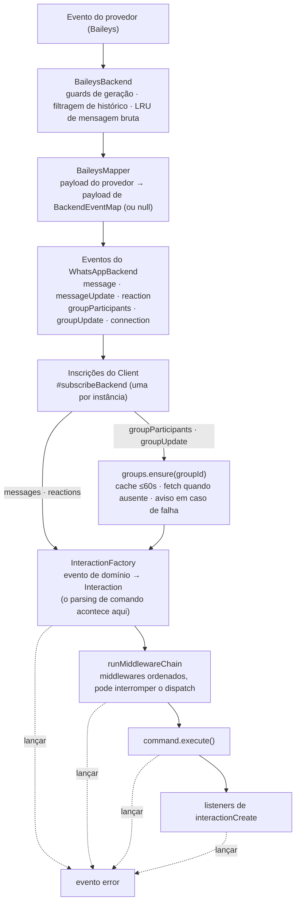
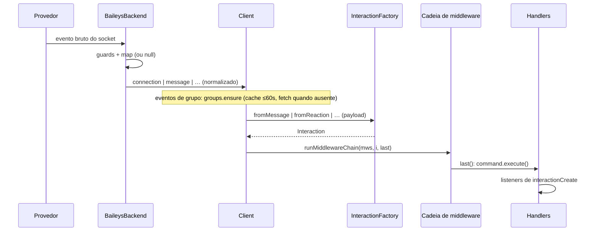
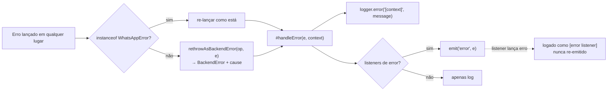

# Pipeline de eventos {#event-pipeline}

A jornada de um evento de entrada desde o socket de um provedor até o seu handler — e as propriedades que a tornam segura.

## Etapas {#stages}

### 1. Provedor → backend (adaptador) {#_1-provider-→-backend-adapter}

`src/backend/baileys/BaileysBackend.ts` se inscreve nos sockets do provedor e aplica guards **antes** que qualquer coisa se torne um evento de domínio:

| Guard | Efeito |
| --- | --- |
| contador de geração | eventos de um socket morto (pré-reconexão) são descartados |
| filtragem de histórico | somente `messages.upsert` com `type === "notify"` faz dispatch; `syncFullHistory` desligado, `emitOwnEvents: false` |
| LRU de mensagem bruta (500) | mantém os payloads brutos para o `download()` lazy |

### 2. Mapper (payload do provedor → payload de domínio) {#_2-mapper-provider-payload-→-domain-payload}

`BaileysMapper.ts` é função pura: `mapIncomingMessage`, `mapMessageUpdates`, `mapMessagesDelete`, `mapReaction`, `mapGroupParticipants`, `mapGroupUpdates`, `mapGroupMetadata`.

- normaliza wrappers (ephemeral/view-once/device-sent/edit), timestamps (segundos/Long → `Date`), JIDs (remoção do sufixo de dispositivo);
- todo tipo de conteúdo vira um membro da união [`MessageContent`](/pt-BR/reference/content);
- **`null` significa "sem evento"** — mensagens de protocolo, stubs de reação, atualizações de enquete, stanzas que só distribuem a sender key e upserts de histórico nunca aparecem; conteúdo que trafega *junto* com chaves de plumbing (a primeira mensagem de um grupo distribui a sender key ao lado do seu texto) ainda chega.

### 3. Barramento de eventos do backend {#_3-backend-event-bus}

Seis eventos de [`BackendEventMap`](/pt-BR/reference/backend#backendeventmap), apenas tipos de domínio:

### 4. Inscrição no client {#_4-client-subscription}

`Client.#subscribeBackend()` anexa os seis listeners **uma vez por instância** (protegido). Cada payload:

1. para payloads de mensagem/reação/atualização, o método `InteractionFactory.from*()` correspondente → uma `Interaction` concreta (nunca `null`; `ignoreSelf` apenas suprime a promoção a *comando* — a mensagem ainda faz dispatch como um `MessageInteraction`). Payloads `connection` vão para a lógica de ciclo de vida no lugar disso;
2. **payloads de grupo (`groupParticipants`, `groupUpdate`) — e payloads da família de mensagem em um chat de grupo — primeiro aguardam `client.groups.ensure(groupId)`**: uma cópia em cache de no máximo 60 segundos resolve sem I/O; metadados mais antigos (ou ausentes) disparam um único fetch compartilhado por eventos concorrentes. A `InteractionFactory` então aplica as mudanças de participação/metadados do evento naquele cache antes de a interação ser construída, de modo que o `group` da interação reflita o próprio evento. Uma atualização que falha registra `[group refresh]` em nível de aviso e o dispatch prossegue com o estado em cache — nunca é bloqueado ou descartado, e só retenta quando a janela de 60 segundos expira;
3. `void this.#dispatch(interaction)` — fire-and-forget com os erros capturados internamente.

### 5. Middleware → comando → listeners {#_5-middleware-→-command-→-listeners}

A construção da interação (`#buildAndDispatch`) e o `#dispatch` rodam então como etapas protegidas, em ordem — uma falha da factory nunca chega ao dispatch:

| Etapa | Comportamento ao lançar |
| --- | --- |
| `InteractionFactory.from*()` — construção da interação (antes do dispatch) | contexto `interaction build` → evento `error` |
| `runMiddlewareChain(middlewares, i, last)` | contexto `middleware` → evento `error` |
| gate `groupOnly`/`dmOnly` → `command.execute(i)` | contexto `` `command "${name}"` `` → evento `error` |
| listeners de `interactionCreate` (sequenciais, aguardados) | contexto `listener for "interactionCreate"` → evento `error` |

Cada etapa é protegida individualmente por try/catch — uma falha nunca pula os demais membros daquela etapa, e **o processo nunca derruba**.

## Justificativa da ordem de dispatch {#dispatch-order-rationale}

| Ordem | Por quê |
| --- | --- |
| middleware **primeiro** | limites de taxa/filtros cobrem comandos *e* mensagens comuns; pular `next()` = silêncio total |
| comando **antes** dos listeners | `execute()` é a reação principal; os listeners observam (UI, logging, efeitos colaterais) |
| comandos com gate ainda notificam | um comando `groupOnly` em um DM pula `execute()`, mas os listeners ainda veem a tentativa |

Veja [Decisões de design #12](/pt-BR/architecture/design-decisions#_12-dispatch-order-middleware-command-listeners).

## Resumo do isolamento de falhas {#failure-isolation-summary}

## Propriedades-chave {#key-properties}

- **Nada com forma de provedor atravessa a fronteira** — os tipos públicos não contêm nenhum conceito do Baileys (garantido pelo `npm run check:exports`).
- **Null = sem evento** — payloads não mapeáveis desaparecem em vez de chegar aos handlers meio formados, mas conteúdo real nunca é ofuscado por chaves de protocolo/plumbing.
- **Nomes viajam com os ids** — nomes de exibição vistos em qualquer lugar (o push name de uma mensagem, um resultado de `fetchUser`) são lembrados nos dois esquemas de id, então payloads posteriores que trazem só o id (menções, autores de reação, membros de grupo) ainda respondem com `user.name`.
- **Mídia continua lazy** — os mappers anexam closures de `download()` sobre o LRU de mensagem bruta; os apps veem `Uint8Array` só quando solicitado.
- **Ordenados e isolados por snapshot** — os listeners rodam na ordem de registro sobre um snapshot; cancelar a inscrição no meio de um emit é seguro.
- **Erros são dados** — falhas de dispatch aparecem em `error` com uma string de contexto, nunca como rejeições não tratadas.

## Veja também {#see-also}

- [Guia de eventos](/pt-BR/guide/events) — visão do lado do handler
- [Middleware](/pt-BR/reference/middleware) — semântica da cadeia
- [Interações](/pt-BR/reference/interactions) — o que a factory constrói
