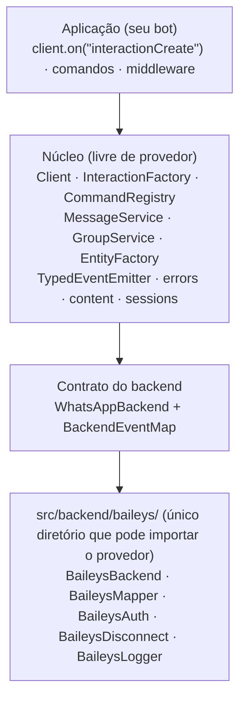
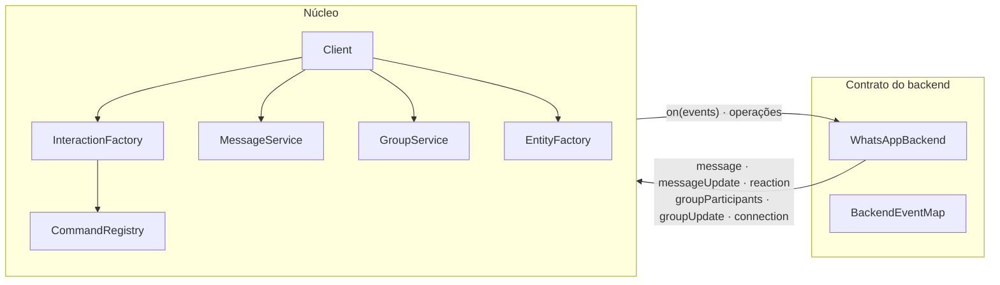

# Visão geral da arquitetura {#architecture-overview}

libwa.js é um núcleo pequeno com uma **fronteira rígida em torno do código do provedor**. Tudo acima da costura é livre de provedor; o único código autorizado a importar `@whiskeysockets/baileys` vive em `src/backend/baileys/`.

## Camadas {#layers}

### Aplicação {#application}

Seu código: listeners, comandos, middleware. Fala apenas com `Client`, serviços, entidades e interações — a superfície do pacote (`src/index.ts`, garantida por [`check:exports`](/pt-BR/development/public-api-guard)).

### Client <ApiBadge kind="class" /> {#client}

[`src/Client.ts`](/pt-BR/reference/client) é a **raiz de composição** e o único dono do ciclo de vida da conexão:

- resolve `ClientOptions` (padrões, validação) e constrói os serviços;
- se inscreve nos seis eventos normalizados do backend exatamente uma vez por instância;
- converte eventos do backend → interações (`InteractionFactory`), executa a cadeia de middleware, faz dispatch para comandos e listeners de `interactionCreate`;
- é dono da **política de reconexão** (backoff, contagem de tentativas, classificação de motivo fatal) — backends apenas relatam *por que* um fechamento aconteceu;
- é dono do **controle de login**: `login()` é uma promise adiada que resolve no primeiro `ready` e rejeita em falha fatal/de autenticação ou com as tentativas esgotadas.

### Serviços {#services}

| Serviço | Campo | Responsabilidade |
| --- | --- | --- |
| `MessageService` | `client.messages` | Validar/normalizar `ReplyContent`, resolver destinos, delegar ao backend, converter confirmações de volta em `Message`s de domínio; reagir/editar/excluir com verificações de capacidade |
| `GroupService` | `client.groups` | Resolução de metadados — `ensure` (cache de 60s, fetch em caso de falha) ou `fetch` (sempre faz ida e volta) — além de operações de membros/configuração, mantendo os metadados em cache sincronizados |
| `CommandRegistry` | `client.commands` | Registro, aliases, unicidade, parsing de prefixo (apenas dados — a execução acontece na pipeline) |

### Entidades {#entities}

Objetos de valor construídos por `EntityFactory`:

- `Chat` / `Group` (um arquivo; `Group extends Chat`, `isGroup()` estreita), `User`, `Message`;
- chats e metadados de grupo são **cacheados por id** — `interaction.chat === interaction.message.chat` — enquanto `User` é recriado a cada evento; eventos de participação/atualização corrigem o grupo em cache entre os fetches;
- entidades expõem ações de nível de intenção (`chat.send`, `message.react`, `group.addMembers`) que delegam de volta aos **serviços**, nunca a um provedor.

### Interações {#interactions}

A [`Interaction`](/pt-BR/reference/interactions) abstrata carrega `id`, `timestamp`, `chat`, `author`, `isFromMe`, `reply()` e a família de guards. Subclasses adicionam dados específicos do evento (`CommandInteraction.args`, `ReactionInteraction.emoji`, …). O discriminador `InteractionType` e a hierarquia de classes permanecem em sincronia: `CommandInteraction extends MessageInteraction`, então `isMessage()` é verdadeiro para comandos.

## Mapa de módulos {#module-map}

| Diretório | Conteúdo | Imports de provedor? |
| --- | --- | --- |
| `src/Client.ts`, `src/ClientOptions.ts` | raiz de composição, resolução de opções | ❌ |
| `src/events/` | `ClientEvents`, `TypedEventEmitter` | ❌ |
| `src/interactions/` | classes de interação + factory | ❌ |
| `src/entities/` | `Chat`, `Group`, `Message`, `User`, `EntityFactory` | ❌ |
| `src/commands/` | registry, definições | ❌ |
| `src/messaging/`, `src/groups/` | serviços de saída + normalização de payload | ❌ |
| `src/users/` | `UserService` — pares de id, resolução, fetch, memória de nomes de exibição, enriquecimento de perfil | ❌ |
| `src/middleware/` | executor de cadeia do `compose.ts` | ❌ |
| `src/errors/`, `src/logging/`, `src/core/`, `src/auth/` | erros, logger, ids/content/reasons, stores | ❌ |
| `src/backend/` | contrato (`Backend.ts`, `events.ts`), `createDefaultBackend` | ❌ |
| **`src/backend/baileys/`** | o adaptador (5 módulos + o barrel `index.ts` — 4 deles importam o provedor) | ✅ **somente aqui** |
| `src/index.ts` | o barrel raiz — a API pública inteira (o pacote exporta `.`) | ❌ |

## Fluxo de dados em uma linha cada {#data-flow-in-one-line-each}

| Direção | Fluxo |
| --- | --- |
| Entrada | evento do provedor → mapper → `BackendEventMap` → `InteractionFactory` → middleware → comando/listeners |
| Saída | `reply()/send()` → `normalizeReplyContent` → requisição ao backend → confirmação `Message` |
| Sessão | backend ⇄ `SessionStore` (`Uint8Array` opaco, somente através do store fornecido) |
| Fechamento | backend mapeia o motivo → `connection: close` → política do client → nova tentativa ou evento `disconnect` |

## Para onde ir a seguir {#where-to-go-next}

- [Pipeline de eventos](/pt-BR/architecture/event-pipeline) — dispatch de entrada em detalhe
- [Contrato do backend](/pt-BR/architecture/backend-contract) — a costura e o adaptador Baileys
- [Sessões](/pt-BR/architecture/sessions) — design da persistência de autenticação
- [Reconexão](/pt-BR/architecture/reconnection) — internos da política de nova tentativa
- [Decisões de design](/pt-BR/architecture/design-decisions) — justificativas no estilo ADR
