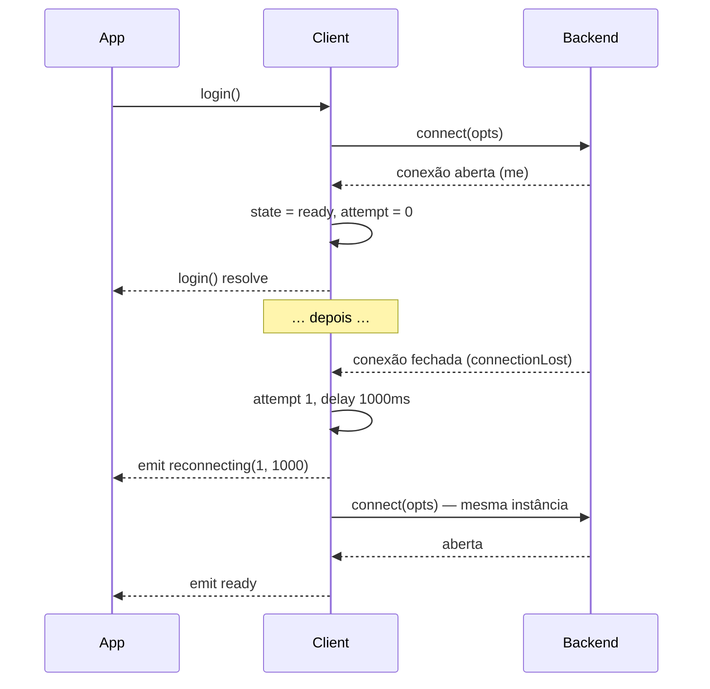

# Reconexão {#reconnection}

A reconexão é **de propriedade do client**. Backends mapeiam os códigos de fechamento do provedor em [`DisconnectReason`](/pt-BR/reference/disconnect-reason) e relatam; o client decide se, quando e como retentar.

```mermaid
flowchart TD
    A["fechamento de conexão<br/>(reason + detail do backend)"] --> B{"state === destroyed?"}
    B -->|sim| Z["ignorado (terminal)"]
    B -->|não| C["isReady = false"]
    C --> D{"FATAL_DISCONNECT_REASONS.has(reason)?"}
    D -->|sim| F["state = idle<br/>login pendente → emit 'error' (login) + reject AuthenticationError<br/>emit 'disconnect'(reason)"]
    D -->|não| E{"reconnect === false?"}
    E -->|sim| F
    E -->|não| G{"attempts used >= attempts?"}
    G -->|sim| H["state = idle<br/>login pendente → emit 'error' (login) + reject ConnectionError<br/>emit 'disconnect'(reason)<br/>emit 'error' (reconnect exhausted)"]
    G -->|não| I["state = connecting<br/>attempt++<br/>delay = min(max, initial * factor^&#123;n-1&#125;)<br/>emit 'reconnecting'(attempt, delay)<br/>agenda timer (unref)"]
    I --> J["connect() de novo<br/>(mesma instância de backend)"]
    J -->|abre| K["attempt = 0<br/>emit 'ready' (novamente)"]
    J -->|lança| L["evento error (contexto: reconnection)<br/>reexecuta a lógica de fechamento com o mesmo motivo"]
```



## Entradas da política {#policy-inputs}

A partir de [`ReconnectOptions`](/pt-BR/reference/client-options#reconnectoptions):

| Campo | Padrão | Papel |
| --- | --- | --- |
| `attempts` | `5` | máximas novas tentativas **por época de conexão** (resetado a cada abertura bem-sucedida) |
| `initialDelayMs` | `1000` | delay antes da tentativa 1 |
| `maxDelayMs` | `30000` | teto |
| `factor` | `2` | base exponencial |
| `reconnect: false` | — | nunca retentar; primeiro fechamento → `disconnect` imediato |

Fórmula do backoff: `delay(n) = min(maxDelayMs, initialDelayMs * factor ** (n - 1))` → 1s, 2s, 4s, 8s, 16s, 30s, 30s, …

## Tabela de decisões {#decision-table}

| Situação | Resultado |
| --- | --- |
| motivo fatal (loggedOut, badSession, connectionReplaced, forbidden) | sem nova tentativa → login pendente: `error` (contexto `login`) + reject `AuthenticationError`, depois `disconnect` |
| `reconnect: false` | sem nova tentativa → `disconnect` |
| tentativas esgotadas | login pendente: `error` (login) + reject `ConnectionError`, depois `disconnect`, depois `error` (mensagem de desistência) |
| motivo transitório, tentativas restantes | `reconnecting(attempt, delayMs)` + timer → `connect()` |
| `connect()` agendado lança erro | `error` (contexto `reconnection`) → a lógica de fechamento reexecuta com o mesmo motivo |
| `logout()` (a qualquer momento) | `#loggingOut = true` bloqueia novas reconexões de serem armadas até a limpeza terminar — um fechamento levantado durante o logout é ignorado, não retentado |
| `destroy()` no meio do timer | timer cancelado, listeners desanexados, `login()` pendente rejeitado (sem evento `error` para isso) |
| reabertura após nova tentativa | contador de tentativas resetado, `me` atualizado, **`ready` emitido de novo** |

## Login como deferred {#login-as-a-deferred}

```ts
login(): Promise<void>
```

- resolve no **primeiro** `ready` (deferred assentado dentro do handler de abertura de conexão, antes da emissão);
- compartilhado entre chamadas `login()` concorrentes (mesma promise);
- rejeições:
  - **caminhos de fail-fast**: `ValidationError` (opções ruins) ou `AuthenticationError` do próprio `connect()` — sem novas tentativas para problemas de auth/sessão;
  - **fechamento fatal enquanto pendente** → `AuthenticationError`;
  - **novas tentativas esgotadas enquanto pendente** → `ConnectionError`;
  - **`destroy()` enquanto pendente** → `ConnectionError("Client was destroyed.")` (reported = false — sem evento `error`);
  - **`logout()` enquanto pendente** → `ConnectionError("Client logged out before login completed.")` (também reported = false — sem evento `error`);
- uma rejeição sem `await` é pré-capturada internamente para que um `login()` fire-and-forget nunca derrube o processo.



## A mesma instância de backend {#same-backend-instance}

As novas tentativas chamam `connect()` **no backend existente** — sem reinstantiação no meio da reconexão. O adaptador Baileys derruba seu socket anterior na reentrada e usa um contador de geração para que eventos tardios de um socket morto sejam descartados ([Decisões de design #8](/pt-BR/architecture/design-decisions#_8-reconnect-the-same-backend-instance)).

## Operações terminais {#terminal-operations}

| Operação | Efeito na reconexão | Efeito na sessão | Listeners |
| --- | --- | --- | --- |
| `destroy()` | cancela timer, estado `destroyed` | preservada | listeners do backend desanexados (listeners da aplicação mantidos) |
| `logout()` | cancela timer, estado `idle`; um `login()` pendente é rejeitado (`ConnectionError`, não relatado) e novas reconexões são bloqueadas até a limpeza terminar | **limpa** (após a revogação remota); caches de entidade + grupo resetados para que a próxima conta comece limpa | mantidos — o `login()` faz um novo pareamento do zero |

## Observabilidade {#observability}

```ts
client.on("reconnecting", (attempt, delayMs) =>
  metrics.increment("wa.reconnect").tag("attempt", attempt),
);
client.on("disconnect", (reason) => {
  metrics.increment("wa.disconnect").tag("reason", reason);
  if (FATAL_DISCONNECT_REASONS.has(reason)) alert("re-pair required");
});
```

Os timers recebem `unref` — um backoff pendente nunca mantém um processo Node vivo.

## Política de testes {#testing-policy}

O repositório testa isso com timers falsos: caminho de esgotamento, caminho fatal, caminho desativado, reset na abertura, cancelamento de timer no destroy ([Desenvolvimento → testes](/pt-BR/development/testing#what-we-test-guarantees)).

## Veja também {#see-also}

- [Referência de DisconnectReason](/pt-BR/reference/disconnect-reason) — catálogo de motivos
- [Guia de tratamento de erros](/pt-BR/guide/error-handling#disconnects) — padrões de aplicação
- [Referência do Client](/pt-BR/reference/client#login) — semântica do login
