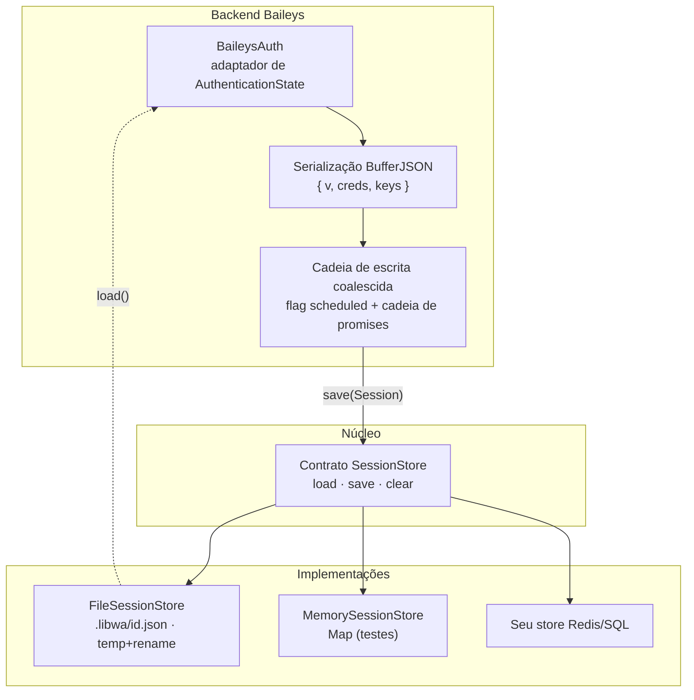
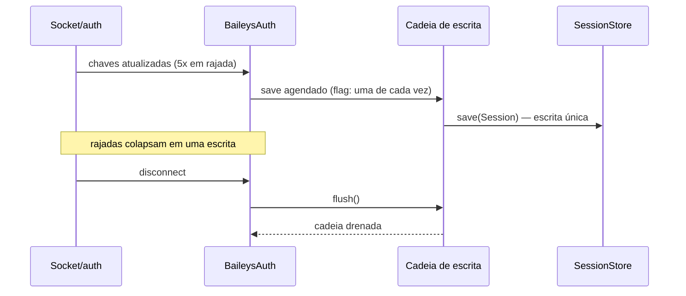

# Arquitetura de sessões {#sessions-architecture}

O estado de autenticação são **bytes de propriedade do provedor** trafegando por um **contrato de propriedade do núcleo**. O núcleo nunca os interpreta; stores nunca os interpretam; somente o backend que os escreveu os lê de volta.



## O contrato {#the-contract}

```ts
interface Session {
  readonly id: string;         // id do slot
  readonly provider: string;   // id do backend, ex. "baileys"
  readonly data: Uint8Array;   // opaco
  readonly updatedAt: Date;
}

interface SessionStore {
  load(id): Promise<Session | null>;
  save(session): Promise<void>;
  clear(id): Promise<void>;
}
```

Regras de design:

1. **`data` opaco** — o núcleo o trata como um blob; a segurança de tipos entre módulos vem de `provider` (detecção de incompatibilidade), não do parsing.
2. **Slot = `sessionId`** — múltiplas contas compartilham um store (`sessionId: "alice"` / `"bob"`).
3. **Ausente ≠ erro** — `load()` retorna `null`; um `clear()` de um slot ausente é um no-op.
4. **Somente através do store fornecido** — um backend nunca abre arquivos nem lê env; `BackendConnectOptions.sessionStore` é o único canal.

## Persistência com Baileys {#baileys-persistence}

O adaptador Baileys serializa `{ v, creds, keys }` com `BufferJSON` em `Session.data` e reviva as chaves de app-state de volta para objetos protobuf na leitura.

| Preocupação | Mecanismo |
| --- | --- |
| atualizações de chave em rajada | **escritas coalescidas**: uma flag `scheduled` + cadeia de promises colapsam N atualizações em 1 escrita no store |
| drenagem no disconnect | `flush()` aguarda a cadeia de escrita antes do socket morrer |
| blob corrompido/não suportado | `ValidationError` — falhe rápido; limpe o slot para recuperar |
| provedor incompatível (`session.provider !== "baileys"`) | aviso + comece com creds novas (nunca derrube por causa dos bytes de outra pessoa) |



## Stores {#stores}

### FileSessionStore (padrão) {#filesessionstore-default}

- caminho `<directory>/<id>.json` (`directory` padrão `.libwa`);
- payload `{ provider, data: base64, updatedAt }`;
- **atômico**: grava `<file>.<writerId>.tmp` → `rename()` (`writerId` = um `randomUUID()` por instância de store, então stores concorrentes nunca compartilham o mesmo arquivo temporário);
- **serializado por slot**: fila interna de promises por id;
- **ids seguros**: `assertSafeSessionId` (`[A-Za-z0-9_-]{1,64}`) em toda op → `ERR_SESSION_ID`;
- JSON corrompido → `ValidationError` `ERR_SESSION_CORRUPT` (cause preservada);
- arquivo existe mas não pode ser lido (`EACCES`, `EIO`, … — qualquer coisa menos `ENOENT`) → `ValidationError` `ERR_SESSION_UNREADABLE` (cause preservada): uma sessão armazenada nunca é confundida com "sem sessão".

### MemorySessionStore {#memorysessionstore}

`Map<string, Session>` — testes e processos descartáveis; sem validação de id (sem sistema de arquivos), sem persistência.

### Stores personalizados {#custom-stores}

Qualquer implementação de três métodos funciona (veja o [esboço de Redis](/pt-BR/reference/sessions#choosing-a-store)). Requisitos: segurança de escrita por id e um `null` honesto para slots ausentes.

## Pontos de contato do ciclo de vida {#lifecycle-touchpoints}

| Evento | Efeito na sessão |
| --- | --- |
| primeiro `login()` | `load()` → o backend hidrata as creds (ou inicia o pareamento) |
| durante a conexão | `save()` coalescido em mudanças de chave/cred |
| fechamento recuperável | instância de backend mantida; sessão intocada; nova tentativa de `connect()` |
| fechamento fatal (`loggedOut` etc.) | os bytes da sessão podem permanecer — `client.logout()` os limpa |
| `logout()` | `backend.logout()` (revogação remota, opcional) → `store.clear(sessionId)` → disconnect |
| `destroy()` | somente disconnect — **sessão preservada** para a próxima execução do processo |
| `provider` incompatível no load | aviso + creds novas (os bytes antigos efetivamente abandonados) |

Multi-conta: um único `FileSessionStore`, `sessionId`s distintos — cada um ganha um arquivo e uma conexão independentes.

```ts
const store = new FileSessionStore({ directory: "/var/lib/bots" });
const alice = new Client({ sessionStore: store, sessionId: "alice" });
const bob = new Client({ sessionStore: store, sessionId: "bob" });
// .libwa/alice.json · .libwa/bob.json
```

## Por que não interpretar sessões no núcleo? {#why-not-parse-sessions-in-the-core}

- **Troca de backend**: um futuro backend no estilo Signal/Telegram traz seu próprio modelo de autenticação; o núcleo não deve codificar o `{ v, creds, keys }` do Baileys.
- **Simplicidade dos stores**: stores Redis/SQL guardam bytes — nunca precisam de conhecimento de schema da autenticação.
- **Superfície de segurança**: os caminhos de código do núcleo nunca desserializam credenciais (somente o backend dono faz isso).

Veja [Decisões de design #6](/pt-BR/architecture/design-decisions#_6-opaque-session-blobs-coalesced-persistence).

## Veja também {#see-also}

- [Guia de sessões](/pt-BR/guide/sessions) — receitas
- [Referência de sessões](/pt-BR/reference/sessions) — detalhes da API
- [Reconexão](/pt-BR/architecture/reconnection) — como as novas tentativas interagem com as sessões
