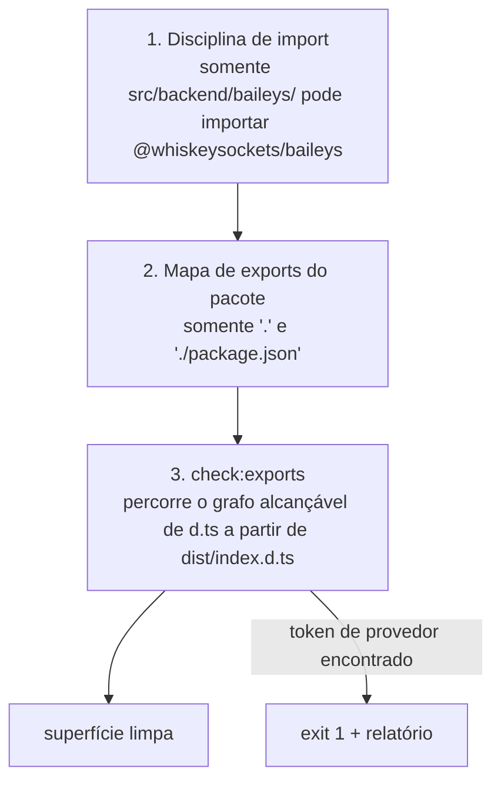

# Guard da API pública {#public-api-guard}

"Nenhum tipo de provedor na API pública" é **imposto mecanicamente**, não uma regra de revisão. `npm run check:exports` falha o build no momento em que o Baileys se torna alcançável a partir de `dist/index.d.ts`.

```bash
npm run build && npm run check:exports
# check:exports: ok — 41 arquivos de declaration alcançáveis a partir de dist/index.d.ts,
# sem tokens de provedor na superfície pública de tipos.
```

## As três camadas de defesa {#the-three-layers-of-defense}



### 1. Disciplina do código-fonte {#_1-source-discipline}

Por convenção (e revisão), os imports do provedor vivem exclusivamente em `src/backend/baileys/`. `createDefaultBackend.ts` é o único arquivo do core que nomeia a factory do provedor, e o faz de forma lazy pela própria entrada do adaptador.

### 2. Mapa de exports {#_2-exports-map}

```json
"exports": {
  ".": {
    "types": "./dist/index.d.ts",
    "import": "./dist/index.js",
    "require": "./dist/index.js",
    "default": "./dist/index.js"
  },
  "./package.json": "./package.json"
}
```

Sem subcaminhos `./dist/…` → resolvers conscientes de exports (bundler/node16) rejeitam deep imports de imediato, enquanto o legado `moduleResolution: "node"` ainda consegue alcançar `dist/` no disco — deep imports em declarações internas (que *podem* referenciar tipos de provedor — tudo bem, elas são inalcançáveis) não são suportados, não fisicamente impossíveis.

### 3. O script (`scripts/check-exports.mjs`, 192 linhas) {#_3-the-script-scripts-check-exports-mjs-192-lines}

Roda **depois do build**; sai com código diferente de zero e um relatório de violação.

**Tokens proibidos:**

```
@whiskeysockets/baileys · WAMessage · WASocket · IWebMessageInfo · makeWASocket · proto.
```

**Checagens, nesta ordem:**

| # | Checagem | Falha quando |
| --- | --- | --- |
| 1 | `dist/index.d.ts` existe | build não executado |
| 2 | chaves do mapa de exports | qualquer chave além de `.` / `./package.json`; ponteiro `types` errado |
| 3 | percurso de alcançabilidade | import relativo em um `.d.ts` alcançável não consegue ser resolvido (declaration ausente) |
| 4 | varredura do `index.d.ts` | **qualquer** token proibido em qualquer lugar da declaration raiz |
| 5 | arquivos alcançáveis: import do provedor | o texto do arquivo contém `@whiskeysockets/baileys` (força os consumidores a resolverem as declarations do provedor) |
| 6 | arquivos alcançáveis: linhas de export | uma linha/bloco `export …` menciona o nome de um tipo proibido |

Como o percurso funciona:

1. analisa especificadores relativos (`from "./x.js"` / `import("./x.js")`);
2. mapeia especificadores `.js` emitidos de volta para candidatos `.d.ts`;
3. BFS a partir de `dist/index.d.ts`, visitando cada arquivo uma vez;
4. aplica as checagens 4–6 em cada arquivo visitado.

**Permitido por design:** arquivos `.d.ts` internos *inalcançáveis* podem referenciar Baileys — o mapa de exports mantém os consumidores longe deles. (O grafo alcançável tem ~41 arquivos; ele inclui `dist/backend/baileys/index.d.ts` e `dist/backend/baileys/BaileysBackend.d.ts` — re-exportados via `createBaileysBackend` — mas passam porque as declarations *emitidas* expõem apenas `browser`/`syncFullHistory`, sem tokens de provedor.)

## Demonstração: um vazamento falha o build {#demonstration-a-leak-fails-the-build}

Injete um tipo de provedor na superfície (ex.: `export type { WASocket } from "./backend/baileys/index.js";` em `src/index.ts`), refaça o build e:

```bash
npm run build && npm run check:exports
# check:exports: 2 violação(ões):
#   - dist/index.d.ts menciona "WASocket" — detalhes do provedor vazaram para a API pública.
#   - dist/backend/baileys/index.d.ts importa o módulo do provedor — …
```

Código de saída 1 → `npm run verify` falha. Remova o export e o guard fica verde de novo. (Isto foi testado contra o repositório real — vazamento dentro, vermelho; vazamento fora, verde.)

## O que ele NÃO verifica {#what-it-does-not-check}

| Fora de escopo | Por quê |
| --- | --- |
| comportamento em runtime | preocupação só de tipos; `dist/index.js` pode importar o adaptador (precisa, para criar o backend padrão) |
| valores de runtime não exportados | a alcançabilidade em `.d.ts` é o contrato que os consumidores veem |
| texto dos exemplos de JSDoc | tokens em comentários são tolerados (eles não forçam a resolução de tipo) |

## Veja também {#see-also}

- [Design decisions #15](/pt-BR/architecture/design-decisions#_15-leaks-are-a-build-failure) — por quê
- [Workflow](/pt-BR/development/workflow) — ordem do `verify`
- [Backend contract](/pt-BR/architecture/backend-contract#enforced-boundaries) — resumo dos limites
