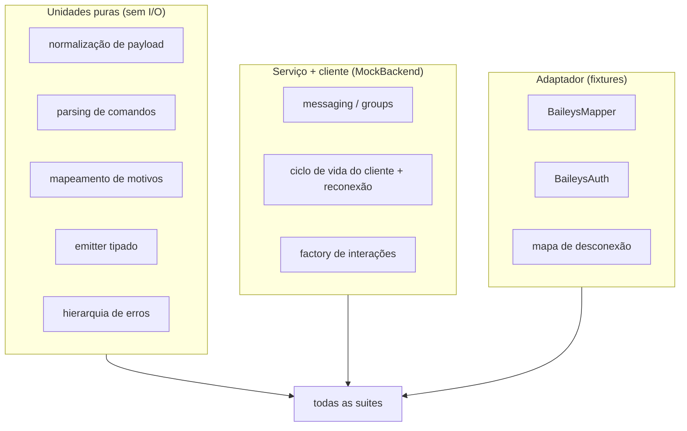

# Testes {#testing}

Como o `libwa` é testado: estratégia, helpers, mapa das suites e o que cada camada garante.

## Configuração {#setup}

| Item | Valor |
| --- | --- |
| executor | vitest 3 (`npm test` = `vitest run`) |
| local | `tests/**/*.test.ts`, ambiente node |
| config | `vitest.config.ts` — cobertura exclui apenas `src/index.ts` |
| totais | **16 arquivos, 324 testes** |

## Estratégia: testes de contrato, não integração com o provedor {#strategy-contract-tests-not-provider-integration}



1. **Core livre de provedor** roda contra `MockBackend` — sem sockets, sem rede, determinístico.
2. **Código específico do Baileys** é testado em unidade no nível mapper/auth/disconnect com **fixtures realistas do provedor** — sem WhatsApp ao vivo no CI.
3. **Reconexão** usa timers falsos (backoff, esgotamento, cancelamento) — sem espera real.

## Helpers {#helpers}

### `tests/helpers/MockBackend.ts` (299 linhas) {#tests-helpers-mockbackend-ts-299-lines}

```ts
class MockBackend implements WhatsAppBackend { /* … */ }
class CapableMockBackend extends MockBackend { /* adiciona toda capacidade opcional */ }
```

- implementa o contrato obrigatório completo (~200 linhas — prova viva da decisão do [contrato pequeno](/pt-BR/architecture/design-decisions#_3-provider-behind-an-interface-with-optional-capabilities));
- registra chamadas (`sentMessages`, `reacted`, …) para asserções;
- falhas programáveis (throw em `sendMessage`, …);
- `CapableMockBackend` habilita os métodos opcionais para que os caminhos condicionais a capacidade sejam testáveis;
- o helper `groupMetadataFixture(id)` constrói `GroupMetadata`.

### `tests/helpers/fixtures.ts` (95 linhas) {#tests-helpers-fixtures-ts-95-lines}

Builders para cada evento do backend: `messageEvent`, `reactionEvent`, `messageUpdateEvent`, `groupParticipantsEvent`, `groupUpdateEvent`, `referenceFixture` — cada um com overrides `Partial<…>` para que os testes só escrevam os campos que interessam.

## Mapa das suites {#suite-map}

| Suite | Testes | Cobre |
| --- | --- | --- |
| `client.test.ts` | 36 | máquina de estados, ordem do dispatch, ensure de metadados de grupo (TTL ≤60s, dedupe de requisições em andamento, backoff de falha, patch de eventos sem refetch), integração com middleware, roteamento de erros, login adiado, destroy/logout, reconexão (timers falsos), fluxo de código de pareamento |
| `baileys-mapper.test.ts` | 57 | todo tipo de conteúdo, wrappers (ephemeral/view-once/edit/device-sent), timestamps, normalização de JID, referências, menções, filtragem de stubs, captura de pares de id LID ↔ telefone, usernames de participantes, conteúdo que viaja junto com a distribuição de sender-key |
| `messaging.test.ts` | 21 | resolução do alvo de envio, citações, menções, react/edit/delete, erros de capacidade, reconstrução da entidade a partir de `BackendSentMessage` |
| `interactions.test.ts` | 25 | guards/estreitamento, classificação da factory, campos de subclasse, `interaction.member` (papéis, entre esquemas, metadados ausentes), `reply()` |
| `commands.test.ts` | 18 | validação de nome/alias, duplicatas, atomicidade da definição inteira, parsing do prefixo mais longo, case folding |
| `baileys-auth.test.ts` | 13 | idas e vindas `AuthenticationState` ⇄ store, coalescing, buffer JSON, revitalização da chave app-state |
| `payload.test.ts` | 10 | `normalizeReplyContent`: vazio/ambíguo/legenda/mídia, fusão de menções |
| `session.test.ts` | 15 | atomicidade da store de arquivos, validação de id, JSON corrompido, arquivos ilegravíveis, escritores concorrentes, store de memória |
| `users.test.ts` | 30 | `client.users`: registro de pares de id (mensagens/metadata/membership), resolução com e sem capacidade, guards de esquema, propagação de erros, `fetch` (formatos/capacidades/buscas), memória de push-name em payloads só-id, enriquecimento de perfil (`pictureUrl`/`about`/`accountType`) |
| `groups.test.ts` | 21 | fetch/aplicação de metadados, cache do `ensure` (fetch único, janela de TTL, dedupe de requisições em andamento, backoff de falha), aplicação de mudanças de membership (add/remove/promote/demote, entre esquemas, idempotente), operações de participantes, rename/descrição, caminhos não suportados, ids de grupo puros, buscas em `Group.member` (ids, users, entre esquemas) |
| `errors.test.ts` | 8 | códigos, `cause`, `toError`, passthrough/wrap de `rethrowAsBackendError` |
| `baileys-disconnect.test.ts` | 8 | códigos Boom, status HTTP, errnos de rede → `DisconnectReason` |
| `typed-event-emitter.test.ts` | 11 | on/once/off, ordenação, snapshots, hook de erro, segurança contra recursão |
| `middleware.test.ts` | 9 | ordenação, semântica de skip, guard contra `next()` duplo, propagação de throw, resultados de `next()` destacado/adotado |
| `entities.test.ts` | 18 | identidade própria sob ambos os esquemas de id, fallbacks de nome de exibição, identidade do cache chat/metadata (upgrade, merge entre esquemas), caches limitados (evicção LRU + reset), guard de revisão de metadados |
| `baileys-backend.test.ts` | 24 | ciclo de vida do adaptador (connect/close/logout, desmantelamento de socket obsoleto), normalização de envio + eventos, metadados de grupo + hook `cachedGroupMetadata`, pareamento automático/re-arm — contra um provedor mockado |

## O que testamos (garantias) {#what-we-test-guarantees}

- **Ordem do dispatch**: middleware → comando → listeners, incluindo gate-skips que ainda notificam os listeners.
- **Isolamento de falhas**: um listener/comando/middleware que lança exceção produz um evento `error` (com o contexto certo) e mais nada — além do guard de recursão do listener de `error`.
- **Política de reconexão**: conjunto fatal respeitado, tentativas esgotadas, `reconnect: false`, fórmula de backoff, reset do contador ao abrir, cancelamento do timer em `destroy()`.
- **Caminhos de validação**: cada regra de validação é exercitada com a entrada certa — as asserções usam a classe de erro, `error.code` ou uma regex na mensagem do construtor.
- **Buscas de identidade**: formatos aceitos por `client.users.fetch`, erros de capacidade ausente, cadeias de resolução de lid (pair → capability → undefined), memória de push-name fluindo para payloads só-id e enriquecimento de perfil (padrões/tipos, normalização, caminhos não suportados/propagação).
- **Contexto do grupo**: os metadados são resolvidos via `client.groups.ensure` — um cache de ≤60s com um único fetch em andamento por grupo; falhas aguardam (backoff) pela janela e disparam sobre o estado em cache + um aviso; eventos de membership/update fazem patch no cache antes de a interação ser construída; `interaction.member` / `Group.member` respondem papéis em ambos os esquemas de id.
- **Fidelidade de mapeamento**: fixtures do provedor → formatos exatos de `MessageContent` (a maior suite — o mapper é a superfície de maior risco).
- **Semântica da store**: escritas atômicas, serialização por slot, `null` para ausente, `ERR_SESSION_ID` / `ERR_SESSION_CORRUPT`.
- **Sem vazamentos**: `check:exports` (estágio separado) prova que a superfície continua livre de provedor.

## Convenções dentro dos testes {#conventions-inside-tests}

- importe internals via caminhos `src/…` (só a raiz é pública — veja [Guard da API pública](/pt-BR/development/public-api-guard));
- use overrides `Partial<…>` nos fixtures em vez de construir payloads completos à mão;
- timers falsos para tudo que envolver backoff;
- sem rede, sem sistema de arquivos além de diretórios temporários (os testes de sessão usam temporários do `node:os` ou caminhos em memória);
- asserção da classe de erro e `error.code` quando estável; regex no texto da mensagem para mensagens exatas do construtor.

## Executando subconjuntos {#running-subsets}

```bash
npx vitest run tests/client.test.ts
npx vitest run -t "reconnect"          # pelo nome do teste
npm run test:watch                      # modo watch
```

## Configuração de cobertura {#coverage-config}

```ts
coverage: {
  reportsDirectory: "coverage",
  include: ["src/**/*.ts"],
  exclude: ["src/index.ts"],
}
```

Só o `index.ts` é excluído — ele é puro re-export. `src/backend/baileys/` está **incluído** e é coberto pelas suites orientadas a fixtures (`baileys-mapper`, `baileys-auth`, `baileys-disconnect`, `baileys-backend`), que dirigem o adaptador contra um provedor mockado em vez de sockets ao vivo.

## Veja também {#see-also}

- [Workflow](/pt-BR/development/workflow) — onde os testes ficam no `verify`
- [Repository](/pt-BR/development/repository) — mapa de arquivos
