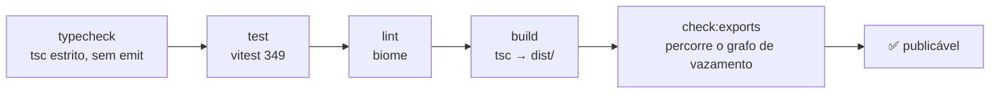

# Fluxo de trabalho {#workflow}

Comandos diários para desenvolver `libwa` — desde loops rápidos até o gate completo.

## Scripts {#scripts}

| Comando | O que executa | Quando |
| --- | --- | --- |
| `npm run typecheck` | `tsc -p tsconfig.json --noEmit` (src + tests + examples + vitest config) | a qualquer momento; pega problemas de `exactOptionalPropertyTypes` cedo |
| `npm test` | `vitest run` — execução única | antes de commits |
| `npm run test:watch` | modo watch do `vitest` | durante o desenvolvimento |
| `npm run test:coverage` | `vitest run --coverage` (v8) | ao auditar a cobertura |
| `npm run lint` | `biome check .` (format + lint + ordem de imports) | antes de commits |
| `npm run lint:fix` | `biome check --write .` | correção automática |
| `npm run format` | `biome format --write .` | passada apenas de formatação |
| `npm run build` | `node scripts/clean-dist.mjs && tsc -p tsconfig.build.json` → `dist/` limpo (js, d.ts, maps) | antes de `check:exports` / publicação |
| `npm run check:exports` | `node scripts/check-exports.mjs` (guard de vazamento) | depois do build |
| **`npm run verify`** | typecheck → test → lint → build → check:exports | **o gate** — rode antes de cada commit |
| `npm run prepare` | `npm run build` | automaticamente em um `npm install` a partir de um checkout git |
| `npm run prepublishOnly` | `npm run verify` | automaticamente antes do `npm publish` |

```bash
npm run verify
# typecheck ✓  tests 349 ✓  lint ✓  build ✓  check:exports ✓
```

## Loops sugeridos {#suggested-loops}

**Implementando uma funcionalidade**

```bash
npm run test:watch          # vermelho → verde
npm run typecheck           # estritez enquanto avança
npm run lint:fix            # antes de commitar
```

**Mexendo na superfície pública**

```bash
npm run verify              # nunca pule check:exports após edições em index.ts
```

**Trabalho no provedor/adaptador** (`src/backend/baileys/`)

```bash
npx vitest run tests/baileys-mapper.test.ts tests/baileys-auth.test.ts tests/baileys-disconnect.test.ts tests/baileys-backend.test.ts
npm run verify              # o adaptador continua sendo o único importador do provedor
```

**Trabalho na documentação** (este site)

```bash
cd ../libwa-docs
npm run dev                 # http://localhost:5173
npm run build               # bundle de produção
```

## Estágios de verificação explicados {#verification-stages-explained}



| Estágio | Pega |
| --- | --- |
| typecheck | erros de tipo, incl. uso indevido de `exactOptionalPropertyTypes`, `noUncheckedIndexedAccess`, `imports` inválidos em exemplos |
| test | regressões de comportamento (reconexão, dispatch, mapeamento, stores) |
| lint | desvios de formato, `any`, asserções non-null, ordem de imports |
| build | problemas só de emit (declarations, violações de `rootDir`) |
| check:exports | tipos do provedor alcançáveis a partir de `dist/index.d.ts` |

Nenhum dos estágios é opcional em `verify`; o repositório trata um estágio com falha como "não concluído".

## Integração contínua {#continuous-integration}

`.github/workflows/ci.yml` (no repositório libwa) roda o mesmo gate fora de uma laptop: em **pushes para `main`** e em **pull requests** ele faz checkout do repositório, configura **Node 20** (com cache do npm), executa `npm ci` e depois `npm run verify` — typecheck, testes, lint, build, `check:exports`. Não há lógica exclusiva de CI: se `npm run verify` estiver verde localmente, o CI está verde.

## Higiene Git (prática do repositório) {#git-hygiene-repo-practice}

- faça stage apenas dos arquivos pretendidos; nunca commit `dist/` ou `.libwa/` (ambos ignorados);
- estilo de mensagem: linha curta no imperativo, escopo quando útil (`fix: guard login rejection without listeners`);
- sem commits durante falhas de `verify` — corrija avançando, não faça amend de commits quebrados.

## Checklist de publicação {#publishing-checklist}

1. `npm run verify` verde;
2. incremento de versão em `package.json` (`files` já inclui `dist` + docs);
3. `npm publish` (config de registry assumida local);
4. exemplos + README ainda correspondem à superfície (eles compilam como parte do typecheck).

## Veja também {#see-also}

- [Repository](/pt-BR/development/repository) — mapa de arquivos
- [Testing](/pt-BR/development/testing) — o que as suites cobrem
- [Public API guard](/pt-BR/development/public-api-guard) — o último estágio em profundidade
