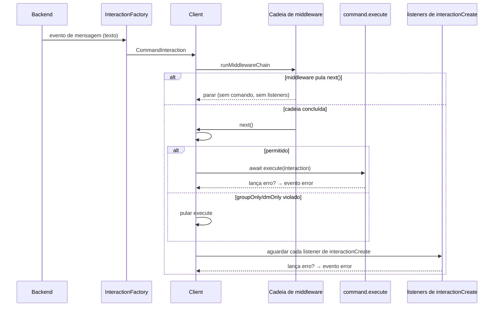

# Comandos {#commands}

O libwa traz um sistema completo de comandos: prefixos, aliases, argumentos tipados, guards de escopo e um registry que você pode consultar para construir comandos de ajuda.

## Registrando comandos {#registering-commands}

Os comandos ficam em [`client.commands`](/pt-BR/reference/commands) — uma instância de [`CommandRegistry`](/pt-BR/reference/commands#commandregistry):

```ts
import { Client } from "libwa";

const client = new Client({ commands: { prefix: ["!", "/"] } });

client.commands.register({
  name: "echo",
  description: "Repeats your text",
  aliases: ["say"],
  category: "fun",
  execute: (interaction) => {
    const text = interaction.rawArgs.length > 0 ? interaction.rawArgs : "…nothing to echo.";
    void interaction.reply(text);
  },
});

client.commands.registerAll([
  { name: "ping", description: "Health check", execute: (i) => void i.reply("pong") },
  {
    name: "members",
    description: "Group member count",
    groupOnly: true,           // aplicado durante o dispatch
    async execute(i) {
      if (!i.isFromGroup()) return;
      const group = await i.chat.client.groups.fetch(i.chat.id);
      await i.reply(`Members: ${group.memberCount ?? "?"}`);
    },
  },
]);
```

### `CommandDefinition` {#commanddefinition}

<ApiTable
  :rows="[
    { name: 'name', type: 'string', description: 'Nome do comando sem prefixo. Comparado sem distinção de maiúsculas: a chave do registry e os nomes parseados são convertidos para minúsculas, enquanto definition.name mantém a caixa original. Padrão (aplicado ao valor em minúsculas): /^[a-z0-9][a-z0-9_-]{0,31}$/ (1-32 caracteres, começa com letra ou dígito).' },
    { name: 'description', type: 'string', def: 'undefined', description: 'Texto curto de ajuda. Livre — a biblioteca nunca renderiza a ajuda para você.' },
    { name: 'aliases', type: 'readonly string[]', def: 'undefined', description: 'Nomes alternativos. Cada um deve passar pelo mesmo padrão de nome e não pode colidir com nenhum comando ou alias existente.' },
    { name: 'category', type: 'string', def: 'undefined', description: 'Rótulo de agrupamento para suas próprias listas de ajuda. O libwa o armazena, mas não o utiliza.' },
    { name: 'groupOnly', type: 'boolean', def: 'false', description: 'Quando true, execute() roda apenas para interações em chats de grupo.' },
    { name: 'dmOnly', type: 'boolean', def: 'false', description: 'Quando true, execute() roda apenas em chats diretos.' },
    { name: 'execute', type: '(interaction: CommandInteraction) => void | Promise<void>', description: 'Roda quando o comando casa. Rejeições são capturadas e reportadas pelo evento de erro do cliente — o dispatch continua com os listeners interactionCreate.' }
  ]"
/>

::: tip Comandos são mensagens
Dentro de `execute`, a interação é um `CommandInteraction`, que **é** um `MessageInteraction`: `interaction.text`, `interaction.message`, `interaction.reply()`, guards de mídia — tudo disponível. `interaction.content` é garantidamente `TextContent`.
:::

## Regras de registro {#registration-rules}

`register()` valida antecipadamente e lança [`ValidationError`](/pt-BR/reference/errors#validationerror) com códigos específicos:

| Situação | Código | Mensagem de exemplo |
| --- | --- | --- |
| Nome/alias falha em `^[a-z0-9][a-z0-9_-]{0,31}$` | `ERR_INVALID_COMMAND_NAME` | `Invalid command name "Ping!": use 1-32 chars from [a-z0-9_-]...` |
| Nome já registrado | `ERR_DUPLICATE_COMMAND` | `Command "ping" is already registered.` |
| Alias colide com um comando ou com outro alias | `ERR_DUPLICATE_COMMAND` | `Alias "p" conflicts with an existing command.` |

Os nomes são armazenados em minúsculas como chaves do registry; `register({ name: "Ping" })` usa a chave `"ping"` para o comando enquanto `definition.name` permanece `"Ping"` (o teste de padrão roda sobre o valor em minúsculas, e `parse()` sempre produz nomes em minúsculas).

```ts
try {
  client.commands.register({ name: "Ping!", execute: () => {} }); // "ping!" → inválido
} catch (error) {
  console.error((error as Error).message);
}
```

## Regras de parsing {#parsing-rules}

O parsing acontece por mensagem recebida dentro da [`InteractionFactory`](/pt-BR/reference/interactions#interactionfactory), *antes* do dispatch:

1. O parsing de comandos deve estar habilitado (a opção `commands` não é `false`).
2. O conteúdo da mensagem deve ser `kind: "text"` — mídia nunca é parseada como comando.
3. Se `ignoreSelf` estiver ativo e a mensagem for do próprio bot, pule o parsing.
4. O texto deve começar com um dos prefixos configurados — o prefixo configurado mais longo que casar prevalece.
5. Tudo depois do prefixo é aparado; um corpo vazio não é um comando.
6. O primeiro token delimitado por espaço em branco é o nome do comando; ele deve corresponder a `COMMAND_NAME_PATTERN` ou a mensagem permanece um `MessageInteraction` simples.
7. O nome é convertido para minúsculas; `args` = tokens restantes separados por espaço em branco; `rawArgs` = o restante intacto (ou `""`).
8. O registry resolve nome-ou-alias → definição (possivelmente `undefined`).

```ts
client.commands.parse("!Ping   a   b c", ["!"]);
// {
//   prefix: "!",
//   name: "ping",
//   args: ["a", "b", "c"],
//   rawArgs: "a   b c",        // espaçamento original preservado
//   command: <definition>       // ou undefined quando não registrado
// }

client.commands.parse("hello", ["!"]);            // null — sem prefixo
client.commands.parse("!  ", ["!"]);              // null — corpo vazio
client.commands.parse("!not a command!!", ["!"]); // nome "not" + args — mas
// nomes no estilo "!42 bad" devem corresponder ao padrão: "42" é válido (começa com [a-z0-9]).
```

Texto bruto que nunca é parseado como comando é despachado como um `MessageInteraction` normal — uma mensagem como `!` sozinho, ou `! bad-name`, *não* é engolida silenciosamente (a menos que o token inicial falhe no padrão, caso em que ela chega como mensagem).

### Múltiplos prefixos {#multi-prefix}

```ts
new Client({ commands: { prefix: ["!", "/", "?"] } });
// "!ping", "/ping", "?ping" todos casam — o prefixo mais longo que casa prevalece
// (os três têm o mesmo comprimento aqui, então a ordem não desempenha papel).
// Com prefix: ["!", "!!"], "!!help" é parseado como o comando "!!", não "!help".
```

### Desativando o parsing {#disabling-parsing}

```ts
new Client({ commands: false });
```

`client.commands` ainda existe para registro, mas a factory nunca promove mensagens a `CommandInteraction`.

## Dispatch: como um comando é executado {#dispatch-how-a-command-runs}



Comportamentos principais:

- **O middleware roda primeiro.** Um limitador de taxa que pula `next()` também pula os comandos.
- **`groupOnly` / `dmOnly` são aplicados pelo cliente**, não pela factory: um comando invocado no chat errado simplesmente não é executado, mas os listeners `interactionCreate` ainda observam a interação (assim logging/ajuda continuam funcionando).
- **Erros são isolados.** Um comando que lança exceção reporta `error` com o contexto `command "<name>"`; os listeners ainda rodam.

```ts
client.on("error", (error) => {
  console.error(error.message); // ex.: [command "members"]: ...
});
```

## Guards de escopo {#scope-guards}

```ts
client.commands.register({
  name: "unmute",
  groupOnly: true,
  execute: (i) => void i.reply("works only in groups"),
});

client.commands.register({
  name: "register",
  dmOnly: true,
  execute: (i) => void i.reply("works only in direct chats"),
});
```

Lógica de aplicação (`Client.#commandAllowed`):

```ts
if (command.groupOnly === true && !interaction.isFromGroup()) return false;
if (command.dmOnly === true && !interaction.isFromDirectChat()) return false;
return true;
```

Ambos definidos? O comando nunca pode rodar (nada impede você de declará-lo — ele simplesmente está morto). Prefira um só.

## Construindo um comando de ajuda {#building-a-help-command}

O registry expõe o suficiente para você gerar a ajuda você mesmo:

```ts
client.commands.register({
  name: "help",
  description: "Lists available commands",
  execute: (i) => {
    const lines = client.commands
      .list()
      .map((cmd) => {
        const alias = cmd.aliases?.length ? ` (${cmd.aliases.join(", ")})` : "";
        const scope = cmd.groupOnly ? " [groups]" : cmd.dmOnly ? " [DMs]" : "";
        return `!${cmd.name}${alias} — ${cmd.description ?? "no description"}${scope}`;
      });
    void i.reply(lines.join("\n") || "No commands registered.");
  },
});
```

::: info Quebras de linha
`reply` com uma string envia uma mensagem de texto; strings longas são enviadas como estão (o WhatsApp quebra as linhas). O libwa não divide mensagens.
:::

## Resumo da API do registry {#registry-api-summary}

| Método | Finalidade |
| --- | --- |
| `register(def)` | Valida + adiciona; retorna `this` (encadeável). |
| `registerAll(iterable)` | Registra vários; para no primeiro inválido (registro parcial possível). |
| `unregister(name)` | Remove por nome ou alias (também remove seus aliases); retorna se o comando canônico existia. |
| `get(name)` | Busca apenas pelo nome canônico (aliases **não** casam). |
| `resolve(name)` | Nome **ou** alias → definição. |
| `has(name)` | `resolve(name) !== undefined`. |
| `list()` | Array instantâneo na ordem de registro. |
| `size` | Número de comandos registrados (aliases excluídos). |
| `clear()` | Remove tudo. |
| `parse(text, prefixes)` | Parser autônomo (veja acima). |

Assinaturas completas: [referência do CommandRegistry](/pt-BR/reference/commands#commandregistry).

## Casos extremos e armadilhas {#edge-cases-pitfalls}

- **Insensibilidade a maiúsculas:** comandos sempre são convertidos para minúsculas — `!PING` invoca `ping`.
- **Prefixo dentro do texto:** apenas um prefixo *inicial* conta (`hello !ping` é uma mensagem).
- **Espaçamento em `rawArgs`:** preservado literalmente após aparar as pontas — use `args` para lógica de tokens.
- **Aliases são globais:** `alias: "ping"` colide com um comando chamado `ping`. O inverso *não* é verificado — um novo nome de comando só colide com comandos existentes, então pode sombrear um alias existente (`resolve()` prefere o alias). Mantenha nomes únicos.
- **Comandos prefixados desconhecidos:** ainda são `CommandInteraction`s com `command === undefined` — trate nos listeners ou via uma verificação de comando de fallback:

  ```ts
  client.on("interactionCreate", (i) => {
    if (i.isCommand() && i.command === undefined) {
      void i.reply(`Unknown command: ${i.name}`);
    }
  });
  ```

- **Mensagens próprias:** sem `ignoreSelf: true`, suas próprias respostas com prefixo reentram no parser (útil para fluxos acionados por prefixo; armadilha para bots que ecoam).

## Relacionados {#related}

- [Referência de comandos](/pt-BR/reference/commands) — API completa de registry/definição
- [CommandInteraction](/pt-BR/reference/interactions#commandinteraction) — o tipo de interação
- [Middleware](/pt-BR/guide/middleware) — controle de comandos antes da execução
- [Exemplo de referência](/pt-BR/guide/examples#middleware-filters-ts-—-middleware-filters-reactions)
