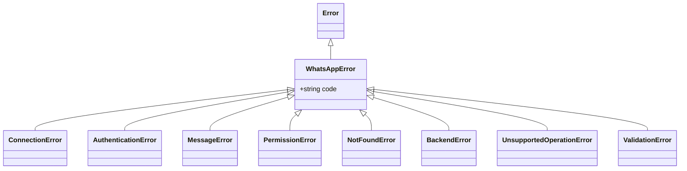
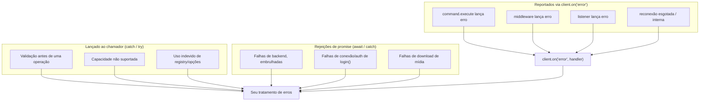

# Tratamento de erros {#error-handling}

O libwa.js garante que **todo erro que ele lança estende `WhatsAppError`** com um `code` estável e legível por máquina. Classes de erro específicas de provedor nunca chegam ao código da aplicação.

## A hierarquia {#the-hierarchy}



| Classe | `code` padrão | Significado |
| --- | --- | --- |
| [`WhatsAppError`](/pt-BR/reference/errors#whatsapperror) | `ERR_WHATSAPP` | Classe raiz; base de tudo o que a biblioteca lança. |
| [`ConnectionError`](/pt-BR/reference/errors#connectionerror) | `ERR_CONNECTION` | A conexão não pôde ser estabelecida ou foi perdida, ou uso indevido do ciclo de vida (login depois de destroy, backend não conectado). |
| [`AuthenticationError`](/pt-BR/reference/errors#authenticationerror) | `ERR_AUTHENTICATION` | Login falhou; sessão armazenada inutilizável; disconnect fatal durante `login()`. |
| [`MessageError`](/pt-BR/reference/errors#messageerror) | `ERR_MESSAGE` | Envio/edição/exclusão/download falhou no provedor. |
| [`PermissionError`](/pt-BR/reference/errors#permissionerror) | `ERR_PERMISSION` | Não permitido (respostas de provedor no estilo 401/403, operações exclusivas de admin). |
| [`NotFoundError`](/pt-BR/reference/errors#notfounderror) | `ERR_NOT_FOUND` | Chat/grupo/mensagem não pôde ser encontrado (404, cache de mídia expirado). |
| [`BackendError`](/pt-BR/reference/errors#backenderror) | `ERR_BACKEND` | Qualquer falha desconhecida do provedor embrulhada por `rethrowAsBackendError`. |
| [`UnsupportedOperationError`](/pt-BR/reference/errors#unsupportedoperationerror) | `ERR_UNSUPPORTED` | O backend ativo não implementa a capacidade. |
| [`ValidationError`](/pt-BR/reference/errors#validationerror) | `ERR_VALIDATION` | A biblioteca foi usada incorretamente (argumento inválido, estado inválido). |

Todas são exportadas da raiz do pacote:

```ts
import {
  WhatsAppError,
  ConnectionError,
  AuthenticationError,
  MessageError,
  PermissionError,
  NotFoundError,
  BackendError,
  UnsupportedOperationError,
  ValidationError,
} from "libwa.js";
```

## Anatomia {#anatomy}

```ts
class WhatsAppError extends Error {
  readonly code: string;
  constructor(message: string, options?: { code?: string; cause?: unknown });
}
```

- `message` — legível por humanos, inclui o contexto da operação (`"Failed to send message: …"`).
- `code` — identificador estável; **ramifique por ele ou pela classe**, nunca pelo texto da mensagem.
- `cause` — o erro subjacente do provedor quando existe (`error.cause`, causa padrão do `Error`).
- `error.name` — o nome da classe (`"ValidationError"`, `"BackendError"`, …) via `new.target.name`.

```ts
try {
  await client.messages.send(chat, "");
} catch (error) {
  if (error instanceof ValidationError) {
    console.log(error.code); // "ERR_EMPTY_MESSAGE"
    return;
  }
  throw error;
}
```

## De onde vêm os erros {#where-errors-come-from}



### 1. Lançados sincronamente / promises rejeitadas (você pode capturar) {#_1-thrown-synchronously-rejected-promises-you-can-catch}

| Chamada | Erros notáveis |
| --- | --- |
| `new Client(options)` | `ValidationError` `ERR_INVALID_PREFIX` |
| `client.login()` | rejeita com `AuthenticationError` (fatal/sessão) ou `ConnectionError` (connect falhou, retries desligados/esgotados antes do ready); resolve após o primeiro `ready` |
| `client.requestPairingCode(phone)` | `ValidationError` `ERR_INVALID_PHONE` / `UnsupportedOperationError` `ERR_UNSUPPORTED` (backend não tem códigos de pareamento) |
| `client.destroy()` | nunca rejeita — falhas internas são reportadas via `error` (contexto `disconnect during destroy`) |
| `client.logout()` | falhas de logout/disconnect do backend → `error`; um `sessionStore.clear()` que rejeita rejeita a chamada |
| `client.messages.send(...)` | `ValidationError` (regras do payload) / `MessageError` (adaptador embutido) / `BackendError` |
| `client.messages.react/edit/delete` | `ValidationError` / `UnsupportedOperationError` / `MessageError` |
| `client.users.fetch(...)` | `ValidationError` `ERR_INVALID_USER_ID` / `UnsupportedOperationError` (backend não consegue verificar) / `BackendError` |
| `client.users.pictureUrl/about/accountType(...)` | `ValidationError` `ERR_INVALID_USER_ID` / `UnsupportedOperationError` (backend não consegue responder) / `BackendError` — dados ausentes/privados resolvem `undefined` em vez de lançar |
| `client.groups.*` | `ValidationError` / `UnsupportedOperationError` / `NotFoundError` / `PermissionError` / `BackendError` |
| `attachment.download()` | `NotFoundError` (evictado do cache) / `MessageError` (falha de download) |
| `client.commands.register(...)` | `ValidationError` `ERR_INVALID_COMMAND_NAME` / `ERR_DUPLICATE_COMMAND` |
| stores de sessão | `ValidationError` `ERR_SESSION_ID` / `ERR_SESSION_CORRUPT` / `ERR_SESSION_UNREADABLE` |
| load de auth do Baileys | `ValidationError` (sessão corrompida/não suportada/sem creds) — aparece do `login()` |

### 2. Reportados via `error` (nenhuma rejeição chega a você) {#_2-reported-through-error-no-rejection-reaches-you}

- rejeições de `command.execute` → contexto `command "<name>"`
- erros de middleware → contexto `middleware`
- rejeições de listener → contexto `listener for "<event>"` (todo evento, `interactionCreate` incluído)
- falhas de `connect()` do backend → contexto `connect`
- falhas de construção da interação → contexto `interaction build`
- falhas de tentativa de reconexão → contexto `reconnection`
- reconexão esgotada → `ConnectionError("Gave up reconnecting after N attempt(s) (reason).")` (contexto `reconnect exhausted`)
- falhas de `login()` → contexto `login`
- falhas de logout/disconnect do backend durante `client.logout()` → contextos `backend logout` / `disconnect after logout`
- falhas de disconnect durante `client.destroy()` → contexto `disconnect during destroy`

```ts
client.on("error", (error) => {
  if (error instanceof PermissionError) return warnUser();
  if (error instanceof MessageError) return retryLater();
  logger.error({ err: error }, "unhandled libwa.js error");
});
```

::: warning Contrato do listener de erro
Se o seu listener de `error` lança erro, essa falha é apenas registrada (`[error listener] …`) — o evento não dispara de novo. Mantenha o listener total.
:::

## A regra de embrulho {#the-wrapping-rule}

Os serviços nunca deixam vazar erros do provedor. `rethrowAsBackendError(operation, error)`:

```ts
if (error instanceof WhatsAppError) throw error;      // deixa os erros da biblioteca passarem
throw new BackendError(`${operation}: ${msg}`, { cause: error }); // embrulha o resto
```

Falhas lançadas pela biblioteca são subclasse de `WhatsAppError`, então `catch (e) { if (e instanceof WhatsAppError) ... }` as cobre. Um `Error` cru ainda pode escapar sem embrulho de `connect()` (throws do provedor ou de backend personalizado passam por `toError` inalterados) — ramifique por `instanceof Error` para o resto. `BackendError.cause` guarda o original para depuração (registre-o em log, não ramifique por ele).

## Erros de capacidade {#capability-errors}

Recursos opcionais de backend falham com `UnsupportedOperationError` **antes** de qualquer I/O de rede:

```ts
try {
  await message.react("👍");
} catch (error) {
  if (error instanceof UnsupportedOperationError) {
    // O backend "xxx" não suporta reações.
  }
}
```

Faça feature detection de antemão se preferir:

```ts
if (client.backend.react) {
  await message.react("👍");
}
```

`ERR_UNSUPPORTED` é sempre um código de `UnsupportedOperationError`, nunca um de `ValidationError` — ex.: `Client.requestPairingCode` o lança quando o backend não tem a capacidade `requestPairingCode`.

## Códigos de validação {#validation-codes}

Lista mestre dos códigos de `ValidationError`:

| Código | Lançado por | Condição |
| --- | --- | --- |
| `ERR_INVALID_PREFIX` | `resolveClientOptions` | lista de prefixos vazia / prefixo string vazia |
| `ERR_INVALID_COMMAND_NAME` | `CommandRegistry.register` | name/alias falha em `^[a-z0-9][a-z0-9_-]{0,31}$` |
| `ERR_DUPLICATE_COMMAND` | `CommandRegistry.register` | comando duplicado ou colisão de alias |
| `ERR_EMPTY_MESSAGE` | `normalizeReplyContent`, `MessageService.edit` | string/texto/texto editado vazio |
| `ERR_AMBIGUOUS_MESSAGE` | `normalizeReplyContent` | mais de um corpo no payload |
| `ERR_INVALID_CAPTION` | `normalizeReplyContent` | caption sem image/video/document |
| `ERR_EMPTY_MEDIA` | `normalizeReplyContent` | anexo de zero byte |
| `ERR_EMPTY_REACTION` | `MessageService.reactTo` | string de emoji vazia |
| `ERR_EMPTY_GROUP_NAME` | `GroupService.rename` | nome vazio |
| `ERR_EMPTY_USER_LIST` | `GroupService.#participants` | nenhum usuário |
| `ERR_INVALID_USER_ID` | `UserService.fetch` | id não é um phone JID (…@s.whatsapp.net / …@c.us, sufixo de dispositivo ok), dígitos puros (`+` opcional) ou `…@lid` |
| `ERR_INVALID_PHONE` | `Client.requestPairingCode` | não corresponde a `^\d{7,15}$` |
| `ERR_SESSION_ID` | `FileSessionStore` | id de slot falha em `^[A-Za-z0-9_-]{1,64}$` |
| `ERR_SESSION_CORRUPT` | `FileSessionStore.load` | arquivo de sessão não é JSON válido |
| `ERR_ENTITY_CONSTRUCTION` | `new Chat(...)` | construir um `Chat` simples com `kind: "group"` |

## Desconexões {#disconnects}

A perda de conexão **não** é um evento `error` — ela chega em `disconnect` com uma [`DisconnectReason`](/pt-BR/reference/disconnect-reason):

```ts
import { DisconnectReason, FATAL_DISCONNECT_REASONS } from "libwa.js";

client.on("disconnect", (reason) => {
  if (FATAL_DISCONNECT_REASONS.has(reason)) {
    // loggedOut / badSession / connectionReplaced / forbidden → refaça o pareamento
    await client.logout().catch(() => undefined);
    process.exit(1);
  }
  // motivo transitório, tentativas esgotadas (ou reconnect: false) → decida você mesmo
});
```

| Classe de motivo | Significado | Sua ação |
| --- | --- | --- |
| fatal (4 motivos) | sessão morta — nunca tentada de novo automaticamente | refaça o pareamento (QR/pareamento), notifique |
| transitório, restam tentativas | o cliente já está tentando de novo | observe `reconnecting`, mantenha-se vivo |
| transitório, esgotado | desistiu (`error` disparou primeiro) | alerta + backoff manual, ou aumente `reconnect.attempts` |

Enquanto `login()` está pendente, as mesmas condições o rejeitam (`AuthenticationError` / `ConnectionError`) **e** ainda emitem `disconnect` — trate os dois caminhos.

## Logging {#logging}

O logger padrão é `nullLogger` — **a biblioteca não imprime nada**. Dois canais independentes:

| Canal | Use para |
| --- | --- |
| `ClientOptions.logger` | diagnósticos internos: reconexões, detalhe de backend/provedor, contextos de falha |
| evento `error` | reações programáticas: alertas, métricas, mensagens para o usuário |

```ts
import { Client, createConsoleLogger, WhatsAppError } from "libwa.js";

const client = new Client({
  logger: createConsoleLogger("bot"), // "bot error: …"
  commands: { prefix: "!" },
});
client.on("error", (e) =>
  metrics.increment("bot.error").tag("code", e instanceof WhatsAppError ? e.code : "UNKNOWN"),
);
```

Regras de bolso:

- dev: `createConsoleLogger(prefix)` ou um `Logger` baseado em pino;
- prod: sempre injete um logger real — caso contrário as falhas existem apenas no evento `error` e, sem listeners, não existem em lugar nenhum;
- as chamadas de logger não têm guarda — um logger que lança erro propaga na operação que o acionou, então mantenha o seu `Logger` total (nunca lance erro).

## Padrões {#patterns}

### Falhe rápido na inicialização {#fail-fast-at-startup}

```ts
try {
  await client.login();
} catch (error) {
  if (error instanceof AuthenticationError) {
    console.error("session invalid — delete .libwa.js/ and re-pair");
    process.exit(1);
  }
  throw error;
}
```

### Nunca deixe handlers lançarem erro sem log {#never-let-handlers-throw-unlogged}

```ts
client.on("interactionCreate", async (i) => {
  try {
    await respond(i);
  } catch (error) {
    // opção A: engole com contexto
    console.error("respond failed", i.id, error);
    // opção B: relança → também reportado pelo dispatcher como contexto de listener
  }
});
```

(Está tudo bem lançar — o dispatcher captura. Faça as duas apenas se quiser contexto extra.)

### Inspecionando as causes embrulhadas {#inspecting-wrapped-causes}

```ts
} catch (error) {
  if (error instanceof BackendError) {
    console.error(error.message, "→", error.cause);
  }
}
```

## Relacionados {#related}

- [Referência de erros](/pt-BR/reference/errors) — cada classe, construtor e helper (`toError`, `rethrowAsBackendError`)
- [Configuração → validação](/pt-BR/guide/configuration#validation-performed-at-construction)
- [Solução de problemas](/pt-BR/troubleshooting) — diagnóstico orientado a sintomas
