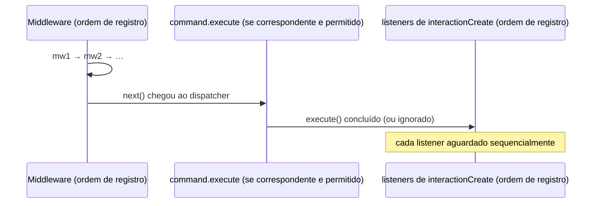

# Eventos {#events}

O cliente expõe uma superfície de eventos pequena, fechada e totalmente tipada via `client.on(...)`. Existem exatamente sete eventos — eventos brutos do provedor nunca são expostos.

## O mapa de eventos {#the-event-map}

```ts
import type { ClientEvents } from "libwa";

type ClientEvents = {
  ready: [client: Client];
  interactionCreate: [interaction: Interaction];
  error: [error: Error];
  disconnect: [reason: DisconnectReason];
  reconnecting: [attempt: number, delayMs: number];
  qr: [qr: string];
  pairingCode: [code: string];
};
```

| Evento | Argumentos | Disparado quando |
| --- | --- | --- |
| `ready` | `(client)` | A conexão abre — na primeira vez **e** após cada reconexão bem-sucedida. `client.me` já está preenchido. |
| `interactionCreate` | `(interaction)` | Um evento do backend virou uma interação **e** passou pelo pipeline de middleware. Todos os listeners rodam depois que qualquer comando correspondente foi executado. |
| `error` | `(error)` | Algo falhou dentro da biblioteca, de um middleware, de um comando ou de um listener. Nunca é disparado para rejeições não tratadas do seu próprio código. |
| `disconnect` | `(reason)` | A conexão fechou e **não** será tentada de novo (motivo fatal, `reconnect: false` ou tentativas esgotadas). |
| `reconnecting` | `(attempt, delayMs)` | Uma nova tentativa foi agendada. `attempt` começa em 1; `delayMs` é a espera do backoff. |
| `qr` | `(qr)` | Um payload QR está disponível (fluxo de login por QR; `pairingCode` cobre o outro caminho). |
| `pairingCode` | `(code)` | Um código de pareamento está disponível (solicitado automaticamente quando `auth.pairingPhoneNumber` está definido, ou via `client.requestPairingCode()`). |

## Registrando listeners {#registering-listeners}

```ts
const stop = client.on("interactionCreate", (i) => {
  console.log(i.type);
}); // → função de unsubscribe

client.once("ready", (c) => {
  console.log(`hello ${c.me?.displayName}`);
});

stop();                 // remove apenas este listener
client.off("interactionCreate", fn); // remove um listener específico
client.off("interactionCreate");     // remove TODOS os listeners do evento
```

Os três métodos retornam `void` (exceto `on`/`once`, que retornam `Unsubscribe = () => void`).

### Listeners assíncronos {#async-listeners}

Listeners podem ser assíncronos. Cada um é aguardado na ordem de registro (o dispatcher o aguarda), mas **falhas nunca derrubam o processo**:

```ts
client.on("interactionCreate", async (i) => {
  await handle(i); // lança erro
});
```

A rejeição é capturada e encaminhada para `#handleError`, que:

1. registra `[<context>] <message>` pelo `logger` injetado, e então
2. emite `error` **se existir pelo menos um listener de `error`**.

::: warning Sem listener de error → apenas log
Se você nunca assina o `error`, as falhas só ficam visíveis pelo seu `logger` (silencioso por padrão). Bots em produção sempre devem registrar `client.on("error", ...)`.
:::

### O evento `error` nunca entra em si mesmo {#the-error-event-never-re-enters-itself}

Se um **listener de `error` lança erro**, a falha é registrada como `[error listener] <message>` e *não* é reemitida — sem recursão infinita:

```ts
client.on("error", (error) => {
  throw new Error("boom"); // registrado, não reemitido
});
```

### Contextos de erro {#error-contexts}

O evento `error` recebe um `Error` comum (geralmente uma subclasse de `WhatsAppError`). O contexto de origem é transformado em string na linha de log, não no payload do evento. O conjunto completo de contextos: `connect`, `disconnect during destroy`, `backend logout`, `disconnect after logout`, `command "<name>"`, `middleware`, `interaction build`, `reconnection`, `reconnect exhausted`, `login`, `listener for "<event>"`.

## Garantias de ordenação {#ordering-guarantees}

Para uma única interação:



Entre eventos: eventos do backend são despachados assincronamente (`void this.#dispatch(...)`), então **dois eventos podem se intercalar** se um dispatch anterior aguardar um middleware demorado. Se a serialização estrita importar, proteja você mesmo o estado compartilhado.

## Padrões comuns {#common-patterns}

### Ignore suas próprias mensagens {#ignore-your-own-messages}

```ts
client.on("interactionCreate", (i) => {
  if (i.isFromMe) return;
  // ...
});
```

### Um handler por tipo de interação {#one-handler-per-interaction-kind}

```ts
const handlers: Array<(i: Interaction) => void | Promise<void>> = [];

client.on("interactionCreate", async (i) => {
  for (const handler of handlers) await handler(i);
});
```

### Encerramento {#teardown}

```ts
const stopReady = client.on("ready", onReady);
// depois:
stopReady();
// ou tudo:
client.destroy(); // também desvincula os listeners do backend
```

### Fluxo de inicialização/QR {#startup-qr-flow}

```ts
client.on("qr", (qr) => writeQrToTerminal(qr));
client.on("pairingCode", (code) => console.log(code));
client.on("ready", () => console.log("online"));
client.on("reconnecting", (attempt, delay) =>
  console.warn(`retry ${attempt} in ${delay}ms`));
client.on("disconnect", (reason) => console.error("gone:", reason));

await client.login();
```

## Erros de listener embutidos {#built-in-listener-errors}

O cliente instala seu próprio hook `onListenerError` no [`TypedEventEmitter`](/pt-BR/reference/typed-event-emitter) interno. Você nunca o configura diretamente; o mapeamento é:

| Listener que lança erro | Resultado |
| --- | --- |
| qualquer evento exceto `error` | log + emite `error` |
| evento `error` | apenas log |

Para o emitter bruto (usado por backends e disponível para o seu próprio código), veja a [referência do TypedEventEmitter](/pt-BR/reference/typed-event-emitter).

## Relacionados {#related}

- [Referência de eventos do Client](/pt-BR/reference/client-events) — assinaturas de tipo exatas
- [Referência do Client](/pt-BR/reference/client#on-once-off) — métodos `on` / `once` / `off`
- [Guia de middleware](/pt-BR/guide/middleware) — filtre `interactionCreate` antes dos listeners
- [Arquitetura de reconexão](/pt-BR/architecture/reconnection) — quando `reconnecting`/`disconnect` disparam
