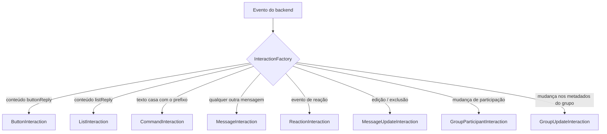

# Interações {#interactions}

Todo evento significativo no WhatsApp chega ao seu bot como uma **`Interaction`**. Esta página explica o modelo, os guards e cada subclasse concreta.

## A classe base {#the-base-class}

Todas as interações estendem a abstrata [`Interaction`](/pt-BR/reference/interactions#interaction):

```ts
abstract class Interaction {
  abstract readonly type: InteractionType;   // discriminador
  readonly id: string;
  readonly timestamp: Date;
  readonly client: Client;
  readonly chat: Chat;
  readonly group: Group | undefined;         // definido quando isFromGroup()
  readonly author: User | undefined;
  readonly member: GroupMember | undefined;  // papel do autor no grupo (chats de grupo)
  readonly isFromMe: boolean;

  reply(content: ReplyContent, options?: SendOptions): Promise<Message>;

  isMessage(): this is MessageInteraction;
  isCommand(): this is CommandInteraction;
  isReaction(): this is ReactionInteraction;
  isMessageUpdate(): this is MessageUpdateInteraction;
  isGroupParticipantUpdate(): this is GroupParticipantInteraction;
  isGroupUpdate(): this is GroupUpdateInteraction;
  isButton(): this is ButtonInteraction;
  isList(): this is ListInteraction;
  isFromGroup(): this is Interaction & { group: Group };
  isFromDirectChat(): boolean;
}
```

### Campos de identidade {#identity-fields}

| Campo | Tipo | Significado |
| --- | --- | --- |
| `type` | [`InteractionType`](/pt-BR/reference/interactions#interactiontype) | Discriminador (`"message"`, `"command"`, `"reaction"`, …). |
| `id` | `string` | Id único — o id da mensagem para interações do tipo mensagem; `` `${chat}:${msg}:${action}:${tsMs}:${seq}` `` para atualizações de mensagem; `` `reaction:${chat}:${msg}:${user}:${tsMs}:${seq}` `` para reações; `` `${groupId}:${action}:${ts}:${participants}` `` (sem seq) para eventos de participantes do grupo; `` `${groupId}:update:${ts}:${seq}` `` para atualizações de metadados do grupo. |
| `timestamp` | `Date` | Quando o evento subjacente aconteceu (timestamps do provedor são convertidos de segundos; algumas atualizações usam `new Date()` como fallback). |
| `client` | `Client` | O cliente que o produziu — útil para `interaction.client.messages...`. |
| `chat` | `Chat` | Onde aconteceu. A identidade é estável: o mesmo id de chat sempre produz a mesma instância `Chat` em cache. |
| `group` | `Group \| undefined` | O grupo quando `isFromGroup()` é verdadeiro — a mesma instância de `chat` nas interações de grupo. `undefined` para chats diretos. |
| `author` | `User \| undefined` | Quem o causou: autor da mensagem, quem reagiu, ator do grupo. `undefined` quando desconhecido (ex.: atualizações de metadados do grupo não têm ator). |
| `member` | `GroupMember \| undefined` | A participação do autor no `group` — `{ user, role }`, com escopo de grupo. `undefined` fora de chats de grupo, em eventos sem autor, ou enquanto os metadados do grupo são desconhecidos. Veja [Participação no grupo](/pt-BR/guide/groups#membership-roles). |
| `isFromMe` | `boolean` | Verdadeiro quando a conta logada o causou. |

### `reply()` {#reply}

```ts
interaction.reply("hello");                        // texto simples
interaction.reply({ image: bytes, caption: "hi" }); // payload estruturado
```

As respostas passam por [`MessageService.send`](/pt-BR/reference/messaging#send) mirando `interaction.chat`, com uma citação anexada quando a interação carrega um alvo de resposta:

- **Interações de mensagem/comando** citam a mensagem recebida em si.
- **Reações** citam a mensagem reagida.
- **Interações de botão/lista** citam o prompt original quando o provedor forneceu um, caso contrário a mensagem de resposta.
- **Interações de grupo/atualização** não têm alvo de resposta — `reply()` envia uma mensagem sem citação no chat.

### Guards de contexto de chat {#chat-context-guards}

`isFromGroup()` é um predicado de tipo: dentro do guard, `interaction.group` é tipado como `Group`, de modo que listas de membros e metadados ficam diretamente acessíveis. `isFromDirectChat()` retorna um boolean simples, e `chat.isGroup()` ainda estreita o próprio chat:

```ts
if (interaction.isFromGroup()) {
  const group: Group = interaction.group;          // estreitado
  console.log(group.memberCount, group.members);
}

if (interaction.chat.isGroup()) {
  const group: Group = interaction.chat;           // estreitado
}
```

## Escolhendo a interação certa {#choosing-the-right-interaction}



::: info Comandos são mensagens
`CommandInteraction extends MessageInteraction<TextContent>` e `isMessage()` retorna `true` para comandos também. Ordene seus guards de acordo — verifique `isCommand()` **primeiro** se precisar distingui-los.
:::

## MessageInteraction {#messageinteraction}

> Classe · [API completa](/pt-BR/reference/interactions#messageinteraction)

Produzida para cada mensagem recebida que não é uma resposta de botão/lista. Genérica sobre o tipo de conteúdo, de modo que os guards de conteúdo estreitam tanto `this` quanto `this.content`.

```ts
client.on("interactionCreate", async (i) => {
  if (!i.isMessage()) return;

  if (i.isImage()) {
    const [attachment] = i.attachments;
    if (attachment) {
      const bytes = await attachment.download();
      console.log(`image, ${bytes.byteLength} bytes`);
    }
    await i.react("📷");
    return;
  }

  if (i.isText()) {
    await i.reply(`You said: ${i.text}`);
  }
});
```

### Acessadores {#accessors}

| Membro | Tipo | Observações |
| --- | --- | --- |
| `message` | [`Message`](/pt-BR/reference/entities#message) | A mensagem de domínio subjacente. |
| `author` | `User` | Sobrescrito como sempre conhecido. |
| `content` | `C extends MessageContent` | Corpo normalizado; estreitado pelos guards de conteúdo. |
| `text` | `string` | `text`, legenda, título da lista, texto exibido ou `""` — nunca lança exceção. |
| `attachments` | `readonly Attachment[]` | 0 ou 1 itens. |
| `reference` | `MessageReference \| undefined` | Mensagem citada, quando o conteúdo inline foi entregue. |
| `isReply` | `boolean` | `reference !== undefined`. |
| `isForwarded` | `boolean` | O provedor marcou como encaminhada (score > 0, informações de encaminhamento de newsletter/IA). |
| `mentions` | `readonly User[]` | Usuários mencionados com @. |

### Ações {#actions}

| Método | Comportamento |
| --- | --- |
| `reply(content, options?)` | Envia no mesmo chat, citando esta mensagem. O opcional [`SendOptions`](/pt-BR/reference/messaging#sendoptions) sobrescreve a citação (`quote` / `replyToMessageId`) ou adiciona `mentions`. |
| `react(emoji \| null)` | Adiciona/remove a reação do bot ([controlado por capacidade](/pt-BR/reference/messaging#react-reactto)). |
| `delete()` | Exclui a mensagem — mensagens próprias, ou qualquer mensagem se o bot for admin do grupo. |
| `edit(text)` | Edita-a (deve ser uma mensagem do próprio bot); retorna um `Message` atualizado. |

### Guards de conteúdo {#content-guards}

Cada guard estreita `content` em tempo de compilação:

| Guard | Estreita para |
| --- | --- |
| `isText()` | `TextContent` |
| `isImage()` / `isVideo()` / `isAudio()` / `isDocument()` / `isSticker()` | o conteúdo de mídia respectivo |
| `isLocation()` | `LocationContent` |
| `isContact()` | `ContactContent` |
| `isPoll()` | `PollContent` |
| `isMedia()` | `MediaMessageContent` (qualquer conteúdo com um `attachment`) |

```ts
if (i.isPoll()) {
  console.log(i.content.name, i.content.options, i.content.selectableCount);
}
if (i.isMedia()) {
  i.content.attachment.mimeType; // estreitado: attachment sempre existe
}
```

## CommandInteraction {#commandinteraction}

> Classe · [API completa](/pt-BR/reference/interactions#commandinteraction)

Criada quando uma mensagem de **texto** começa com um prefixo configurado e passa na validação do nome do comando — independentemente de o nome estar registrado.

```ts
client.on("interactionCreate", (i) => {
  if (!i.isCommand()) return;
  console.log(i.name);    // nome normalizado em minúsculas, prefixo removido
  console.log(i.args);    // ["a", "b"]
  console.log(i.rawArgs); // "a b"
  console.log(i.command); // CommandDefinition | undefined (undefined = comando desconhecido)
});
```

- Regras de parsing, validação de nomes e comportamento do registry → [Comandos](/pt-BR/guide/commands).
- Um comando prefixado desconhecido ainda se torna um `CommandInteraction` (`command === undefined`), para que você mesmo possa responder `Unknown command`.
- Tudo em `MessageInteraction` continua disponível.

## ReactionInteraction {#reactioninteraction}

> Classe · [API completa](/pt-BR/reference/interactions#reactioninteraction)

Alguém adicionou ou removeu uma reação.

```ts
client.on("interactionCreate", async (i) => {
  if (!i.isReaction()) return;

  if (i.isRemoved) {
    console.log(`${i.author?.displayName} removed their reaction`);
    return;
  }

  if (i.emoji === "🔥" && i.author && !i.isFromMe) {
    await i.react("🔥"); // retribuir (controlado por capacidade)
  }
});
```

<ApiNote kind="info" title="Payloads de reação não carregam push name">
Eventos de reação do provedor trazem apenas a chave alvo e o emoji — sem o nome do remetente. `i.author?.name` ainda responde a partir da **memória de nomes** da biblioteca (o push name visto nas mensagens anteriores daquele usuário, em qualquer esquema de id); sem nada memorizado ainda, `displayName` cai como fallback para telefone → id.
</ApiNote>

| Membro | Observações |
| --- | --- |
| `messageId` | A mensagem reagida. |
| `emoji` | String do emoji, ou `null` quando a reação foi **removida**. |
| `isRemoved` | Atalho para `emoji === null`. |
| `author` | Quem reagiu (sempre conhecido). |
| `react(emoji)` | Reage à **mesma mensagem** (respostas a citariam). |

## MessageUpdateInteraction {#messageupdateinteraction}

> Classe · [API completa](/pt-BR/reference/interactions#messageupdateinteraction)

Uma mensagem foi editada ou excluída — aparece a partir de stubs de revogação do provedor, atualizações `message: null` e eventos `messages.delete`.

```ts
client.on("interactionCreate", (i) => {
  if (!i.isMessageUpdate()) return;

  if (i.isEdit) {
    console.log(`edited ${i.messageId}:`, i.content && "text" in i.content ? i.content.text : "");
  } else if (i.isDelete) {
    console.log(`deleted ${i.messageId}`);
  }
});
```

| Membro | Observações |
| --- | --- |
| `messageId` | A mensagem afetada. |
| `action` | `"edit"` ou `"delete"`. |
| `content` | Conteúdo novo para edições; `undefined` para exclusões. |
| `isEdit` / `isDelete` | Booleans de conveniência. |
| `author` | Quando conhecido (`undefined` para muitas exclusões em massa). |

## GroupParticipantInteraction {#groupparticipantinteraction}

> Classe · [API completa](/pt-BR/reference/interactions#groupparticipantinteraction)

Mudanças de participação: adicionar, remover, promover, rebaixar — além de `"other"` para ações do provedor não mapeadas.

```ts
client.on("interactionCreate", async (i) => {
  if (!i.isGroupParticipantUpdate()) return;

  if (i.isAdd) {
    const names = i.users.map((u) => u.displayName).join(", ");
    await i.reply(`Welcome ${names}!`);
  } else if (i.isRemove && i.isFromMe) {
    console.log("bot removed someone");
  }
});
```

`group` é a entidade [`Group`](/pt-BR/reference/entities#group) com **metadados resolvidos** (o cliente a resolve através de `groups.ensure` antes do dispatch — cache de ≤60s, corrigido pelos eventos de participação/atualização, de modo que `group.members` está atual); `user` é o participante afetado (`users[0]` — exatamente quem foi adicionado/removido/promovido/rebaixado em mudanças de participante único), `users` cobre lotes; `author` é quem executou a ação (pode ser `undefined`); getters de conveniência: `isAdd`, `isRemove`, `isPromote`, `isDemote`.

## GroupUpdateInteraction {#groupupdateinteraction}

> Classe · [API completa](/pt-BR/reference/interactions#groupupdateinteraction)

Metadados do grupo alterados. As mudanças são **parciais**: apenas as chaves alteradas estão presentes, e um valor limpo aparece como `undefined` (assim, `"description" in changes` é `true` para uma limpeza).

```ts
client.on("interactionCreate", (i) => {
  if (!i.isGroupUpdate()) return;

  if (i.hasNameChange) {
    console.log(`group renamed to ${i.changes.name}`);
  }
  if (i.hasDescriptionChange) {
    console.log(`new description: ${i.changes.description}`);
  }
  if (i.changes.announceOnly !== undefined) {
    console.log("announce-only:", i.changes.announceOnly);
  }
});
```

::: tip O estado em cache se atualiza sozinho
Antes de a interação ser criada, a factory aplica as mudanças no grupo em cache ([`EntityFactory.applyGroupChanges`](/pt-BR/reference/entities#entityfactory)) — `i.group.name` já reflete a atualização.
:::

## ButtonInteraction & ListInteraction {#buttoninteraction-listinteraction}

> Classes · [API completa](/pt-BR/reference/interactions#buttoninteraction)

Respostas interativas legadas (botões, listas e respostas modernas de *native flow*) são mapeadas para interações dedicadas em vez de mensagens simples:

```ts
client.on("interactionCreate", async (i) => {
  if (i.isButton()) {
    // i.buttonId  — id do provedor (native flow: `id` de paramsJson, senão o nome do flow)
    // i.title     — título do prompt recuperado do prompt citado, ou ""
    // i.displayText— texto no botão tocado
    // i.variant   — "template" | "plain"
    await handleChoice(i.buttonId, i);
    return;
  }

  if (i.isList()) {
    // i.rowId, i.title, i.description
    await handleRow(i.rowId, i);
  }
});
```

Ambas carregam `messageId`, `reference` (o prompt, quando citado) e respondem com uma citação ao prompt quando disponível. Detalhes do mapeamento (qual payload do provedor produz qual campo) estão em [Decisões de design §14](/pt-BR/architecture/design-decisions#_14-legacy-buttons-lists-map-to-dedicated-interactions).

## Exemplo completo detalhado {#full-worked-example}

```ts
import { type Interaction, Client } from "libwa";

const client = new Client({ commands: { prefix: "!" } });

client.on("interactionCreate", async (i: Interaction) => {
  try {
    if (i.isCommand()) return; // tratado pelas definições de comando

    if (i.isMessage()) {
      if (i.isFromMe) return;
      if (i.isMedia()) await i.react("👀");
      return;
    }

    if (i.isReaction()) {
      console.log("reaction:", i.emoji, "by", i.author?.displayName);
      return;
    }

    if (i.isMessageUpdate()) {
      console.log(`message ${i.messageId} ${i.action}`);
      return;
    }

    if (i.isGroupParticipantUpdate() && i.isAdd) {
      await i.reply(`Welcome! You are member #? of ${i.group.displayName}`);
    }
  } catch (error) {
    console.error("handler failed:", error);
  }
});

await client.login();
```

Exceções de listeners nunca derrubam o processo: elas são roteadas para o evento `error` do cliente (veja [Tratamento de erros](/pt-BR/guide/error-handling)).

## Relacionados {#related}

- [Guia de eventos](/pt-BR/guide/events) — o ciclo de vida de `interactionCreate`, ordenação, padrões de unsubscribe
- [Referência de conteúdo de mensagem](/pt-BR/reference/content) — cada forma de conteúdo em detalhe
- [Referência de interações](/pt-BR/reference/interactions) — assinaturas, construtores, interfaces de init
- [InteractionFactory (interno)](/pt-BR/reference/interactions#interactionfactory) — como eventos do backend se tornam interações
