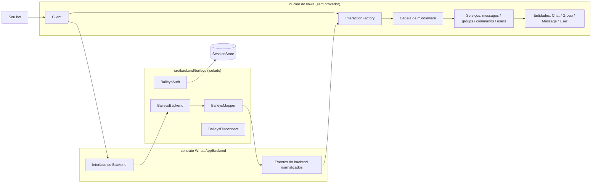
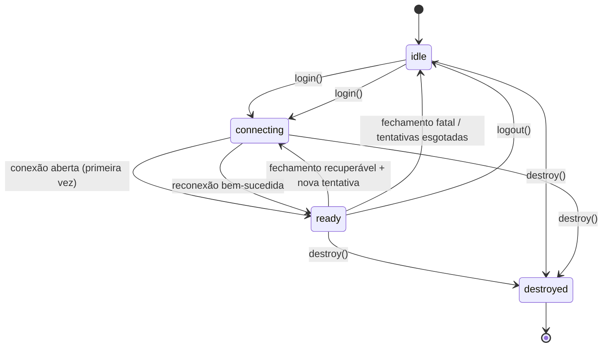

# Introdução {#introduction}

**libwa** é uma biblioteca TypeScript para construir bots de WhatsApp. Ela esconde a complexidade do protocolo do WhatsApp atrás de uma abstração única e opinada: a **interação**. Em vez de lidar com payloads crus do provedor, seu bot recebe objetos tipados e responde a eles com uma API pequena e consistente.

```ts
import { Client } from "libwa";

const client = new Client();

client.on("interactionCreate", async (interaction) => {
  if (interaction.isMessage() && interaction.isText()) {
    await interaction.reply(`You said: ${interaction.text}`);
  }
});

await client.login();
```

Esse trecho é um bot completo: ele se conecta ao WhatsApp (mostrando um código QR para escanear), recebe mensagens e as ecoa de volta.

## O que torna o libwa diferente {#what-makes-libwa-different}

| Aspecto | Bibliotecas cruas do provedor | libwa |
| --- | --- | --- |
| Mensagens recebidas | Árvores de payload aninhadas e específicas do provedor | Uma família de classes `Interaction` com guards de estreitamento |
| Conteúdo da mensagem | Dezenas de campos opcionais parcialmente presentes | Uma união discriminada `MessageContent`, normalizada sempre |
| Comandos | Implemente seu próprio parser | `CommandRegistry` com prefixos, aliases, args e guards |
| Erros | O que o provedor lançar | Hierarquia estável de `WhatsAppError` com `.code` |
| Sessões | Tratamento de arquivos ad hoc dentro do provedor | Abstração `SessionStore` (arquivo/SQLite/memória/traga a sua) |
| Reconexão | Geralmente controlada pelo provedor ou manual | Política de propriedade do cliente com backoff exponencial |
| Multi-conta | Pouco claro | Slots de `sessionId` sobre um único store |

## Conceitos centrais {#core-concepts}

Tudo no libwa flui por algumas ideias. Você usará todas elas:

**[Client](/pt-BR/reference/client)** — o ponto de entrada. Controla o ciclo de vida da conexão, compõe os serviços (`client.messages`, `client.groups`, `client.commands`, `client.users`), converte eventos do backend em interações, executa middlewares e faz dispatch para seus listeners.

**[Interaction](/pt-BR/reference/interactions)** — algo significativo que aconteceu: uma mensagem chegou, um comando casou, alguém reagiu, a participação no grupo mudou. Produzida pela biblioteca a partir de eventos do backend; você os estreita com guards:

```ts
client.on("interactionCreate", (i) => {
  if (i.isCommand()) {
    /* CommandInteraction */
  } else if (i.isReaction()) {
    /* ReactionInteraction */
  } else if (i.isMessage()) {
    /* MessageInteraction */
  }
});
```

**[MessageContent](/pt-BR/reference/content)** — o corpo normalizado de uma mensagem: `text`, `image`, `video`, `audio`, `document`, `sticker`, `location`, `contact`, `poll`, `buttonReply`, `listReply` ou `unknown`. Você faz `switch` sobre `content.kind` — nunca sobre estruturas do provedor.

**[Backend](/pt-BR/reference/backend)** (`WhatsAppBackend`) — a interface do adaptador do provedor. O padrão incluso é o [Baileys](https://github.com/WhiskeySockets/Baileys), mas o núcleo só conversa com esse contrato. Capacidades opcionais (`react`, `editMessage`, …) aparecem como `UnsupportedOperationError` quando um backend não as possui.

**[SessionStore](/pt-BR/reference/sessions)** — persistência para credenciais de login: [`FileSessionStore`](/pt-BR/reference/sessions#filesessionstore) (padrão), [`SqliteSessionStore`](/pt-BR/reference/sessions#sqlitesessionstore) (produção — um único banco em modo WAL para todos os slots), `MemorySessionStore` (testes) ou o seu próprio. O núcleo trata os dados da sessão como um `Uint8Array` opaco; apenas o backend dono o interpreta.

**[Middleware](/pt-BR/reference/middleware)** — funções ordenadas que controlam o dispatch: `client.use((interaction, next) => …)`. Pular `next()` impede que a interação chegue a comandos e listeners.

**[Events](/pt-BR/reference/client-events)** — um conjunto fechado e tipado (`ready`, `interactionCreate`, `error`, `disconnect`, `reconnecting`, `qr`, `pairingCode`). Os argumentos dos listeners são totalmente inferidos.

**[Errors](/pt-BR/reference/errors)** — tudo o que a biblioteca lança estende `WhatsAppError` com um `code` estável, em oito especializações (`ConnectionError`, `ValidationError`, …).

## Arquitetura em uma olhada {#architecture-at-a-glance}



Regra principal: **os tipos do provedor nunca atravessam a fronteira.** O Baileys só é importado dentro de `src/backend/baileys/`, e um guard em tempo de build (`npm run check:exports`) falha o build se qualquer token do provedor se tornar alcançável a partir da superfície pública de tipos. Veja [Guard da API pública](/pt-BR/development/public-api-guard).

## Ciclo de vida em uma imagem {#lifecycle-in-one-picture}



`login()` retorna uma promise que resolve no primeiro `ready` e rejeita em falha de autenticação ou tentativas esgotadas. Leia mais em [Sessões e login](/pt-BR/guide/sessions) e [Reconexão](/pt-BR/architecture/reconnection).

## Terminologia {#terminology}

| Termo | Significado |
| --- | --- |
| **Chat** | Uma conversa no WhatsApp — direta, grupo, lista de transmissão ou newsletter. Identificada por uma string `ChatId` (ex.: `123@g.us`, `5511…@s.whatsapp.net`). |
| **Grupo** | Um chat com `kind: "group"`; a classe de entidade `Group extends Chat`. |
| **Interação** | Um objeto de evento normalizado entregue a comandos e listeners. |
| **Comando** | Um `CommandDefinition` registrado, casado por prefixo + nome. |
| **Backend / provedor** | O adaptador que implementa `WhatsAppBackend` (backend); a biblioteca de protocolo subjacente (provedor — Baileys). |
| **Sessão** | Estado de login persistido: `{ id, provider, data, updatedAt }`. |
| **Slot** | Um id de sessão dentro de um store compartilhado (`ClientOptions.sessionId`, padrão `"default"`). |
| **`isFromMe`** | Verdadeiro quando a conta logada causou a interação. |
| **JID** | Id no formato do provedor (`user@s.whatsapp.net`). O libwa passa ids como strings puras e normaliza os sufixos de dispositivo no backend. |

## O que o libwa *não* faz {#what-libwa-does-not-do}

- Não é um framework: sem carregador de comandos baseado em arquivos, sem plugins, sem dashboard. Traga sua própria estrutura sobre as primitivas.
- Ele não expõe extras do provedor (anti-spam, uploads de stories, …) — qualquer coisa que o contrato `WhatsAppBackend` não modela exigiria seu próprio código de backend.
- Ele não sincroniza todo o histórico de chat por padrão ([por quê?](/pt-BR/architecture/design-decisions#_7-history-sync-off-by-default)).
- Não há CLI: você roda seu bot com seu próprio runtime (`node`, `tsx`, `vitest`, …).

## Para onde ir a seguir {#where-to-go-next}

- Novo por aqui? → [Primeiros passos](/pt-BR/guide/getting-started)
- Procurando um símbolo específico? → [Visão geral da API](/pt-BR/reference/)
- Quer saber por que algo funciona assim? → [Decisões de design](/pt-BR/architecture/design-decisions)
- Algo quebrou? → [Solução de problemas](/pt-BR/troubleshooting)
