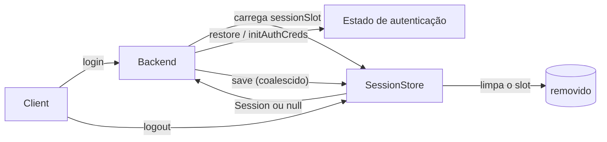
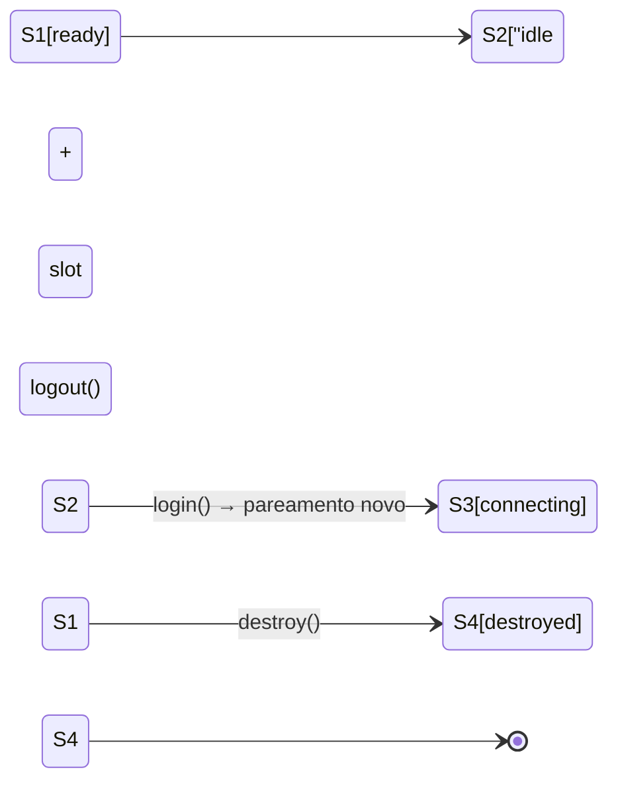

# Sessões e login {#sessions-login}

Uma **sessão** é o estado de login persistido que permite ao seu bot voltar ao ar sem escanear um QR de novo. O libwa.js mantém as sessões independentes do provedor: o core armazena um blob opaco; apenas o backend dono o interpreta.

## O modelo de sessão {#the-session-model}

```ts
interface Session {
  readonly id: string;          // id do slot — ClientOptions.sessionId
  readonly provider: string;    // id do backend que o escreveu, ex. "baileys"
  readonly data: Uint8Array;    // estado serializado opaco
  readonly updatedAt: Date;
}
```



Regras:

- O core **nunca** lê `data` — ele apenas passa objetos `Session` entre a store e o backend.
- `provider` protege contra restore entre backends: um blob escrito por outro id de backend é ignorado com um aviso e reinicializado do zero.
- Os ids de slot devem satisfazer `/^[A-Za-z0-9_-]{1,64}$/` (imposto pelas stores de arquivo e de SQLite; o id vem de `ClientOptions.sessionId`, padrão `"default"`).

## Stores {#stores}

### FileSessionStore (padrão) {#filesessionstore-default}

```ts
import { Client, FileSessionStore } from "libwa.js";

new Client(); // → new FileSessionStore() → diretório ".libwa.js"
new Client({ sessionStore: new FileSessionStore({ directory: ".sessions/work" }) });
```

- Um arquivo JSON por slot: `<directory>/<id>.json`, payload codificado em base64:

  ```json
  { "provider": "baileys", "data": "eyJ2IjoxL…", "updatedAt": "2026-09-25T12:00:00.000Z" }
  ```

- **Escritas atômicas**: arquivo temporário (`<target>.<writerId>.tmp`, `writerId` sendo um `randomUUID()` único para a instância da store) + `rename`.
- **Fila de escrita por slot**: `save`s concorrentes para o mesmo id se serializam; slots diferentes escrevem em paralelo.
- `load()` de um slot ausente → `null` (apenas `ENOENT` conta como ausente — qualquer outra falha de leitura, ex. `EACCES`/`EISDIR`, lança `ValidationError` `ERR_SESSION_UNREADABLE`); JSON corrompido → `ValidationError` `ERR_SESSION_CORRUPT`.
- `clear()` tolera slots ausentes (apaga com `force: true`).
- O getter `directory` expõe o diretório resolvido.
- Nenhum teardown necessário — nada fica aberto entre as chamadas.

### SqliteSessionStore (produção) {#sqlitesessionstore-production}

```ts
import { Client, SqliteSessionStore } from "libwa.js";

const store = new SqliteSessionStore({ filename: "var/bot.db" });
const sales = new Client({ sessionStore: store, sessionId: "sales" });
const support = new Client({ sessionStore: store, sessionId: "support" });

await Promise.all([sales.login(), support.login()]);
// no encerramento:
await sales.destroy();
await support.destroy();
store.close(); // você é dono do handle — o libwa.js nunca o fecha
```

Um único arquivo de banco de dados guarda todos os slots. Prefira-o à store de arquivo assim que as sessões importarem: modo WAL mais `synchronous = FULL` significa que a última escrita de credencial sobrevive a uma queda de energia, um `busy_timeout` deixa um segundo processo (uma ferramenta de migração, uma segunda instância) bloquear em vez de dar erro, e cada save é um único upsert transacional.

- Opções: `filename` (padrão `libwa.js-sessions.db`; diretórios pais ausentes são criados) e `busyTimeoutMs` (padrão `5000`).
- Os ids são validados exatamente como no `FileSessionStore`; uma linha com tipos de coluna errados → `ERR_SESSION_CORRUPT`.
- Usada depois de `close()` → `ERR_SESSION_STORE`, assim bugs de encerramento falham de forma evidente.
- A versão do schema vive no `PRAGMA user_version`: um banco escrito por um libwa.js mais novo é recusado em vez de ser aberto com um schema que esta build não entende.
- Suportada por `better-sqlite3`, carregada de forma lazy — `import "libwa.js"` nunca toca no binding nativo. Uma instalação feita com `--ignore-scripts` falha com `ERR_SESSION_STORE` e instruções, não com um crash de carregamento.

### MemorySessionStore (testes / efêmera) {#memorysessionstore-tests-ephemeral}

```ts
import { MemorySessionStore } from "libwa.js";

const store = new MemorySessionStore(); // as sessões desaparecem ao sair do processo
```

`load`/`save`/`clear` sobre um `Map` — sem validação de id, sem durabilidade.

### Traga a sua própria store {#bring-your-own}

```ts
import type { Session, SessionStore } from "libwa.js";

const redisStore: SessionStore = {
  async load(id) {
    const raw = await redis.get(`wa:session:${id}`);
    return raw ? JSON.parse(raw, revive) : null;
  },
  async save(session) {
    await redis.set(`wa:session:${session.id}`, serialize(session), "EX", 60 * 60 * 24 * 30);
  },
  async clear(id) {
    await redis.del(`wa:session:${id}`);
  },
};
```

Expectativas: `save` deve persistir `data` sem perda (bytes!); `load` retorna `null` para as ausentes; `clear` é idempotente. Todo o resto (filas, validação) é problema da sua store. Se a sua store mantém um socket ou uma conexão, adicione o opcional `close(): Promise<void> | void` — o libwa.js nunca o chama, então chame você mesmo no encerramento.

## O que há dentro do blob (Baileys) {#what-s-inside-the-blob-baileys}

Para o backend embutido, `data` é JSON UTF-8 serializado com o `BufferJSON` do Baileys:

```ts
{ v: 1, creds: { /* AuthenticationCreds incl. noiseKey, signedIdentityKey, me, … */ },
  keys: { "pre-key": { … }, "sender-key": { … }, "app-state-sync-key": { … }, … } }
```

- `v` é `SESSION_FORMAT_VERSION = 1`. Versões desconhecidas → `ValidationError` "formato não suportado".
- `creds` ausente → `ValidationError` "credenciais ausentes".
- JSON imparseável → `ValidationError` "corrompido".
- Campos tipados Buffer fazem ida e volta pelo `BufferJSON.replacer/reviver` (restaurados como `Buffer`s).
- Entradas `app-state-sync-key` são revividas como objetos protobuf (`proto.Message.AppStateSyncKeyData.fromObject`) no momento da leitura — espelhando o estado de auth de referência do provedor.

As quatro falhas acontecem **durante `login()`** (`connect` do backend), falham rápido sem retries (veja [Tratamento de erros](/pt-BR/guide/error-handling#_1-thrown-synchronously-rejected-promises-you-can-catch)).

### Coalescência de escrita {#write-coalescing}

O Baileys atualiza credenciais e chaves de sinal em rajadas. O `createBaileysAuth` agenda as escritas em uma cadeia de promises:

```ts
persist()  // se uma escrita já está agendada → retorna a cadeia pendente
         // senão marca como agendada → acrescenta um store.save() à cadeia
flush()    // while (scheduled) await chain   — usado no disconnect
```

Assim, N atualizações de chaves em um tick → **um** `store.save`. Falhas de save são registradas (`failed to persist session`) mas nunca derrubam o loop de conexão. O `set()` da key-store também aceita entradas `null` como **exclusões**.

## Fluxos de login {#login-flows}

### QR (padrão) {#qr-default}

```ts
client.on("qr", (qr) => console.log(qr)); // renderize/escaneie logo — primeiro QR ~60s, os seguintes ~20s
await client.login();
```

O backend emite payloads QR enquanto não autenticado; escanear pareia o dispositivo; `ready` dispara; as credenciais são persistidas automaticamente (`creds.update` → `persistCreds`).

### Código de pareamento {#pairing-code}

```ts
const client = new Client({ auth: { pairingPhoneNumber: "5511999999999" } });
client.on("pairingCode", (code) => console.log(code));
await client.login();
```

- Com `pairingPhoneNumber`, o backend solicita um código automaticamente enquanto `!creds.registered && (creds.me === undefined || creds.me.name === "~")` (na conexão, e de novo em uma atualização posterior de QR/`connecting` — uma solicitação com falha rearma, então a próxima atualização tenta de novo).
- Sob demanda: `await client.requestPairingCode("5511999999999")` (valida o formato; o evento `pairingCode` também dispara com o código).
- Os códigos são de uso único por tentativa; refaça o pareamento limpando a sessão.

### Semântica de `login()` {#login-semantics}

```ts
const p1 = client.login();
const p2 = client.login();   // mesma promise enquanto pendente
await p1;                     // resolve no PRIMEIRO ready
```

| Situação | Resultado |
| --- | --- |
| Já em ready | resolve imediatamente |
| Pendente | retorna o deferred compartilhado |
| `ValidationError` / `AuthenticationError` do connect | rejeita rápido (sem retries) |
| Outra falha de connect | registrado + close sintetizado → política normal de retry |
| Disconnect fatal antes do ready | rejeita com `AuthenticationError` |
| Close não fatal com retries desligados/esgotados | rejeita com `ConnectionError` |
| `destroy()` foi chamado | rejeita com `ConnectionError` (estado `destroyed`) |
| `logout()` chamado enquanto pendente | rejeita com `ConnectionError("Client logged out before login completed.")` |
| rejeição sem `await` | engolido internamente (anexe `error` para observar) |

## Bots com múltiplas contas {#multi-account-bots}

```ts
const store = new FileSessionStore({ directory: ".sessions" });
const a = new Client({ sessionStore: store, sessionId: "sales" });
const b = new Client({ sessionStore: store, sessionId: "support" });

await Promise.all([a.login(), b.login()]);
```

Cada slot é um arquivo de sessão / chave de store independente. Nunca rode dois clientes vivos no **mesmo** slot: as escritas se intercalariam e os dois sockets disputariam uma única sessão de dispositivo. Com o `SqliteSessionStore` os slots são linhas em uma única tabela, então a mesma regra vale — um client vivo por slot, uma store por deployment.

## logout vs destroy {#logout-vs-destroy}



| | `logout()` | `destroy()` |
| --- | --- | --- |
| Sessão do provedor invalidada | sim, quando o backend tem `logout()` | não |
| Slot de sessão limpo | sim (`sessionStore.clear`) | não |
| Conexão fechada | sim | sim |
| Timer de reconexão cancelado | sim | sim |
| Estado depois | `idle` (a menos que destruído) | `destroyed` (terminal) |
| `login()` em seguida | fluxo de pareamento novo | rejeita com `ConnectionError` |
| `login()` pendente | rejeitado com `ConnectionError("Client logged out before login completed.")` | rejeitado com `ConnectionError("Client was destroyed.")` |
| Caches de entidade e grupo | resetados (`#entities.reset()` + `groups.reset()`) | resetados (`#entities.reset()` + `groups.reset()`) — o estado de identidade/grupo em cache nunca vaza para a próxima conta |
| Erros de backend | reportados via `error`, engolidos | reportados via `error`, engolidos |

```ts
// trocar de contas
await client.logout();          // o celular encerra a sessão antiga
await client.requestPairingCode("5511999999999"); // precisa do estado connecting

// encerrar
await client.destroy();
```

## Higiene de sessão {#session-hygiene}

- **`.libwa.js/` (e `*.db`) é sensível** — ele autentica a sua conta. Adicione ao `.gitignore`, nunca faça commit, nunca compartilhe. O SQLite também pode deixar arquivos `-wal` / `-shm` ao lado do banco; eles pertencem ao mesmo segredo.
- **Rotacionando dispositivos**: o WhatsApp pode revogar sessões remotamente → a próxima conexão resulta em `DisconnectReason.LoggedOut` → evento `disconnect`, sem retry. Apague o slot e refaça o pareamento.
- **Apagar o slot** (`rm .libwa.js/default.json` ou `sessionStore.clear(id)`) força um login novo.
- **Slot corrompido**: a biblioteca falha com `ValidationError` dizendo para limpá-lo — corrija apagando o arquivo/linha, não editando o JSON à mão.
- **Encerramento**: `await client.destroy()` primeiro (para de escrever), depois `store.close()` se você estiver usando `SqliteSessionStore`.

## Relacionados {#related}

- [Referência de sessões e stores](/pt-BR/reference/sessions) — API completa das stores + `Session`
- [Arquitetura: sessões](/pt-BR/architecture/sessions) — estado de auth, coalescência, internals do formato
- [Testes de auth do Baileys](/pt-BR/development/testing) — comportamento fixado por `tests/baileys-auth.test.ts`
- [Solução de problemas](/pt-BR/troubleshooting) — sintomas relacionados a sessão
