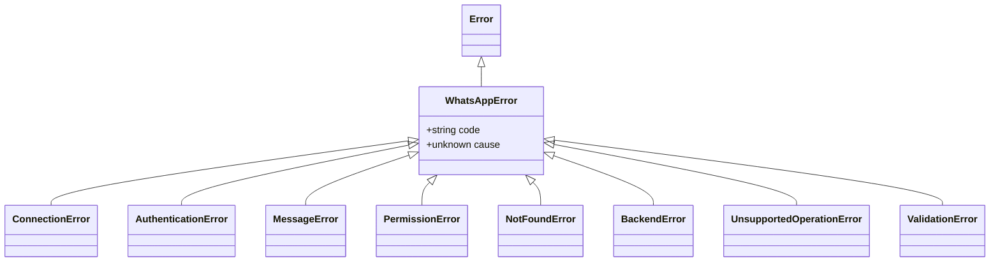

# Erros {#errors}

<ApiBadge kind="class" /> Uma única hierarquia: toda falha da biblioteca estende `WhatsAppError`, carrega um `code` estável e pode preservar o erro do provedor como `cause`. As classes de erro do provedor nunca chegam ao código da aplicação.

```ts
import { WhatsAppError, ValidationError, toError } from "libwa";

try {
  await client.login();
} catch (error) {
  if (error instanceof WhatsAppError) {
    console.error(error.code, error.message, error.cause);
  }
}
```

## Hierarquia {#hierarchy}



## WhatsAppErrorOptions <ApiBadge kind="interface" /> {#whatsapperroroptions}

```ts
interface WhatsAppErrorOptions {
  code?: string;   // padrão: o padrão da classe (veja abaixo)
  cause?: unknown; // erro original, apenas para depuração
}
```

## WhatsAppError <ApiBadge kind="class" /> {#whatsapperror}

```ts
class WhatsAppError extends Error {
  readonly code: string;
  constructor(message: string, options?: WhatsAppErrorOptions);
}
```

Base de tudo. Código padrão `ERR_WHATSAPP` (subclasses sobrescrevem via `{ code: "ERR_…", ...options }` para que um código fornecido pelo chamador sempre vença). `cause` é passado ao `Error` nativamente (`error.cause`).

### Registro de códigos {#code-registry}

| Classe | `code` padrão | Significado |
| --- | --- | --- |
| `WhatsAppError` | `ERR_WHATSAPP` | Falha genérica da biblioteca / base |
| `ConnectionError` | `ERR_CONNECTION` | Problemas do ciclo de vida da conexão |
| `AuthenticationError` | `ERR_AUTHENTICATION` | Login/sessão inválidos |
| `MessageError` | `ERR_MESSAGE` | Envio/edição/exclusão rejeitados pelo provedor |
| `PermissionError` | `ERR_PERMISSION` | Direitos ausentes (admin, não permitido) |
| `NotFoundError` | `ERR_NOT_FOUND` | Chat/mensagem/usuário alvo ausente |
| `BackendError` | `ERR_BACKEND` | Falha do provedor embrulhada |
| `UnsupportedOperationError` | `ERR_UNSUPPORTED` | Capacidade não implementada pelo backend |
| `ValidationError` | `ERR_VALIDATION` | Entrada inválida (veja os códigos abaixo) |

### Códigos de validação {#validation-codes}

Emitem `ValidationError` com um `code` específico (sobrescrevendo `ERR_VALIDATION`):

| Code | Lançado por |
| --- | --- |
| `ERR_INVALID_PREFIX` | Construção do `Client` / `resolveClientOptions` |
| `ERR_INVALID_COMMAND_NAME` | `CommandRegistry.register` (padrão de nome ou alias) |
| `ERR_DUPLICATE_COMMAND` | `CommandRegistry.register` (colisão de nome/alias) |
| `ERR_EMPTY_MESSAGE` | `normalizeReplyContent` / `MessageService.edit` |
| `ERR_AMBIGUOUS_MESSAGE` | `normalizeReplyContent` (múltiplos corpos) |
| `ERR_INVALID_CAPTION` | `normalizeReplyContent` (caption sem mídia) |
| `ERR_EMPTY_MEDIA` | `normalizeReplyContent` (bytes de tamanho zero) |
| `ERR_EMPTY_REACTION` | `MessageService.reactTo` (string de emoji vazia) |
| `ERR_EMPTY_GROUP_NAME` | `GroupService.rename("")` |
| `ERR_EMPTY_USER_LIST` | `GroupService` ops de participantes com `[]` |
| `ERR_INVALID_USER_ID` | `UserService.fetch` (id não é um phone JID / dígitos puros / `…@lid`) |
| `ERR_INVALID_PHONE` | `Client.requestPairingCode` |
| `ERR_UNSUPPORTED` | não é um código de `ValidationError` — é o código padrão de `UnsupportedOperationError` (veja o [registro de códigos](#code-registry)) |
| `ERR_SESSION_ID` | `assertSafeSessionId` (id de slot inválido) |
| `ERR_SESSION_CORRUPT` | `FileSessionStore.load` (JSON inválido) |
| `ERR_SESSION_UNREADABLE` | `FileSessionStore.load` (arquivo existe mas não pode ser lido — não-ENOENT) |
| `ERR_ENTITY_CONSTRUCTION` | guard do construtor de `Chat` (ex.: `new Chat({kind:"group"})` — use o `group()` da factory em vez disso) |

## Assinaturas das subclasses {#subclass-signatures}

Toda subclass compartilha a mesma forma de construtor — `new X(message, options?)` — diferindo apenas no código padrão.

### ConnectionError {#connectionerror}

```ts
class ConnectionError extends WhatsAppError  // código padrão: ERR_CONNECTION
```

Problemas do ciclo de vida da conexão: login tentado em um client destruído, retries esgotados (`Gave up reconnecting after N attempt(s)`), falhas de conexão. **Ação:** faça retry/backoff você mesmo ou corrija o uso indevido do ciclo de vida.

### AuthenticationError {#authenticationerror}

```ts
class AuthenticationError extends WhatsAppError  // código padrão: ERR_AUTHENTICATION
```

O login falhou ou a sessão armazenada está inutilizável — desconexões fatais (`loggedOut`, `badSession`, `connectionReplaced`, `forbidden`) durante `login()`. **Ação:** pareie de novo (QR ou código de pareamento); retries nunca vão resolver.

### MessageError {#messageerror}

```ts
class MessageError extends WhatsAppError  // código padrão: ERR_MESSAGE
```

O provedor rejeitou um envio/edição/exclusão. **Ação:** verifique o conteúdo, os rate limits e o estado do chat alvo.

### PermissionError {#permissionerror}

```ts
class PermissionError extends WhatsAppError  // código padrão: ERR_PERMISSION
```

Direitos ausentes — não é admin do grupo, chat restrito, não pode apagar mensagens de outras pessoas. **Ação:** degrade graciosamente ou restrinja a funcionalidade.

### NotFoundError {#notfounderror}

```ts
class NotFoundError extends WhatsAppError  // código padrão: ERR_NOT_FOUND
```

Chat/mensagem/usuário alvo ausente (mensagem apagada, JID desconhecido, cache de mídia removido). **Ação:** pare de agir sobre ele.

### BackendError {#backenderror}

```ts
class BackendError extends WhatsAppError  // código padrão: ERR_BACKEND
```

Falha do provedor embrulhada (via `rethrowAsBackendError`) — `` `${operation}: ${providerMessage}` `` com o original em `.cause`. **Ação:** registre o `cause`; geralmente é transitória.

### UnsupportedOperationError {#unsupportedoperationerror}

```ts
class UnsupportedOperationError extends WhatsAppError  // código padrão: ERR_UNSUPPORTED
```

O backend não implementa uma capacidade (`` `Backend "baileys" does not support reactions.` ``). **Ação:** faça feature-detect (`if (client.backend.react)`) ou descarte a funcionalidade.

### ValidationError {#validationerror}

```ts
class ValidationError extends WhatsAppError  // código padrão: ERR_VALIDATION (sobrescrevível)
```

Entrada inválida capturada antes do I/O — carrega um dos códigos específicos na [tabela de validação](#validation-codes). **Ação:** corrija o local da chamada; estes são erros de programação, não condições de execução.

Resumo das orientações:

| Classe | Fonte típica | Ação |
| --- | --- | --- |
| `ConnectionError` | login antes do connect, client destruído, retries esgotados | faça retry/backoff você mesmo |
| `AuthenticationError` | fechamento fatal (logged out), falha de login | pareie de novo (QR/pareamento) |
| `MessageError` | provedor rejeitou um envio | verifique conteúdo/limites |
| `PermissionError` | não é admin do grupo, chat restrito | corrija o cargo ou pule |
| `NotFoundError` | mensagem apagada/chat desconhecido | pare de agir sobre ele |
| `BackendError` | internos inesperados do provedor | registre o `cause`, geralmente transitório |
| `UnsupportedOperationError` | capacidade opcional ausente | faça feature-detect |
| `ValidationError` | sua entrada | corrija o local da chamada |

## Funções {#functions}

### `toError` {#toerror}

```ts
function toError(value: unknown): Error
```

Normaliza qualquer coisa: retorna instâncias `Error` como estão; embrulha qualquer outra coisa em `WhatsAppError(String(value), { cause: value })`. Usado internamente para tornar reportáveis os erros lançados que não são instâncias de Error.

```ts
toError(new TypeError("x"));  // mesma instância
toError("boom");              // WhatsAppError "boom" com .cause === "boom"
```

### `rethrowAsBackendError` {#rethrowasbackenderror}

```ts
function rethrowAsBackendError(operation: string, error: unknown): never
```

O limite uniforme dos serviços: `WhatsAppError`s passam direto sem alterações; todo o resto vira `` new BackendError(`${operation}: ${message}`, { cause: error }) ``.

```ts
rethrowAsBackendError("Failed to send message", providerError);
// BackendError: Failed to send message: <mensagem do provedor>   cause: providerError
```

Retorno `never` — sempre lança erro.

## Veja também {#see-also}

- [Guia de tratamento de erros](/pt-BR/guide/error-handling) — roteamento, padrões, diagramas de fluxo
- [Client → evento error](/pt-BR/reference/client-events#error) — onde as falhas aparecem em tempo de execução
