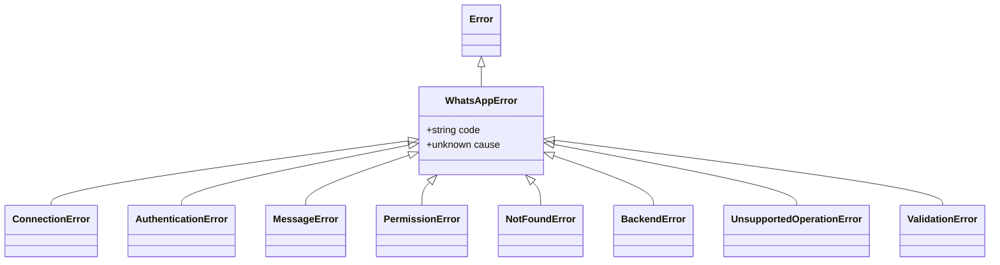

# Errors

<ApiBadge kind="class" /> One hierarchy: every library failure extends `WhatsAppError`, carries a stable `code`, and may preserve the provider error as `cause`. Provider error classes never reach application code.

```ts
import { WhatsAppError, ValidationError, toError } from "libwa";

try {
  await client.login();
} catch (error) {
  if (error instanceof WhatsAppError) {
    console.error(error.code, error.message, error.cause);
  }
}
```

## Hierarchy



## WhatsAppErrorOptions <ApiBadge kind="interface" />

```ts
interface WhatsAppErrorOptions {
  code?: string;   // default: the class default (see below)
  cause?: unknown; // original error, debugging only
}
```

## WhatsAppError <ApiBadge kind="class" />

```ts
class WhatsAppError extends Error {
  readonly code: string;
  constructor(message: string, options?: WhatsAppErrorOptions);
}
```

Base of everything. Default code `ERR_WHATSAPP` (subclasses override via `{ code: "ERR_…", ...options }` so a caller-supplied code always wins). `cause` is passed to `Error` natively (`error.cause`).

### Code registry

| Class | Default `code` | Meaning |
| --- | --- | --- |
| `WhatsAppError` | `ERR_WHATSAPP` | Generic library failure / base |
| `ConnectionError` | `ERR_CONNECTION` | Connection lifecycle problems |
| `AuthenticationError` | `ERR_AUTHENTICATION` | Login/session invalid |
| `MessageError` | `ERR_MESSAGE` | Send/edit/delete rejected by provider |
| `PermissionError` | `ERR_PERMISSION` | Missing rights (admin, not allowed) |
| `NotFoundError` | `ERR_NOT_FOUND` | Target chat/message/user missing |
| `BackendError` | `ERR_BACKEND` | Wrapped provider failure |
| `UnsupportedOperationError` | `ERR_UNSUPPORTED` | Capability not implemented by backend |
| `ValidationError` | `ERR_VALIDATION` | Bad input (see codes below) |

### Validation codes

Emit `ValidationError` with a specific `code` (overriding `ERR_VALIDATION`):

| Code | Raised by |
| --- | --- |
| `ERR_INVALID_PREFIX` | `Client` construction / `resolveClientOptions` |
| `ERR_INVALID_COMMAND_NAME` | `CommandRegistry.register` (name or alias pattern) |
| `ERR_DUPLICATE_COMMAND` | `CommandRegistry.register` (name/alias collision) |
| `ERR_EMPTY_MESSAGE` | `normalizeReplyContent` / `MessageService.edit` |
| `ERR_AMBIGUOUS_MESSAGE` | `normalizeReplyContent` (multiple bodies) |
| `ERR_INVALID_CAPTION` | `normalizeReplyContent` (caption without media) |
| `ERR_EMPTY_MEDIA` | `normalizeReplyContent` (zero-length bytes) |
| `ERR_EMPTY_REACTION` | `MessageService.reactTo` (empty emoji string) |
| `ERR_EMPTY_GROUP_NAME` | `GroupService.rename("")` |
| `ERR_EMPTY_USER_LIST` | `GroupService` participant ops with `[]` |
| `ERR_INVALID_PHONE` | `Client.requestPairingCode` |
| `ERR_UNSUPPORTED` | same as `UnsupportedOperationError` but as validation |
| `ERR_SESSION_ID` | `assertSafeSessionId` (bad slot id) |
| `ERR_SESSION_CORRUPT` | `FileSessionStore.load` (invalid JSON) |
| `ERR_ENTITY_CONSTRUCTION` | `Chat` constructor guard (e.g. `new Chat({kind:"group"})` — use the factory's `group()` instead) |

## Subclass signatures

Every subclass shares the same constructor shape — `new X(message, options?)` — differing only in default code.

### ConnectionError

```ts
class ConnectionError extends WhatsAppError  // default code: ERR_CONNECTION
```

Connection lifecycle problems: login attempted on a destroyed client, retries exhausted (`Gave up reconnecting after N attempt(s)`), connect failures. **Action:** retry/backoff yourself or fix lifecycle misuse.

### AuthenticationError

```ts
class AuthenticationError extends WhatsAppError  // default code: ERR_AUTHENTICATION
```

Login failed or the stored session is unusable — fatal disconnects (`loggedOut`, `badSession`, `connectionReplaced`, `forbidden`) during `login()`. **Action:** re-pair (QR or pairing code); retries will never fix it.

### MessageError

```ts
class MessageError extends WhatsAppError  // default code: ERR_MESSAGE
```

The provider rejected a send/edit/delete. **Action:** inspect content, rate limits, and target chat state.

### PermissionError

```ts
class PermissionError extends WhatsAppError  // default code: ERR_PERMISSION
```

Missing rights — not group admin, restricted chat, cannot delete others' messages. **Action:** degrade gracefully or gate the feature.

### NotFoundError

```ts
class NotFoundError extends WhatsAppError  // default code: ERR_NOT_FOUND
```

Target chat/message/user missing (deleted message, unknown JID, evicted media cache). **Action:** stop acting on it.

### BackendError

```ts
class BackendError extends WhatsAppError  // default code: ERR_BACKEND
```

Wrapped provider failure (via `rethrowAsBackendError`) — `` `${operation}: ${providerMessage}` `` with the original in `.cause`. **Action:** log `cause`; often transient.

### UnsupportedOperationError

```ts
class UnsupportedOperationError extends WhatsAppError  // default code: ERR_UNSUPPORTED
```

The backend does not implement a capability (`` `Backend "baileys" does not support reactions.` ``). **Action:** feature-detect (`if (client.backend.react)`) or drop the feature.

### ValidationError

```ts
class ValidationError extends WhatsAppError  // default code: ERR_VALIDATION (overridable)
```

Bad input caught before I/O — carries one of the specific codes in the [validation table](#validation-codes). **Action:** fix the call site; these are programming errors, not runtime conditions.

Guidance summary:

| Class | Typical source | Action |
| --- | --- | --- |
| `ConnectionError` | login before connect, destroyed client, exhausted retries | retry/backoff yourself |
| `AuthenticationError` | fatal close (logged out), login failure | re-pair (QR/pairing) |
| `MessageError` | provider rejected a send | check content/limits |
| `PermissionError` | not group admin, restricted chat | fix role or skip |
| `NotFoundError` | deleted message/unknown chat | stop acting on it |
| `BackendError` | unexpected provider internals | log `cause`, often transient |
| `UnsupportedOperationError` | optional capability missing | feature-detect |
| `ValidationError` | your input | fix the call site |

## Functions

### `toError`

```ts
function toError(value: unknown): Error
```

Normalizes anything: returns `Error` instances as-is; wraps anything else in `WhatsAppError(String(value), { cause: value })`. Used internally to make thrown non-errors reportable.

```ts
toError(new TypeError("x"));  // same instance
toError("boom");              // WhatsAppError "boom" with .cause === "boom"
```

### `rethrowAsBackendError`

```ts
function rethrowAsBackendError(operation: string, error: unknown): never
```

The services' uniform boundary: `WhatsAppError`s pass through untouched; everything else becomes `` new BackendError(`${operation}: ${message}`, { cause: error }) ``.

```ts
rethrowAsBackendError("Failed to send message", providerError);
// BackendError: Failed to send message: <provider message>   cause: providerError
```

`never`-returning — always throws.

## See also

- [Error handling guide](/guide/error-handling) — routing, patterns, flow diagrams
- [Client → error event](/reference/client-events#error) — where failures surface at runtime
